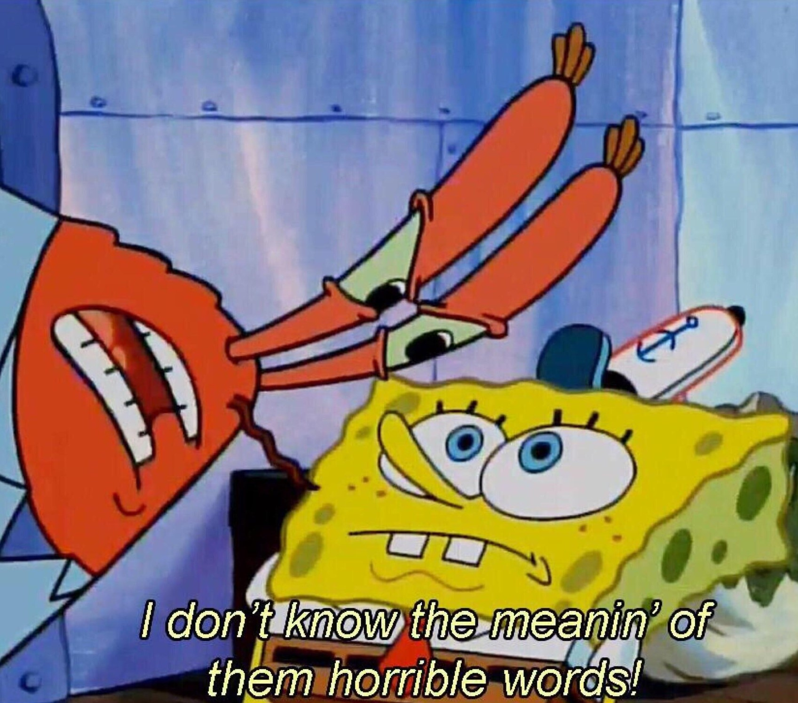
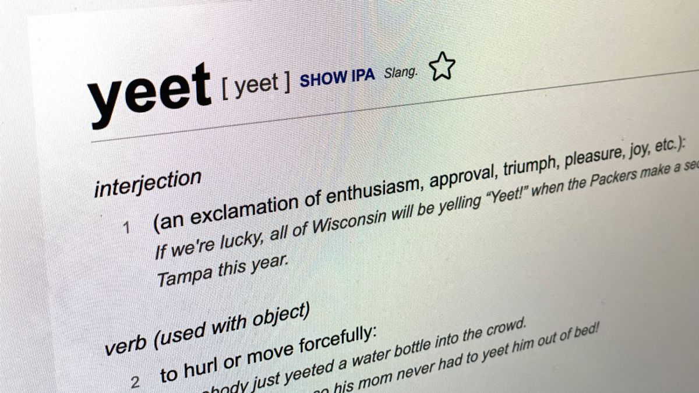
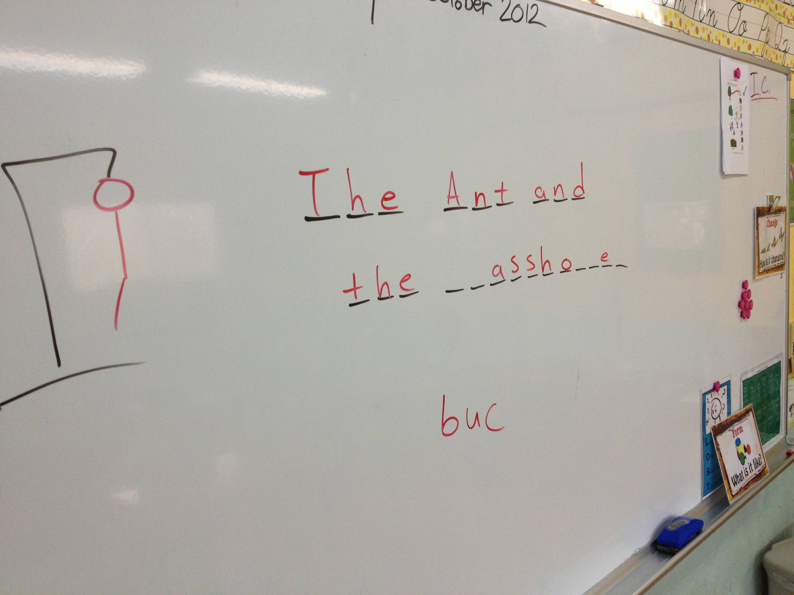

---  
layout: myDefault
title: PROJECT 1
---   

# Project 1: Hang in there!

_**Welcome students! You've been working on the labs and homeworks so far. Its time to take it up a notch. Use everything you've learned so far and hang in there!**_
<p align="center">
    
</p>

## Introduction

Using what you've learned, we will create a dictionary. Later, we will implement Hangman using the dictionary.

Things you need to know for this project: [Arrays](https://www.geeksforgeeks.org/arrays-in-c-cpp/), [Functions](https://www.geeksforgeeks.org/functions-in-cpp/),  [Global-Variables](https://www.geeksforgeeks.org/scope-of-variables-in-c/), [String-Manipulation](https://www.geeksforgeeks.org/substring-in-cpp/)

---
## Implementation:


**Work incrementally!** Work through the tasks sequentially (implement and test). Only move on to a task when you are positive that the previous one has been completed correctly. Remember that the **function prototypes and global-variables must be exactly as specified in this project specification**. Lastly, **do NOT use EOF(End of File), vector, or any library that we haven't learned yet in calss.** This is a contract, it gives you all the information necessary to complete this assignment correctly. If you don't understand this project specification and its requirements, ask for clarification before you proceed. **TEST YOUR CODE BEFORE SUBMITTING!!!**

---

## Task A: Dictionary using Arrays
<p align="center">
    
</p>

A regular dictionary contains the words and the definitions. In addition to the words and the definitions, we will also store the parts of speech (POS). The words, definitions and POS are going to be stored in Arrays. Use these global-variables in your code outside `main()` function:

``` Cpp
const int MAX_WORDS = 1000;
int WORD_COUNT = 0;

string WORDS[MAX_WORDS];
string DEFINITIONS[MAX_WORDS];
string POS[MAX_WORDS];
```

Create a C++ file and add the following function:

```Cpp
/*
    @param            :   The string with the `filename`
    @post             :   Reads the words, definitions, POS into the global arrays, and set the value of `WORD_COUNT` to the number of words read
*/
void readWords(string filename);
```
Here's an example text file:
```
WORD POS
definition: DEFINITION
Grumpy Adjective 
definition: bad-tempered and irritable
Professor Noun
definition: a teacher of the highest rank in a college or university
Does Verb
definition: perform (an action, the precise nature of which is often unspecified)
Nothing Adverb
definition: not at all
```

Example:

Calling `readWords()` on the above text file will modify the global variables like this:

```
MAX_WORDS: 1000

WORD_COUNT: 5

WORDS: ["WORD", "Grumpy", "Professor", "Does", "Nothing"]

POS: ["POS", "Adjective", "Noun", "Verb", "Adverb"]

DEFINITIONS: [
    "DEFINITION",
    "bad-tempered and irritable", 
    "a teacher of the highest rank in a college or university", 
    "perform (an action, the precise nature of which is often unspecified)", 
    "not at all"
]
```


Make sure your program produces the correct output by testing the function and global-variables using `main()` function. 

**Note: Only submit single `.cpp` file to gradescope. Remove or comment out the main function from your code before submitting it on gradescope. Otherwise, the autograder will fail.**

---

## Task B: Dictionary Operations
<p align="center">
    
</p>
Now that we have the words stored, it is time to provide functions that allow users to use our dictionary. Add and implement the following functions:

```Cpp
/*
    @param            :   The string with a query word
    @return           :   Integer index of the word in `WORDS` global array. Returns -1 if the word is not found
    @post             :   Find the index of given `word` in the `WORDS` array. Return -1 if word is not in the array
*/
int getIndex(string word);

/*
    @param            :   The string with a query word
    @return           :   Return the string definition of the word from  `DEFINITIONS` global array. Return "NOT_FOUND" if word doesn't exist in the dictionary
    @post             :   Find the definition of the given `word`. Return "NOT_FOUND" otherwise
*/
string getDefinition(string word);

/*
    @param            :   The string with a query word
    @return           :   Return the string part of speech(POS) from the `POS` global array. Return "NOT_FOUND" if the word doesn't exist in the dictionary.
    @post             :   Find the POS of the given `word`. Return "NOT_FOUND" otherwise.
*/
string getPOS(string word);

/*
    @param            :   The string prefix of a word (the prefix can be of any length)
    @return           :   Integer number of words found that starts with the given `prefix`
    @post             :   Count the words that start with the given `prefix`
*/
int countPrefix(string prefix);
```
Remember to test each function before moving on to implement the next one. Similar to Task A, submit only one `.cpp` file without the `main()` function.

---

## Task C: Dictionary Admin Operations
<p align="center">
    
</p>
Languages evolve constantly. Hundreds of new English words are added to the English dictionary each year. Definitions of words change. Thus, we should be able to modify, add and remove words in our dictionary. Besides, don't you want to use your own words for hangman? Add and implement the following functions to your `.cpp` file:

```Cpp
/*
    @param word       :   The string with a new word
    @param definition :   The string with the definition of the new `word`
    @param pos        :   The string with the pos of the new `word`
    @return           :   return `true` if the word is successfully added to the dictionary, return `false` if failed(word already exists or dictionary is full)
    @post             :   Add the given `word`, `definition`, `pos` to the end of the respective global-arrays if the arrays didn't reach maximum capacity.
                          The word should not be added to the dictionary if it already exists or if the array reached maximum capacity (`MAX_WORDS`).
                          Update `WORD_COUNT` if the word is successfully added.
*/
bool addWord(string word, string definition, string pos);

/*
    @param word       :   The string with a word that is to be editted
    @param definition :   The string with the new definition of the `word`
    @param pos        :   The string with the new pos of the `word`
    @return           :   return `true` if the word is successfully edited, return false if the `word` doesn't exist in the dictionary
    @post             :   Replace the given `word`'s  definition and pos with the given `definition` and `pos` (by modifying global-arrays `DEFINITIONS` and `POS`).
                          The modification will fail if the word doesn't exist in the dictionary.
*/
bool editWord(string word, string definition, string pos);

/*
    @param word       :   The string with the word that is to be removed
    @return           :   return `true` if the word is successfully swapped and removed from the dictionary, return `false` if the word doesn't exist in the dictionary
    @post             :   Remove the given `word`, `word`'s definition and `word`'s pos from the respective global-arrays if the word exists.  
                          Update `WORD_COUNT` if the word is successfully added.

    ** NOTE: To have this function work successfull, the given `word` needs to be swapped first and then removed. 
*/
bool removeWord(string word);
```
You can use the functions you wrote previously within the implementation of Task C functions. The `getIndex()` function is extremely useful!

Test each function before moving on to implement the next one. Submit only one `.cpp` file without the `main()` function similar to the previous tasks.

---

## Task D: Hangman
<p align="center">
    
</p>
Now that we have created our own dictionary, let's have some fun. It is time to make and play Hangman! 

The game-loop is a sequence of processes that run continuously as long as the game is running. The three main processes that occur in the game-loop are input, update, and render. Lucky for you, we have provided the game-loop. Make sure to include the following function in your program:

```Cpp
// game-loop for Hangman
void gameLoop() {
    int difficulty, tries;
    string word, current;
    char letter;
    while (true) {
        cout << "Welcome to Hangman!" << endl;
        cout <<  "0. easy\n1. normal\n2. hard\n3. exit\nChoose a difficulty: ";
        cin >> difficulty;
        while (difficulty < 0 || difficulty > 3) {
            cout <<  "Enough horseplay >_< !\n0. easy\n1. normal\n2. hard\n3. exit\nChoose a difficulty: ";
            cin >> difficulty;
        }
        if (difficulty == 3) {
            cout << "If you're hangry, go grab a bite! See what I did there?" << endl;
            break;
        }
        word = getRandomWord();
        current = maskWord(word);
        tries = getTries(difficulty);
        while (tries != 0) {
            cout << "Life: ";
            printAttempts(tries, difficulty);
            cout << endl << "Word: "<< current << endl;
            cout << "Enter a letter: ";
            cin >> letter;
            
            if (!revealLetter(word, letter, current)) {
                tries--;
            }
            if (current == word) {
                break;
            }
            if (tries == 2) {
                cout << "The part of speech of the word is "<< getPOS(word) << endl;
            }
            if (tries == 1) {
                cout << "Definition of the word: " << getDefinition(word) << endl;
            }
        }
        if (tries == 0) {
            cout << "The word is \"" << word << "\". Better luck next time! You're getting the ..ahem.. hang of it." << endl;
        }
        else {
            cout << "Congrats!!!" << endl;  // {U2FkYWItUnlhbi1Zb29taW4=}
        }
    }
}
```
The game-loop uses some helper functions that are not implemented yet. You will implement most of them. One of the helper function is `getRandomWord()`. In the game-loop, we are going to choose a random word from the dictionary. Use this function to get a random word from your dictionary:

```Cpp
// MAKE SURE YOU INCLUDE THIS LIBRARY!
#include <stdlib.h>

string getRandomWord() {
    srand((unsigned) time(NULL));
    int index = rand() % WORD_COUNT;
    return WORDS[index];
}
```
Now that we have a random word from our dictionary, let's create some other functions that will be used in the game-loop. Add and implement the following functions:

```Cpp
/*
    @param            :   The string with a random word from our dictionary 
    @return           :   string of "_" based on the number of characters in the random word 
    @post             :   Return string of "_" given the number of characters in the random word. For example, if the randomly chosen word is game, then the function would return _ _ _ _
*/
string maskWord(string word);

/*
    @param            :   The integer for the difficulty. It'll be 0 for easy, 1 for normal, and 2 for hard. 
    @return           :   integer of number of tries given the difficulty of the word. 
    @post             :   Return 9 if the difficulty of the word is hard; 7 for normal; and 5 for easy. 
*/
int getTries(int difficulty);

/*
    @param            :   The integer with number of tries, and the integer with the difficulty of a word   
    @return           :   none  
    @post             :   Upon calling the getTetris() function, the number of hearts will be displayed based on the difficulty of the word to indicate number of lives         remaining. If a guess was unsuccessful, it removes the heart and prints out "X". 
*/
void printAttempts(int tries, int difficulty);

/*
    @param            :   The string word, the char letters in that word, and string current which is a reference to the string current, which indicates the current word with the characters that have been revealed. 
    @return           :   true if the character was guessed correctly; otherwise return false  
    @post             :   Check if a character you are guessing exists in the random word. If the character exists, then it's true; otherwise return false 
*/
bool revealLetter(string word, char letter, string &current)
```
