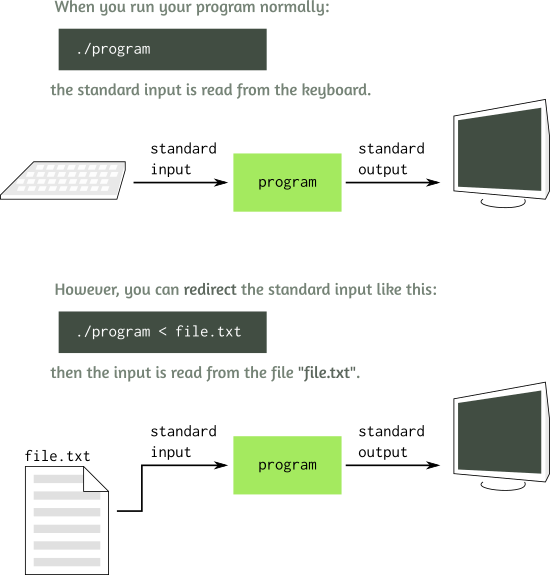

---  
layout: myDefault
title: PROJECT 1
---   

# Project 1: The Corn Maze Problem --- Streams

_**Welcome students! Fall is upon us and there is no better time to get lost in a corn maze with your friends. Grab a soda pop and some funnel cake because it will take a while... Uh, wait a minute. The maze isn't ready yet? Huh. Well, the boss just told me that if you help them set it up and host, they will pay you with some grade points... I don't know what that means but it seems good I guess. Oh well, good luck!**_


We have learned how to read user input from keyboard, and we will learn how to use file streams to read data from files.

However, there is another simpler way to read data from a file – using a feature of Unix shell called standard input redirection. We are going to use it in this assignment.

You will create a program that takes in a given maze and streaming in possible traversals, will check if any of the inputs solves the maze.

## Introduction




In Unix, if we run the program as follows:

```./program < myfile.txt```

Every time you read from cin, such as in this statement

```cin >> x;```

the value `x` is read not from the keyboard, but from the text file `myfile.txt` you specified. Isn’t it neat? It is called file redirection. The text from the file is redirected character by character as the standard input for your program.

To read the full contents of the file word by word, you can write a program:

```
#include <iostream>
using namespace std;
int main() {
    string s;
    while(cin >> s) { // While the reading operation is a success
        cout << s << endl;  // print the read word
    }
}
```

It relies on the fact that the expression `cin >> s` does not only read a string into the variable `s`, but also itself evaluates to `true`, if the reading operation was a success, and to `false`, if it was a failure. Practically, it means that **when the program reaches the end of the file**, the operation `cin >> s` fails to read anything from the file, evaluating to `false` and indicating that the loop should stop.

---

### Implementation:


**Work incrementally!** Work through the tasks sequentially (implement and test). Only move on to a task when you are positive that the previous one has been completed correctly. Remember that the **function prototypes must be exactly as specified in this project specification**. This is a contract, it gives you all the information necessary to complete this assignment correctly. If you don't understand this project specification and its requirements, ask for clarification before you proceed. _Remember to make parameters read-only when appropriate._

---

## Task 1: Reading in directions


Create a file called `direction_reader.cpp` that reads a sequence of letters from `cin`
and prints out its corresponding direction.

- 'R': go Right of the current location
- 'L': go Left of the current location
- 'U': go Up from the current location
- 'D': go Down from the current location

Example

If you have a file `movement.txt` that contains:

```
R R G Q D L T L U R
```

Then if you redirect it into the program, it should report:

```
$ ./maze_setup < movement.txt
Right
Right
Down
Left
Left
Up
Right
```

---

## Task 2: Stepping in


Create a file called `maze_runner.cpp` that will implement the two sub-tasks below:

### Sub-Task A) Initializing the map

Add the following code as the maze that will be traversed (This is a 2-dimensional array).

```
int maze[6][6] = {
   1,0,1,1,1,1,
   1,0,0,0,1,1,
   1,0,1,0,0,1,
   1,0,1,0,1,1,
   1,0,0,0,0,0,
   1,1,1,1,1,1
};
```

Please note that the **start** to the maze is at `row 0, column 1` and the exit is at `row 4, column 5`.


### Sub-Task B) Don't get lost!

With the maze being provided, we want to stream in a list of directions as to determine whether or not it correctly
traverses the maze.

Imagine you have a `directions.txt` with the list of directions as follows:

```
D W R R D R H
```

If you redirect the file into your program, it should compute and print the answer:

```
$ ./maze_runner < directions.txt
You are stuck in the maze.
```

It may sound tricky, but it is actually easy to write such a program, and you already know all the needed tools. Just think carefully how to put it all together.

Specifically, write a program `maze_runner.cpp` that reads from the `cin` a sequence of one or more letters and treat it as a list of directions that take you through the maze array to see whether or not you exit the maze at the correct location or not. Space characters can be anywhere in the input. After the input ends (end-of-file is reached), the program should compute and print the result of the input summation.

#### Possible input for your program may look like this:

- ```D D L```

- ```D DD DR RRR```

- ```    D R R DR DDLDD   RR ```

(Each of the inputs above is a separate file containing one single list of instructions, even if it spans multiple lines.) 

#### The corresponding outputs should be: 

- ```You are stuck in the maze.```

- ```You got out of the maze.```

- ```You got out of the maze.```

---

## Task 3: Open to the public


Write a better version of the program called `maze_runner_plus.cpp` that can evaluate multiple direction lists.
Let’s use the semicolon symbol that must be used at the end of each direction in the input.

Assuming that the input file `multiple_directions.txt` looks as follows:

```
D D L R D D L R R U R R ;
D  RRRR ABLQPO D D L L R D V LL RRRR ;
D D D L CST
D D RRRR DD ;
```

When we run the program with that input, the output should evaluate all of the directions and 
print them each on its own line:

```
$ ./maze_runner_plus < multiple_directions.txt
You are stuck in the maze.
You got out of the maze.
You got out of the maze.
```

---

## Task 4: We've got a franchise on our hands


Write a program `maze_runner_modded.cpp` 
that can stream in a maze and set up the array then take in directions to see if they can traverse the custom maze.

The format for the maze will be as follows, and will always be a 10x10 size array:
```
Row 0 of maze
Row 1 of maze
...
Row 9 of maze

row column of starting location
row column of ending location
```

When reading input file `maze_and_directions.txt`:
```
1 1 1 1 1 1 1 1 1 1
0 0 1 0 0 0 1 0 0 1
1 0 1 0 1 0 1 1 0 1
1 0 0 0 1 0 0 0 0 1
1 1 1 0 1 1 1 0 1 1
1 1 0 0 0 1 0 0 0 1
1 1 1 1 0 0 0 1 0 1
1 0 0 0 0 1 0 1 1 1
1 0 1 1 0 1 0 0 0 1
1 0 1 1 1 1 1 1 1 1

1 0
9 1

;

R DDRR UU R R D D ;
R DDRRD D RDDLLLDD;
DRL RUDDRRDD LLLLL;
```

The program should report:

```
$ ./maze_runner_modded < maze_and_directions.txt
You are stuck in the maze.
You got out of the maze.
You are stuck in the maze.
```

## An additional note on how to test maze programs

In addition to writing your formulas into files, remember that your program still accepts the input from the keyboard (Hey, do you see the benefit of input redirection? The program can work great on both keyboard and file inputs!)

When typing the input from the keyboard, the key combination Ctrl+D emulates the End-of-file situation, telling the program that the input has ended.

So, you can test your program like this:

```
$ ./maze_runner
R R U D R <Enter> <Ctrl+D>
You are stuck in the maze.
```

(finalizing your input by pressing Enter and Ctrl+D).


