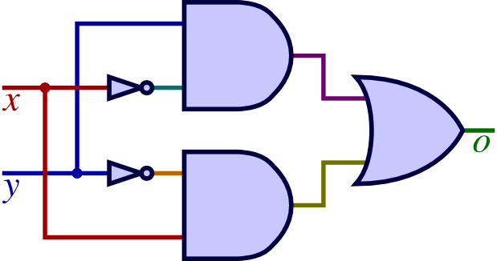

  
  
### CSCI 160&nbsp; &nbsp; &nbsp; &nbsp; &nbsp; &nbsp; &nbsp; &nbsp; &nbsp;  &nbsp; &nbsp; &nbsp; &nbsp;  &nbsp; &nbsp; &nbsp; &nbsp; &nbsp; &nbsp; &nbsp; &nbsp; &nbsp; &nbsp; &nbsp; MIDTERM EXAM &nbsp;&nbsp; &nbsp; &nbsp; &nbsp; &nbsp; &nbsp; EMPL ID: $$\huge{\boxed{\;\;}\boxed{\;\;}\boxed{\;\;}\boxed{\;\;}\boxed{\;\;}\boxed{\;\;}\boxed{\;\;}\boxed{\;\;}}$$   First Name:  $$\huge{\boxed{\;\;}\boxed{\;\;}\boxed{\;\;}\boxed{\;\;}\boxed{\;\;}\boxed{\;\;}\boxed{\;\;}\boxed{\;\;}\boxed{\;\;}\boxed{\;\;}}$$ &nbsp;&nbsp; &nbsp;  &nbsp;Last Name:  $$\huge{\boxed{\;\;}\boxed{\;\;}\boxed{\;\;}\boxed{\;\;}\boxed{\;\;}\boxed{\;\;}\boxed{\;\;}\boxed{\;\;}\boxed{\;\;}\boxed{\;\;}}$$

1\.  Consider the numbers $$M = 96_{10}$$ and $$N = 118_{10}$$.  
 &nbsp; 1 )  Convert them to base $$2$$ first,  
  
   
   
  
____________________________________________________________________________________________________________  
 &nbsp; 2 )  then perform $$M-N$$ using the $$(r-1)'s$$ complement representation subtraction algorithm.  
  
   
   
  
____________________________________________________________________________________________________________  
 &nbsp; 3 )  Finally, convert the result to base $$16$$.  
  
   
  
____________________________________________________________________________________________________________  
2\.  Given the equality: &nbsp; $$141_x = 3D_{16}$$ , &nbsp; determine the value of the radix $$x$$.  
  
   
   
  
____________________________________________________________________________________________________________  
3\.  Determine whether or not the Boolean NAND operator, that is defined by:
$$x \uparrow y = (xy)'$$
  
is COMMUTATIVE, and give boolean algebra justification.  
  
   
  
and whether or not it is ASSOCIATIVE, and give boolean algebra justification.  
  
   
   
  
____________________________________________________________________________________________________________  
4\.  Simplify the following boolean functions:  
  
 &nbsp; 1 )  $$ f = WXY'Z + W'XZ + WXYZ $$  
  
   
  
   
   
  
____________________________________________________________________________________________________________  
 &nbsp; 2 )  $$ f = ( ( A + C ) * ( A + B' ) * ( A' + B + C' ) )' $$  
  
   
  
   
   
  
____________________________________________________________________________________________________________  
5\.1 )  Represent the following circuit as a boolean function $$f(x,\, y)$$: {:width="240px"}{: style="float:right"}  
  
   
   
  
____________________________________________________________________________________________________________  
 &nbsp; 2 )  Draw the truth table for boolean function $$f()$$.  
  
   
   
  
____________________________________________________________________________________________________________  
 &nbsp; 3 )  What is another name for the operation that $$f()$$ computes?  Spell the two-, three-, or four-letter word from left to right in the boxes below:  
$$\huge{\boxed{\;\;}\boxed{\;\;}\boxed{\;\;}\boxed{\;\;}}$$
  
  
  
  
  
<table border="0px"><tr><td style="width:50%">
</td><td style="width:50%">
</td></tr></table>
