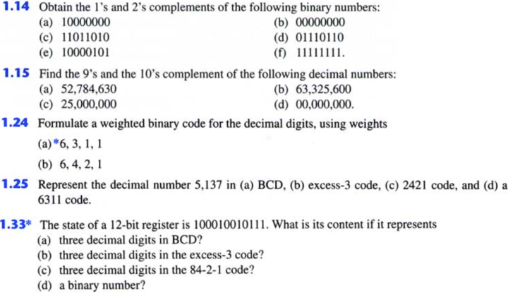

HOMEWORK 1  
  
1-1
Find a method similar to the remainder method for the integer numbers that applies to fractional numbers -- as in converting: &nbsp;$$0.379_{10} = 0.???_2$$&nbsp;  
  
1-2
Consider the two decimal numbers:  
&nbsp;$$M = 3892.74$$&nbsp;  
&nbsp;$$N = 9341.65$$&nbsp;  
Convert them to bases &nbsp;$$2$$&nbsp; and &nbsp;$$16$$ , and then add & subtract them in those bases.  
  
1-A
Which is the largest binary number that can be expressed with &nbsp;$$15$$&nbsp; bits?  
What are the equivalent decimal and hexadecimal numbers?  
  
1-B
Consider a system that contains &nbsp;$$32K$$&nbsp; bytes.  Assume that we are using byte addressing, that is each byte will need to have its own address, and therefore we will need &nbsp;$$32K$$&nbsp; different addresses.  For convenience all addresses will have the same number &nbsp;$$n$$&nbsp; of bits, and &nbsp;$$n$$&nbsp; should be as small as possible.  
What is the value of &nbsp;$$n$$ ?  
  
1-C
The numbers in each of the following equalities are all expressed in the same base &nbsp;$$r$$ .  Determine this radix (base) &nbsp;$$r$$&nbsp; in each case for the following operations to be correct:  
a) &nbsp;$$14 / 2 = 5$$&nbsp;  
b) &nbsp;$$54 / 4 = 13$$&nbsp;  
  
  
---  
  
  

HOMEWORK 2  
  
1 - 12  
Perform these binary multiplications:  
a) &nbsp;$$1101 * 1011$$&nbsp;  
b) &nbsp;$$0101 * 1010$$&nbsp;  
c) &nbsp;$$100111 * 011011$$&nbsp;  
  
1 - 14  
A limited number system uses base &nbsp;$$12$$ .  There are at most four integer digits.  The weights of the digits are &nbsp;$$12^3$$, &nbsp;$$12^2$$, &nbsp;$$12$$, and &nbsp;$$1$$ .  Special names are given to the weights of the digits as follows: &nbsp;$$12 = 1$$&nbsp; dozen, &nbsp;$$12^2 =$$&nbsp; gross, and &nbsp;$$12^3 = 1$$&nbsp; great gross.  
a) How many beverage companies are in &nbsp;$$6\;great\;gross\;+\;8\;gross\;+\;7\;dozen\;+\;4$$ ?  
b) Find the representation in base &nbsp;$$12$$&nbsp; for &nbsp;$$7569_{10}$$&nbsp; beverage cans.  
  
1 - 16  
In each of the following cases, determine the radix &nbsp;$$r$$ :  
a) &nbsp;$$BEE_r = 2699_{10}$$&nbsp;  
b) &nbsp;$$365_r = 194_{10}$$&nbsp;  
  
  
---  
  
  

HOMEWORK 3  
  
3 - 1  
Why does the &nbsp;$$1$$s complement subtraction algorithm work?  
  
3 - A  
Do the following conversion problems:  
a) Convert &nbsp;$$34.4375_{10}$$&nbsp; to binary.  
b) Calculate the binary equivalent of &nbsp;$$1/3$$&nbsp; to &nbsp;$$8$$&nbsp; binary places, enter the result, then, after converting back to decimal consider how close it is to &nbsp;$$1/3$$.  
c) Convert the binary result of b) to hexadecimal and enter result. Then convert the hexadecimal decimal and consider: is it the same as from binary?  
  
3 - B  
Determine the base &nbsp;$$x$$ ,&nbsp; if &nbsp;$$211_x = 152_8$$ .  
  
3 - C  
Noting that &nbsp;$$3^2 = 9$$, formulate a procedure to convert from base &nbsp;$$3$$&nbsp; to base &nbsp;$$9$$ .  Use it to convert &nbsp;$$2110201102220112_3$$&nbsp; to base &nbsp;$$9$$ .  

3 - D  
The solutions to the quadratic equasion &nbsp;$$x^2 - 11x + 22 = 0$$&nbsp; are &nbsp;$$x = 3$$&nbsp; and &nbsp;$$x = 6$$ . Determine the base of the numbers in the equasion.  

3 - E  
Convert the hexadecimal number &nbsp;$$68BE$$&nbsp; to binary, then convert it to octal, and then to base &nbsp;$$32$$ .  
  
  
---  
  
  

HOMEWORK 4  
  

  
  
---  
  
  

HOMEWORK 5  
  
1  
Solve the problem of independent switches for $$n = 4$$.  
Create a both the truth table and the 4D hypercube representations.  
  
2  
Write all axioms and properties for Boolean algebra sets:  
$$S = set$$, $$\space S \neq \varnothing$$  
$$(P(S), \symbfup\cup, \symbfup\cap, C, ), S)$$  
$$P(S)$$ is the set of all of subsets of $$S$$;  remember:  if $$S$$ has $$n$$ elements, then $$P(S)$$ has $$2^n$$.  
  
  
---  
  
  
  
  
  

