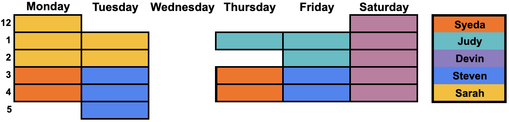

**[CSCI160 COMPUTER ARCHITECTURE I &nbsp;HUNTER COLLEGE CITY UNIVERSITY OF NEW YORK](index.html)**
**Spring 2024 &nbsp; &nbsp; Tuesday and Friday &nbsp; 11:30 PM to 12:45 PM &nbsp;&nbsp; IN PERSON in the Hunter West 615. However, in order to prepare for potential contigencies, several lectures throughout the semester will take place on BlackBoard Collaborate TBA**
[**SYLLABUS**](syllabus.html "CSCI 160 Computer Architecture I"){:target="_blank"}&nbsp; &nbsp; &nbsp; &nbsp; &nbsp; &nbsp; &nbsp; &nbsp; &nbsp; &nbsp; &nbsp; &nbsp; &nbsp; &nbsp; &nbsp; &nbsp; &nbsp; &nbsp; &nbsp; &nbsp; &nbsp; &nbsp; &nbsp; &nbsp; &nbsp; &nbsp; &nbsp; &nbsp; &nbsp; &nbsp; &nbsp; &nbsp; &nbsp; &nbsp; &nbsp; &nbsp; &nbsp; &nbsp; &nbsp; &nbsp; &nbsp;  
[**GRADESCOPE** [Entry Code: 4GEVV8]](https://www.gradescope.com/courses/723302 "CSCI 160 entry code 4GEVV8"){:target="_blank"}    
  
**INSTRUCTOR**  
**Genady Maryash** &nbsp; gmaryash@hunter.cuny.edu &nbsp; office hours TBD and by appointment 
  
**TEXTBOOK**  
[**Digital Design, 6th (or 5th) Edition eText**](https://www.pearson.com/store/p/mano-ciletti-digital-design-with-an-introduction-to-the-verilog-hdl-vhdl-and-systemverilog-6-e/3100003043990/9780137208333){:target="_blank"}, Mano, Ciletti ISBN-9780134529561. It can be purchased at a discounted price ($54.99) direct from the publisher through [**Vitalsource.com**](https://bookshelf.vitalsource.com/#/books/9780134529561/epubcfi/6/2%5B%3Bvnd.vst.idref%3Dcover%5D!/4/2%5Bvst-image-button-81818%5D%400:0){:target="_blank"} in order for the chapter links to work.  Do not buy any other electronic version of this edition of the book. Of course, you may be able to find prior editions of this book for less -- you will simply have to match the reading assignments to older edditions.  
  
**OTHER RESOURCES**  
[**Circuit Builder Simulator**](https://logic.ly/demo/){:target="_blank"} 
  
**TUTORS**

**Devin** [https://calendly.com/dewiin/devin-s-160-tutoring](https://calendly.com/dewiin/devin-s-160-tutoring){:target="_blank"}  
**Judy** [https://calendly.com/judy-liu94/tutoring?month=2024-02](https://calendly.com/judy-liu94/tutoring?month=2024-02){:target="_blank"}  
**Sarah** [https://calendly.com/sarahkhaldi-160/10min](https://calendly.com/sarahkhaldi-160/10min){:target="_blank"}  
**Steven** [calendly.com/steven-palomino/csci160-office-hours](https://calendly.com/steven-palomino/csci160-office-hours){:target="_blank"}  
**Syeda** [calendly.com/daniel-elkik26/160-office-hours](https://calendly.com/huntertutoring/160-ta-w-syeda){:target="_blank"}  
  
**COURSE OUTLINE**  
  
 DATE | TOPIC | READINGS | SLIDES | ASSIGNMENTS 
 :---: | :---: | --- | :---: | ---: 
 1/26 | Introduction | [Syllabus](syllabus.html){:target="_blank"} |  | [Homework&nbsp;0](hw.html#00){:target="_blank"}&nbsp;due&nbsp;1/30 
 1/30 | Binary Numbers | [1.2 Binary Numbers](https://bookshelf.vitalsource.com/#/books/9780134529561/epubcfi/6/18%5B%3Bvnd.vst.idref%3DP70010139700000000000000000001E8%5D!/4/6%400:0){:target="_blank"} | [Class 1](slides/class_01_introduction.pdf){:target="_blank"} | [Homework&nbsp;1](hw.html#01){:target="_blank"}&nbsp;due&nbsp;2/2 
 2/2 | Radix Conversions | [1.3 Number Base Conversions](https://bookshelf.vitalsource.com/#/books/9780134529561/epubcfi/6/20%5B%3Bvnd.vst.idref%3DP7001013970000000000000000000287%5D!/4/2%5BP7001013970000000000000000000287%5D/2/2%5BP700101397000000000000000000D390%5D/2%400:0){:target="_blank"} [1.4 Octal and Hexadecimal Numbers](https://bookshelf.vitalsource.com/#/books/9780134529561/epubcfi/6/22%5B%3Bvnd.vst.idref%3DP7001013970000000000000000000362%5D!/4/2%5BP7001013970000000000000000000362%5D/2/2%5BP700101397000000000000000000D45A%5D/2%400:0){:target="_blank"} | [Class 2](slides/class_2_conversions.pdf){:target="_blank"} | [**Binary&nbsp;Multiplication**](https://cdn1.byjus.com/wp-content/uploads/2019/04/binary-multiplication-steps.png){:target="_blank"} [**Div&nbsp;$$_{10}$$**](https://images.twinkl.co.uk/tr/raw/upload/u/ux/how-to-do-long-division-9_ver_1.jpg){:target="_blank"},&nbsp;[**Div&nbsp;$$_2$$**](https://cdn1.byjus.com/wp-content/uploads/2020/10/Binary-Division.png){:target="_blank"},&nbsp;[**Div&nbsp;$$_2$$&nbsp;2**](https://cdn1.byjus.com/wp-content/uploads/2020/10/Binary-Division-2.png){:target="_blank"} [Homework&nbsp;2](hw.html#02){:target="_blank"}&nbsp;due&nbsp;2/6 
 2/6 | Complements of Numbers | [1.5 Complements of Numbers](https://bookshelf.vitalsource.com/#/books/9780134529561/epubcfi/6/24%5B%3Bvnd.vst.idref%3DP7001013970000000000000000000411%5D!/4/2%5BP7001013970000000000000000000411%5D/2/2%5BP700101397000000000000000000D4FF%5D/2%400:0){:target="_blank"} [1.6 Signed Binary Numbers](https://bookshelf.vitalsource.com/#/books/9780134529561/epubcfi/6/26%5B%3Bvnd.vst.idref%3DP700101397000000000000000000048E%5D!/4/2%5BP700101397000000000000000000048E%5D/2/2%5BP700101397000000000000000000D563%5D/4%400:0){:target="_blank"} | [Class 3](slides/class_03_complements.pdf){:target="_blank"} | [Homework&nbsp;3](hw.html#03){:target="_blank"}&nbsp;due&nbsp;2/9 
 2/9 | Binary Codes | [1.7 Binary Codes](https://bookshelf.vitalsource.com/#/books/9780134529561/epubcfi/6/28%5B%3Bvnd.vst.idref%3DP7001013970000000000000000000594%5D!/4/2%5BP7001013970000000000000000000594%5D/2/2%5BP700101397000000000000000000D655%5D/4%400:0){:target="_blank"} [1.9 Binary Logic](https://bookshelf.vitalsource.com/#/books/9780134529561/epubcfi/6/32%5B%3Bvnd.vst.idref%3DP700101397000000000000000000090E%5D!/4/2%5BP700101397000000000000000000090E%5D/2/2%5BP700101397000000000000000000D9A7%5D/2%400:0){:target="_blank"} | [Class 4](slides/class_4_binary_codes.pdf){:target="_blank"} | [Homework&nbsp;4](hw.html#04){:target="_blank"}&nbsp;due&nbsp;2/13 

  
---   
    
    
---   
    
    
---   
    
    
---   
    
    
<!--  
    

  
-->
  

