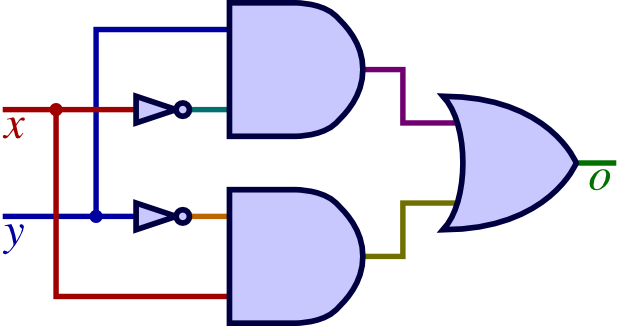

  

  
  
1.  Consider the numbers $$M = 306_{10}$$ and $$N = 238_{10}$$. Convert them to base $$2$$ first,
then perform $$M-N$$ using the $$(r-1)'s$$ complement representation subtraction algorithm for following values. Finally, convert the result to base $$16$$.  

  
  
  
  
2.  Find $$(r-1)'s$$ complement of the number $$2602_8$$. 
  
  
  
  
  
  
  
3.  Knowing that we have the equality:  
$$1C3_{x-2} = 2A_{16}$$  
determine the value of $$x$$.  
Hint: start by converting both sides to base 10.  
  
  
  
  
  
  
  
4.  Consider the following circuit:  
{:width="240px"}  
{:width="240px"}  
  
Draw the truth table for boolean function $$f()$$.  
  
  
  
  
Represent $$f()$$ as a boolean expression of $$x$$ and $$y$$.  
  
  
  
  
What is another name for the operation that $$f()$$ computes?  Spell the two-, three-, or four-letter word from left to right in the boxes below: 
$$\huge{\boxed{\;\;}\boxed{\;\;}\boxed{\;\;}\boxed{\;\;}}$$
  
  
  
  
  
  
5.  
Determine whether the Boolean NAND operator, that is defined by:
$$x \uparrow y = (xy)'$$
  
is COMMUTATIVE and give boolean algebra justification.  
  
  
  
  
  
is ASSOCIATIVE and give boolean algebra justification.  
  
    
  
  
  
6.  
Simplify the following boolean function:  $$f = (xz + (y + t)' + (xz)'y')'$$
  
  
  
  
  
  
  
<table border="0px"><tr><td style="width:50%">
</td><td style="width:50%">
</td></tr></table>
