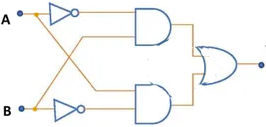

  
**CSCI 160 &nbsp; &nbsp; &nbsp; MIDTERM EXAM &nbsp; &nbsp; &nbsp; &nbsp; &nbsp; &nbsp; &nbsp; &nbsp;  &nbsp; &nbsp; &nbsp; &nbsp;  &nbsp; &nbsp; &nbsp; &nbsp; &nbsp; &nbsp; &nbsp; &nbsp; &nbsp; &nbsp; &nbsp; &nbsp; EMPLID: &nbsp;  $$\huge{\boxed{\;\;}\boxed{\;\;}\boxed{\;\;}\boxed{\;\;}\boxed{\;\;}\boxed{\;\;}\boxed{\;\;}\boxed{\;\;}}$$   First Name: &nbsp; $$\huge{\boxed{\;\;}\boxed{\;\;}\boxed{\;\;}\boxed{\;\;}\boxed{\;\;}\boxed{\;\;}\boxed{\;\;}\boxed{\;\;}\boxed{\;\;}\boxed{\;\;}}$$ &nbsp; &nbsp; &nbsp; Last Name: &nbsp; $$\huge{\boxed{\;\;}\boxed{\;\;}\boxed{\;\;}\boxed{\;\;}\boxed{\;\;}\boxed{\;\;}\boxed{\;\;}\boxed{\;\;}\boxed{\;\;}\boxed{\;\;}}$$**  
1\.1 )  Convert the numbers $$M = 87_{10}$$ and $$N = 43_{10}$$ to base $$2$$,  
  
   
   
  
____________________________________________________________________________________________________________  
 &nbsp; 2 )  then perform $$M-N$$ using the $$r's$$ complement representation subtraction algorithm.  
  
   
   
  
____________________________________________________________________________________________________________  
 &nbsp; 3 )  Finally, convert the result to base $$8$$.  
  
   
  
____________________________________________________________________________________________________________  
2\.  Given the equality: &nbsp; $$32_x = 27_8$$ , &nbsp; determine the value of the radix $$x$$.  
  
   
   
  
____________________________________________________________________________________________________________  
3\.1 )  Is Boolean NOR operator, defined by: $$x \downarrow y = (xy)'$$ COMMUTATIVE? Give BA justification.  
  
   
   
____________________________________________________________________________________________________________  
 &nbsp; 2 )  Is it ASSOCIATIVE? Give BA (boolean algebra) justification.  
  
   
 
  
4\.  Simplify the following boolean functions:  
 &nbsp; 1 )  $$ f = ( ( x + y' ) * ( x' + y + z' ) * ( x + z ))' $$
  
   
   
   
  
____________________________________________________________________________________________________________  
 &nbsp; 2 )  $$f = (AC + (B + C)' + (AC)'B')'$$
  
   
   
   
   
  
____________________________________________________________________________________________________________  
5\.1 )  Represent the following circuit as a boolean function $$f(A,\, B)$$, and simplify it:  
{:width="240px"}{: style="float:right"}  
   
  
  
  
____________________________________________________________________________________________________________  
 &nbsp; 2 )  Draw the truth table for boolean function $$f()$$.  
   
   
  
____________________________________________________________________________________________________________  
 &nbsp; 3 )  What is another name for the operation that $$f()$$ computes?  Spell the two-, three-, or four-letter word from left to right in the boxes below:  
$$\huge{\boxed{\;\;}\boxed{\;\;}\boxed{\;\;}\boxed{\;\;}}$$
