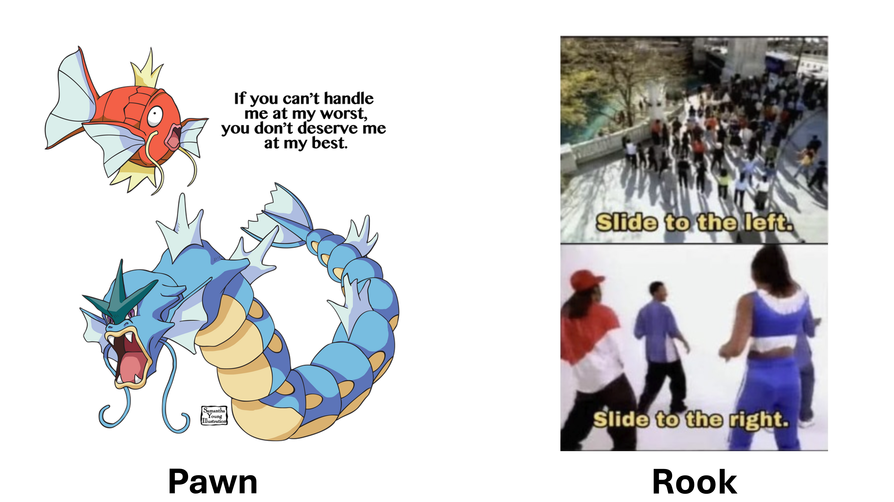

<!-- BEGIN PROJECT SPECS -->

# Algorithmic Adventures: The King's Gambit
<p align="center">
  
</p>

## Project 2: Boxing Up Our Pieces
This time, we'll be building on Inheritance & getting our feet wet with Abstract Data Types (ADTs).

**This project may get a little involved. Be sure you work incrementally and do *not* wait until the deadline to start.**

In this project you will:
1) Make some brief modifications to the `ChessPiece` base class and `Pawn` & `Rook` subclasses.
2) Implement the `ArrayBox` class, an ADT which supports storage of any class with `size()` & `getType()` functions. 
3) Implement the `ChessBox` class, containing two `ArrayBox` members that store `ChessPiece` objects, akin to one of them newfangled portable chess sets.

---
#### Additional Resources (if you need)
Abstract Data Types
* [Geeks for Geeks](https://www.geeksforgeeks.org/abstract-data-types/)
* [Neso Academy](https://www.geeksforgeeks.org/abstract-data-types/)

Template Classes
* [Geeks for Geeks](https://www.geeksforgeeks.org/templates-cpp/)
* [CPP Manual](https://cplusplus.com/doc/oldtutorial/templates/)
* [Tutorials Point](https://www.tutorialspoint.com/cplusplus/cpp_templates.htm)

---
### Before You Continue

Work through the tasks sequentially (implement and test). Only move on to a task when you are positive that the previous one has been completed correctly. 

#### Don't Forget!
1) Names of classes and methods must exactly match those in this specification
2) Functions that *do not* modify the object must be declared `const`
3) Document your code! The doc requirements still apply!

---

## Task 1: New Year, New Me: Updating `ChessPiece`, `Pawn`, & `Rook`

<p align="center">
  
</p>


Boot up your IDE of choice, we're coding now. 

### Part A: Modifying `ChessPiece`
First, we'll start by introducing some additional functionality into the `ChessPiece` base class.

#### New Private Members
Let's define the following private member variables:
```c++
int piece_size_;        // An integer representing the size of the current chess piece
std::string type_;      // A string representing the type of the current chess piece
```


#### Constructor Additions
Then, update its constructors to initialize these variables. *By the way, you should not be deleting anything, we're just adding additional functionality here.*

**Default Constructor**
```c++
/**
* @brief Default Constructor : All values 
* Default-initializes all private members.  
* Booleans are default-initialized to False. 
* Default color : "BLACK"
* Default row & columns: -1 (ie. represents that it has not been put on the board yet)
* Default piece_size: 0
* Default type: "NONE"
*/
ChessPiece
```

**Parameterized Constructor**
```c++
/**
* @brief Parameterized constructor.
* @param : A const reference to the color of the Chess Piece (a string). 
*          Set the color "BLACK" if the provided string contains 
*          non-alphabetic characters. If the string is purely alphabetic, 
*          it is converted and stored in uppercase.
*
* @param : The 0-indexed row position of the Chess Piece (as a const 
*          reference to an integer). Default value -1 if not provided, 
*          or if the value provided is outside the board's dimensions, 
*          [0, BOARD_LENGTH).
*
* @param : The 0-indexed column position of the Chess Piece (as a const 
*          reference to an integer). Default value -1 if not provided, 
*          or if the value provided is outside the board's dimensions, 
*          [0, BOARD_LENGTH).
*
* @param : A flag indicating whether the Chess Piece is moving up on the 
*          board, or not (as a const reference to a boolean). Default 
*          value false if not provided.

* ADDITIONS:
* @param : An integer representing the size of the current chess piece. 
*          Default value 0.
* @param : A string representing the type of the current chess piece. 
*          Default value "NONE".
*
*/
ChessPiece
```


#### Accessors & Mutators

Lastly, we define & implement their accessor & mutator functions for these members.

**This time we have a twist.** The getters will be `public`, as usual. 

**But the mutator functions will be `protected`.** In theory, a 'public' chess player can change the piece's row & column. They can't, however, shrink or expand the piece. That's why it will only be available inside the class & other subclasses like `Pawn` and `Rook`.

**Accessors**
*Remember these are `public`*
```c++
/**
* @brief Getter for the piece_size_ data member
* @return The integer value stored in piece_size_
*/
size

/**
* @brief Getter for the type_ data member
* @return The string value stored in type_
*/
getType
```

**Mutators**
*Remember these are `protected`*
```c++
/**
 * @brief Sets the size of the chess piece.
 * @param size An integer representing the new size of the chess piece.
 * @note This method does not validate pre-conditions 
 *       (e.g., checking for negative sizes).
 * @post The size_ member of the ChessPiece is overridden. No value is returned.
 */
setSize

/**
 * @brief Sets the type of the chess piece.
 * @param type A const reference to a string representing the new type of the chess piece 
 *      (e.g., "ROOK", "PAWN", "NONE").
 * @note This method does not validate pre-conditions 
 *      (e.g., checking for caps or symbols in the type string).
 * @post The type_ member of the ChessPiece is overridden. No value is returned.
 */
setType
```

---

### Part B: Modifying `Pawn` and `Rook`
Since we modified the `ChessPiece` base class constructors, we'll update the sizes & types of the `Pawn` and `Rook` class in their constructors.

**Pawn Additions** 
For clarity, we only include the modifications. This means that the function signatures remains the same, and you shouldn't be making changes to them.

```c++
/**
 * Default Constructor.
 * NOTE: All previous post conditions still apply.
 * 
 * ADDITIONS: 
 * 1) The piece_size_ member is set to 1
 * 2) The type member is set to "PAWN"
 */
Pawn

/**
* Parameterized constructor.
* NOTE: All previous parameters & post conditions still apply.
*
* ADDITIONS: 
* 1) The piece_size_ member is set to 1
* 2) The type member is set to "PAWN"
*/
Pawn
```

**Rook Additions**
```c++
/**
 * Default Constructor.
 * NOTE: All previous post conditions still apply.
 * 
 * ADDITIONS: 
 * 1) The piece_size_ member is set to 2
 * 2) The type member is set to "ROOK"
 */
Rook

/**
* Parameterized constructor.
* NOTE: All previous parameters & post conditions still apply.
*
* ADDITIONS: 
* 1) The piece_size_ member is set to 2
* 2) The type member is set to "ROOK"
*/
Rook
```
## Task 2: Hello Templates: Implementing the `ArrayBox` ADT.
We're going to step away from the chess bit for now and get down to implementing our first container and ADT. You've seen an `ArrayBag` before. Here's its little sibling `ArrayBox`.

The only difference is that instead of each index corresponding to some unique object,
given any object `Object` where `i = Object.size()`, our object will occupy `i` cells in the underlying array.

**Here's an example to make this a little more clear:**
Given the following pseudocode, and a capacity 8 `ArrayBox`:
```c++
ArrayBox<ChessPiece> box(capacity=8);
box.addItem(Pawn)   // Pawn size = 1
box.addItem(Rook)   // Rook size = 2
box.addItem(Queen)  // Queen size = 3
box.addItem(Pawn)   // Pawn size = 1
box.addItem(Rook)   // Rook size = 2
```

Our `ArrayBox` will look like the following, after all insertions, under the hood. 

```
PAWN ROOK ROOK QUEEN QUEEN QUEEN PAWN NONE
``` 

*Notice, the last insertion fails since we only have one space left, but `ROOK` occupies `2` spaces.*

### Part A: Setting Up Our Container

**Since ADTs can get complicated, we'll provide the `ArrayBox.hpp` file. All you need to do is implement the member functions as specified.**

Firstly, templates in C++ allow us to write generic and reusable code by letting the type of data be a parameter. In this project, we use a templated type `T` so that the `ArrayBox` class can work with any object type, such as integers, strings, or user-defined objects like chess pieces.

**For our purposes, we will assume that *any* class that we use, implements `size()` and `getType()` functions**

For example:
- If you define an `ArrayBox<T>`, it will hold objects of type `T`.
- If you define an `ArrayBox<ChessPiece>`, it will hold `ChessPiece` objects.

Here's how we've set things up:
1) Define the class as **`template <typename T> class ArrayBox`**.
2) We add **`#include "ArrayBox.cpp"`** statement at the bottom of the header file to include the implementation at runtime. **This is essential,** as we will not explicitly compile the `ArrayBox.cpp` when calling `g++`.

#### Private & Protected Member Variables
We start off by defining an `array` to contain our objects as a **`protected`** member. 
```c++
T* items_       // Dynamically allocated array to hold the elements.
```
Notice the use of `T*`, since we'll use a dynamically allocated array, whose objects are of whatever type our `ArrayBox` is instantiated to contain.

We also define the following **`private`** members:
```c++
int capacity_   // Represents the max number of spaces allocated to our array
int size_;      // Represents the number of spaces currently occupied in our array
```

#### Constructors 
Just like any class, we have constructors:
```c++
/**
* @brief Default constructor
* @post Initializes capacity_ to 64 and size_ to 0. 
*      Allocates a dynamic array for items_ of length equal to the capacity_. 
*/
ArrayBox

/**
* @brief Parameterized constructor
* @param capacity A const reference to an integer describing the maximum capacity of the items_ array.
*      If capacity is not positive (ie. <= 0), 64 is used instead.
* @post size_ is initialized to 0. items_ is initialized to a dynamically allocated array of length equal to 'capacity'
*/
ArrayBox
```

#### Basic Accessors
Since we don't want to be able to resize our `ArrayBox`, we *won't* provide any mutators for the `size` nor `capacity`. Instead, our future functions will modify `size` as elements are added and removed, but the **capacity will stay constant.**

We define the following `public` accessor methods:
```c++
/**
* Getter for the size member
* @return Returns the integer value stored in size_
*/
size

/**
* Getter for the capacity member
* @return Returns the integer value stored in capacity_
*/
capacity
```

### Part B: Adding Container Functionality
Now we're onto the real meat and potatoes, adding, removing and checking for values in our `ArrayBox`.

**Remember you should incrementally test your code, especially as you write this.**
*Pro Tip:* Try instantiating your own `ArrayBox<ChessPiece>`, and writing a `display()` function that visits each element of  `items_` and prints out their type. 

Trust me, it'll help you debug your code.

#### Implementating `addItem` and `remove`

```c++
/**
 * @brief Appends the parameter item to the `items_` array such that:
 *  1) There current size_ and target.size() is small enough 
 *      that the item can be added without exceeding the ArrayBox capacity_
 *  2) The target item takes up target.size() spaces at 
 *      starting at the leftmost non-occupied space
 * 
 * @param type A const reference to an item of type T, specifying the object to add
 * @return True if the add was successful. False otherwise.
 * @post Increment size_ if the item was added.
 * 
 * @example Given the following instructions, and a length 8 Object array:
        ArrayBox<ChessPiece> box(capacity=8);
        box.addItem(Pawn)   // Pawn size = 1
        box.addItem(Rook)   // Rook size = 2
        box.addItem(Queen)  // Queen size = 3
        box.addItem(Pawn)   // Pawn size = 1
        box.addItem(Rook)   // Rook size = 2
    
    Our `ArrayBox` will look like the following, 
    after all insertions, under the hood (assuming we print out the `type`).
        PAWN ROOK ROOK QUEEN QUEEN QUEEN PAWN NONE
        size = 7
    After this, when we tried addItem(Rook), the add would fail.
*/
addItem
```

```c++
/**
* @brief Removes the first instance in `items_` of an object whose `getType()` equals the parameter given
*      To maximize contiguous space available to add objects later, we shift 
*      all elements over by the size of the object we just removed.
*      
*      `size_` is also decremented by the size of the object we just removed.
* 
*      Instead of lazy-deletion, all values that are not counted as part of the valid subarray, ie. not from indices [0, size_)
*      are set to a default-initialized object
* 
*      If no object of the given type is found, nothing happens.
*  
* @param type A const reference to a string specifying the type of the object to remove
*
* @post Objects after the removed instance are shifted elements over by the size of the object we just removed
* 
* @return True if the remove operation was successfully performed. False otherwise.
* 
* @example Given the resuls from the previous example, 
*       Before: "PAWN ROOK ROOK QUEEN QUEEN QUEEN PAWN NONE"
*       After removing `QUEEN`: "PAWN ROOK ROOK PAWN NONE NONE NONE NONE"
*       where `null` = ChessPiece()
*/
remove
```

#### Implementing `getIndexOf`, `count`, & `contains`
Now that we have items in our `ArrayBox`, we want to know if we have any item of some specified type. The idea is that, if you're looking for a pawn to place on the board, it doesn't matter if it’s the first or second—a pawn's a pawn, and that's all we need.

So we don't need to access specific indices in our `ArrayBox`. Just like our `ArrayBag`.

**We'll have a `protected` function `getIndexOf()`, and two `public` members `count()` and `contains()`.**

We start off with `getIndexOf()` as a `protected` member, as public users need not know about the indices involved in our array.
```c++
/**
 *  @brief Searches a subarray of `items_` for an item of the given type. 
 *      Returns the *leftmost* index of the item if it is found within 
 *      the subarray from [start, end). Return -1 if not found.
 * 
 *  @param type A const reference to a string denoting the `type` of the object to search for
 *  @param start An integer representing the start of the subarray to search
 *  @param end An integer representing the end of the subarray to search (non-inclusive)
 * 
 *  @return Either the index target in the subarray within items_ as an integer
 *          or -1, if the subarray does not contain an object of that type
 * 
 *  @note [start, end) means we look at all values from index = start, up to but 
 *  not including index = end
 *  a) If `start` is negative or >= size_
 *  b) If `end` is negative or > size_
 *  c) If `start` >= `end`
    The search is fails to execute, and -1 is returned.
**/
getIndexOf
```

Then, we implement `count()` and `contains()` as `public` members:
*Hint: Use the previous function to make your life a little easier.*
```c++
/**
 * @brief Counts the number of distinct intances of the 
 *        given type within items_ from indices [0, size_)
 *        A singular instance of an object is the block of indices from [a, a + a.size())
 * 
 * @param type A const reference to a string denoting the type of the item to search for
 * @return An integer representing the number of 
 *         distinct instances of objects 
 *         whose `getType()` is equal to the parameter.
 * 
 * @example If given Pawn size = 1 and Queen size = 3 and an items_ array such as
 *       PAWN PAWN QUEEN QUEEN QUEEN NONE
 *       There are 2 instances of PAWN (since their size = 1, so they each only occupy one cell)
 *       There is 1 instance of QUEEN (since its size = 3, so one Queen will occupy three cells)
 */
count

/**
 * @param type A const reference to a string denoting the type of the item to search for
 * @return True if items_ contains an object whose getType() equals the given parameter
 */
contains
```

## Task 3: Putting the Pieces Away: Implementing the `ChessBox` class

<p align="center">
  
</p>


Now we'll put it all together and create the `ChessBox`, which has two `ArrayBox` members each containing `ChessPiece` objects of a specific color with one color per player in our little Chess game.

Really, we've done most of the heavy-lifting by implementing `ArrayBox`, so our work is just in calling the functions we've already made.

#### Private Members
You know the drill by now. Let's define our private member variables:
```c++
std::string P1_COLOR_           // A string representing the color of pieces used by Player 1
std::string P2_COLOR_           // A string representing the color of pieces used by Player 2
ArrayBox<ChessPiece> P1_BOX_    // A collection of pieces whose color is of P1_COLOR
ArrayBox<ChessPiece> P2_BOX_    // A collection of pieces whose color is of P2_COLOR
```

#### Constructors
Let's write the default and parameterized constructors.
```c++
/**
 * Default constructor
 * @post 
 *  1) Default initializes P1_COLOR_ to "BLACK" and P2_COLOR_ to "WHITE"
 *  2) Initializes ArrayBox members with capacity 64
 */
ChessBox

/**
 * Parameterized Constructor
 * @param color1 A const reference to the color of the ChessPiece (a string)
 * @param color2 A const reference to the color of the ChessPiece (a string)
 * 
 * @param capacity An integer describing the capacity of each player's ArrayBox, 
 *                 with default capacity 64.
 * 
 * @note If either color1 or color2 contains non-alphabetic characters, 
 *          set P1_COLOR_ to "BLACK" and P2_COLOR_ to "WHITE"
 *       
 *       If both strings are thus purely alphabetic, 
 *          they are transformed and stored in uppercase.
 *       Now, if the provided colors are equal, set color1 to "BLACK" and color2 to "WHITE"
 *
 *       If the specified capacity is not positive (ie. <= 0) or not provided, 
 *          64 is used instead.
 * 
 * Also note, there are NO default values for color1 or color2 (ie. we must specify them).
 * 
 * @post Initializes ArrayBox members with the specified capacity. 
 *       All strings are initialized as described above. 
 */
ChessBox
```

#### Adding Functionality to `ChessBox`
**1. Here we write the basic accessor members:**
```c++
/**
 * @brief Getter for P1_Color
 * @return The string value stored in P1_COLOR
 */
getP1Color

/**
 * @brief Getter for P2_Color
 * @return The string value stored in P2_COLOR
 */
getP2Color

/**
 * @brief Getter for P1_BOX
 * @return The ArrayBox<ChessPiece> (ie. the value) of P1_BOX_
 */
getP1Pieces

/**
 * @brief Getter for P2_BOX
 * @return The ArrayBox<ChessPiece> (ie. the value) of P2_BOX_
 */
getP2Pieces
```

**2. And now the add, remove, and contains operations.**

*Remember, we've already done the grunt-work when writing `ArrayBox`.* After all, you wrote the functions, so you may as well use them; that's the beauty of writing reusable ADTs.

```c++
/**
 * @brief Adds a given ChessPiece object to the ArrayBox corresponding to its color:
 *      - If the color of the given piece matches P1_COLOR_, add it to P1_BOX_
 *      - If the color of the given piece matches P2_COLOR_, add it to P2_BOX_
 *      - If the color does not match either box, or the corresponding box doesn't have
 *           enough remaining space to add the piece, the add operation fails.
 * 
 * @param piece A const reference to a ChessPiece object 
 *              that is to be added to one of the ArrayBoxes
 * 
 * @return True if the piece was added successfully. False otherwise.
 *
 */
addPiece

/**
 * @brief Removes a ChessPiece of the given type 
 *        if one exists in the ArrayBox corresponding to the given color
 * 
 * @param type A const reference to an uppercase string 
 *             representing the type of the ChessPiece to remove
 * @param color A const referene to an uppercase string 
 *             representing the color of the ChessPiece to remove
 * 
 * @return True if a piece is found and removed. False otherwise. 
 * @note Since we require `type` and `color` to be uppercase, you need not transform it.
 */
removePiece

/**
 * @brief Determines whether a ChessPiece of the given type 
 *        exists within the ArrayBox corresponding to the given color
 * 
 * @param type A const reference to an uppercase string 
 *             representing the type of the ChessPiece to find
 * @param color A const referene to an uppercase string 
 *              representing the color of the ChessPiece to find
 * 
 * @return True if a piece is contained within the correct ArrayBox. False otherwise. 
 * @note Since we require `type` and `color` to be uppercase, you need not transform it.
 */
contains
```

## Submission, Testing, & Debugging

<p align="center">
  
</p>

You will submit your solution to Gradescope via GitHub Classroom. The autograder will grade the following files:

```
1. ChessPiece.cpp
2. ChessPiece.hpp
3. Pawn.cpp
4. Pawn.hpp
5. Rook.cpp
6. Rook.hpp
7. ArrayBox.cpp
8. ArrayBox.hpp
9. ChessBox.cpp
10. ChessBox.hpp
```

Although Gradescope allows multiple submissions, it is not a platform for testing and/or debugging, and it should not be used for that purpose. You MUST test and debug your program locally. 

**To help prevent over-reliance on Gradescope for testing, only 5 submissions per day will be allowed.**

Before submitting to Gradescope, you MUST ensure that your program compiles using the provided Makefile and runs correctly on the Linux machines in the labs at Hunter College. This is your baseline—if it runs correctly there, it will run correctly on Gradescope. If it does not, you will have the necessary feedback (compiler error messages, debugger, or program output) to guide you in debugging, which you don’t have through Gradescope. “But it ran on my machine!” is not a valid argument for a submission that does not compile. Once you have done all the above, submit it to Gradescope.

### Testing: Compiling with the Included `Makefile`

*For your convenience, we've included a `Makefile`, which allows you to quickly re-compile your code, instead of writing `g++` over and over again. **It also ensures that your code is being compiled using the correct version of C++. And by correct one, we mean the one the auto-grader uses.***

In the terminal, in the same directory as your `Makefile` and your source files, you can use the following commands:

```bash
make # Compiles all recently modified files specified by the OBJs list
make clean # Removes all files ending in .o from your directory, ie. clears your folder of old code
make rebulild # Performs clean and make in one step
```

This assumes you did not rename the Makefile and that it is the only one in the current directory.

### Debugging
*Here are some quick tips, in case you run into the infamous "It compiles on my machine, but not on Gradescope"*
1) Ensure your filenames are correct (case-sensitive), and don't contain leading / trailing spaces 
2) Ensure that your function signatures are correct (ie. function name spelling, order/type of the parameters, return type). 
**This also includes `const` declarations. Remember, if a function does *not* modify the underlying object, it must be declared `const`.** 
3) Ensure that you include `ArrayBox.cpp` at the end of `ArrayBox.hpp`. Similarly, if you're compiling locally and it's not running, make sure you **don't** compile `ArrayBox.cpp` when writing the `g++` command (or just use our Makefile).

---

### Grading Rubric
- **Correctness:** 80% (distributed across unit testing of your submission)
- **Documentation:** 15%
- **Style and Design:** 5% (proper naming, modularity, and organization)

---

### Due Date
This project is **due on 3/4**.
*No late submission will be accepted.*

---

### Important Notes
You must start working on the projects as soon as they are assigned to detect any problems and to address them with us well before the deadline so that we have time to get back to you before the deadline.


**There will be no extensions and no negotiation about project grades after the submission deadline.**

---

### Additional Help

Help is available via drop-in tutoring in Lab 1001B (see Blackboard for schedule). You will be able to get help if you start early and go to the lab early. We only a finite number of UTAs in the lab; **the days leading up to the due date will be crowded and you may not be able to get much help then.**

Authors: Daniel Sooknanan, Georgina Woo, Prof. Maryash

Credit to Prof. Ligorio & Prof. Wole
