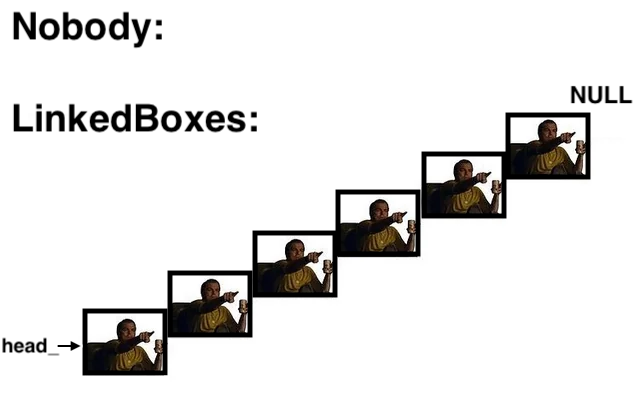
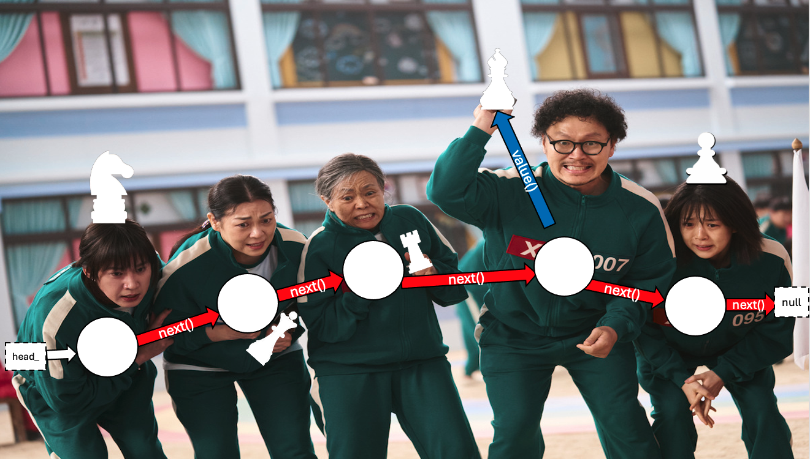

---  
layout: myDefault
title: PROJECT 3
---  

# PROJECT 3 &nbsp; Chaining Things Together

<p align="center">
  
</p>

This time, we'll be working with more ADTs & linked data structures, nothing too fancy!

In this project you will:
1) Implement the `LinkedBox` class, an ADT which supports storage of any class with `size()` & `getType()` functions. 
2) Modify the `ChessBox` class, altering the underlying structure used to store our pieces to use `LinkedBox` in lieu of `ArrayBox`

**The link to accept the GitHub Classroom assignment can be found** [here](https://classroom.github.com/a/Fw0RMUz5)

---
#### Additional Resources (if you need)
Abstract Data Types
* [Geeks for Geeks](https://www.geeksforgeeks.org/abstract-data-types/)
* [Neso Academy](https://www.geeksforgeeks.org/abstract-data-types/)

Template Classes
* [Geeks for Geeks](https://www.geeksforgeeks.org/templates-cpp/)
* [CPP Manual](https://cplusplus.com/doc/oldtutorial/templates/)
* [Tutorials Point](https://www.tutorialspoint.com/cplusplus/cpp_templates.htm)

Linked Data Types
* [Geeks for Geeks](https://www.geeksforgeeks.org/singly-linked-list-tutorial/)
* [freeCodeCamp](https://www.freecodecamp.org/news/what-is-a-linked-list-types-and-examples/)

---
### Before You Continue

Work through the tasks sequentially (implement and test). Only move on to a task when you are positive that the previous one has been completed correctly. 

**Notice, we also provide the `Node` class for you all to work with, saving you some headaches and keystrokes.**

#### Don't Forget!
1) Names of classes and methods must exactly match those in this specification
2) Functions that *do not* modify the object must be declared `const`
3) Document your code! The doc requirements still apply!

---

## Task 1: Link Up: Implementing the `LinkedBox` Class

<p align="center">
  
</p>

IDE? Check. Fingers warmed up? Check. Coffee? Check(mate). Let's begin!

### Part A: Setting Up Our Class
Create a templated class `LinkedBox` in `LinkedBox.hpp`. 

**Remember to include `LinkedBox.cpp` at the bottom of the `.hpp` file, so our `LinkedBox` can store different object types (eg. `LinkedBox<ChessPiece>` or `LinkedBox<MyObject>`, etc.)**

#### Member Variables
1) We'll define some private members: 
```c++
int size_          // Current size of the LinkedBox
int capacity_      // Maximum capacity of the LinkedBox (we don't have infinite space!)
```

2) And a protected member as well:
```c++
Node<T>* head_;     // The head of the LinkedBox chain
```

#### Constructor
You know the drill by now. We have some constructors for our class.

**Default Constructor**
```c++
/**
 * @brief Default constructor
 * @post Sets head_ to nullptr. 
 *       Initializes capacity_ to 64 and size_ to 0. 
 */
LinkedBox
```

**Parameterized Constructor**
```c++
/**
 * @brief Parameterized constructor
 * @param capacity A const reference to an integer to specify the capacity of the LinkedBox
 * @post Sets the head pointer to nullptr. 
 *       Initializes capacity_ to the specified parameter and size_ to 0. 
 * @note If the capacity is 0 or negative, 64 is used instead
 */
LinkedBox
```

#### Accessor Methods
We define & implement some simple accessor methods for our `private` members. 

Once we construct our box, we don't want to allow users to alter the `capacity`. Kind of like an actual box you might buy from the arts store; you're going to have to get real crafty to make it bigger or smaller. 

Similarly, it doesn't make sense for users to directly alter the `size` member, since its purely dependent on what our box is storing.

For that reason, we design our class to only have accessors for these members. 


**Accessors**
```c++
/**
 * @brief Getter for the size_ member
 * @return The integer value stored within the size_ member variable
 */
int size() const; 

/**
 * @brief Getter for the capacity_ member
 * @return The integer value stored within the capacity_ member variable
 */
int capacity() const;
```

---

### Part B: Adding Functionality
<small>Get it? Since we're adding `addItem`? No? Ok fine.</small>
Like last time, we'll add ways to add and remove items in our box, see whether we have an item, and if so, how many.

#### Adding & Removing

```c++
/**
 * @brief Appends the target item to the chain such that
 *      1) The current size_ and target.getSize() is small enough 
 *         that the item can be added without exceeding the LinkedBox capacity_
 *      2) A new Node whose value equals the target item is created 
 *         and inserted at the head (ie. at the front of the chain)
 * 
 * @param target A const reference to the item (of the templated type) to be added
 * 
 * @return True if the add was successful. False otherwise.
 * @post Increment size_ (if the item was added) by the size of the added object.
 * 
 * @example Given the following instructions, and a capacity 8 LinkedBox:
            addItem(Pawn)   // Pawn size = 1
            addItem(Rook)   // Rook size = 2
            addItem(Queen)  // Queen size = 3
            addItem(Pawn)   // Pawn size = 1
            addItem(Rook)   // Rook size = 2

            Our LinkedBox Chain will look like: 
            "PAWN(head)->QUEEN->ROOK->PAWN" (size = 7) after all insertions.

            Notice, since Rook is of size 2, the add fails, 
            as adding it would make our size exceed capacity 8.
    */
bool addItem(const T& target);

/**
 * @brief Removes the first Node in the chain whose value() 
 *      is an object with getType() [ie. the type] equals the stringified type specified
 * 
 *      If no object of the given type is found, the remove fails.
 *  
 * @param type A const reference to a string specifying the type of the object to remove
 * @post 1) The Node storing the object of the target type is de-allocated.
 *       2) The head_ (or next_ pointer) of the Node preceding the deleted Node is updated 
 *      
 * @return True if the remove operation was successfully performed. False otherwise.
 * @example Given a chain of the form: "PAWN(head)->ROOK->PAWN"
 *      If we remove an object whose type is a PAWN, we'll have "ROOK(head)->PAWN"
 *      Notice, we removed the *leftmost* instance.
 */
bool remove(const std::string& type);
```

#### Counting (Our Blessings)
And lastly, we want to know whether we have an object of a given type in our chain & if so, how many.

```c++
/**
 * @brief Determines whether the LinkedBox contains an item of the specified type
 * 
 * @param type A const reference to a string denoting 
 *        the type of the item to search for
 * 
 * @return True if items_ contains an object whose getType() 
 *         equals the given parameter. False otherwise.
 */
bool contains(const std::string& type) const;

/**
 * @brief Counts the number of distinct intances of the given type stored within the chain
 * 
 * @param type A const reference to a string denoting 
 *        the type of the item to search for
 * 
 * @return An integer representing the number of instances 
 *        of objects whose type is equal to the parameter.
 */
int count(const std::string& type) const;
```

## Task 2: Modifying the `ChessBox` Class
If you find yourself working on this for too long, *you're probably overthinking it.*

You should've noticed that the `LinkedBox` interface is strangely reminiscent of the `ArrayBox` interface (ie. the function signatures are the same).

**There's a reason for that.**

### Changing to `LinkedBox`
Modify the `ChessBox` interface (`ChessBox.hpp`) and the implementation (`ChessBox.cpp`), to work with `LinkedBox` instances instead of `ArrayBox` instances.

#### Constructors
```c++
/**
 * Default constructor
 * Default initializes P1_COLOR_ to "BLACK" and P2_COLOR_ to "WHITE"
 * Initializes LinkedBox members with capacity 64
 */
ChessBox

/**
 * Paramaterized Constructor
 * @param color1 A const reference to the color of the Chess Piece (a string)
 * @param color2 A const reference to the color of the Chess Piece (a string)
 * @param capacity An integer describing the 
 *                 capacity of each player's LinkedBox, with default capacity 64.
 * 
 * @note 1) If either color1 or color2 contains 
 *       non-alphabetic characters, set P1_COLOR_ to "BLACK" and P2_COLOR_ to "WHITE"
 *       2) Otherwise, if the string is purely alphabetic, 
 *          it is converted and stored in uppercase.* 
 *       3) However, if the are equal, set color1 to "BLACK" and color2 to "WHITE"
 *       4) If the specified capacity is not positive (ie. <= 0), 64 is used instead.
 * 
 * @post Initializes LinkedBox members with the specified capacity. 
 *       All strings are initialized as described above. 
 */
ChessBox
```

#### Accessors
```c++
/**
 * @brief Getter for P1_BOX
 * @return The LinkedBox<ChessPiece> (ie. the value) of P1_BOX_
 */
getP1Pieces

/**
 * @brief Getter for P2_BOX
 * @return The LinkedBox<ChessPiece> (ie. the value) of P2_BOX_
 */
getP2Pieces
```

#### Add, Remove, Contains
```c++
/**
 * @brief Adds a given ChessPiece object to the LinkedBox corresponding to its color:
 *      - If the color of the given piece matches P1_COLOR_, add it to P1_BOX_
 *      - If the color of the given piece matches P2_COLOR_, add it to P2_BOX_
 *      - If the color does not match either box, or the corresponding 
 *           box doesn't have enough remaining space to add the piece, 
 *           the add operation fails.
 * 
 * @param piece A const reference to a ChessPiece object that is to be added to one of the LinkedBoxes
 * @return True if the piece was added successfully. False otherwise.
 *
 */
addPiece

/**
 * @brief Removes a ChessPiece of the given type if one 
 *        exists in the LinkedBox corresponding to the given color
 * 
 * @param type A const reference to an uppercase string 
 *             representing the type of the ChessPiece to remove
 * @param color A const referene to an uppercase string 
 *              representing the color of the ChessPiece to remove
 * @return True if a piece is found and removed. False otherwise. 
 */
removePiece

/**
 * @brief Finds whether a ChessPiece of the given type exists within the LinkedBox corresponding to the given color
 * 
 * @param type A const reference to an uppercase string 
 *             representing the type of the ChessPiece to find
 * @param color A const referene to an uppercase string 
 *             representing the color of the ChessPiece to find
 * @return True if a piece is contained within the correct LinkedBox. False otherwise. 
 */
contains
```

## Submission, Testing, & Debugging

<p align="center">
  
</p>

You will submit your solution to Gradescope via GitHub Classroom. The autograder will grade the following files:

```
1. ChessBox.cpp
2. ChessBox.hpp
3. LinkedBox.cpp
4. LinkedBox.hpp
```

Although Gradescope allows multiple submissions, it is not a platform for testing and/or debugging, and it should not be used for that purpose. You MUST test and debug your program locally. 

**To help prevent over-reliance on Gradescope for testing, only 5 submissions per day will be allowed.**

Before submitting to Gradescope, you MUST ensure that your program compiles using the provided Makefile and runs correctly on the Linux machines in the labs at Hunter College. This is your baseline—if it runs correctly there, it will run correctly on Gradescope. If it does not, you will have the necessary feedback (compiler error messages, debugger, or program output) to guide you in debugging, which you don’t have through Gradescope. “But it ran on my machine!” is not a valid argument for a submission that does not compile. Once you have done all the above, submit it to Gradescope.

### Testing: Compiling with the Included `Makefile`

*For your convenience, we've included a `Makefile`, which allows you to quickly re-compile your code, instead of writing `g++` over and over again. **It also ensures that your code is being compiled using the correct version of C++. And by correct one, we mean the one the auto-grader uses.***

In the terminal, in the same directory as your `Makefile` and your source files, you can use the following commands:

```bash
make # Compiles all recently modified files specified by the OBJs list
make clean # Removes all files ending in .o from your directory, ie. clears your folder of old code
make rebulild # Performs clean and make in one step
```

This assumes you did not rename the Makefile and that it is the only one in the current directory.

### Debugging
*Here are some quick tips, in case you run into the infamous "It compiles on my machine, but not on Gradescope"*
1) Ensure your filenames are correct (case-sensitive), and don't contain leading / trailing spaces 
2) Ensure that your function signatures are correct (ie. function name spelling, order/type of the parameters, return type). 
**This also includes `const` declarations. Remember, if a function does *not* modify the underlying object, it must be declared `const`.** 
3) Ensure that you include `ArrayBox.cpp` at the end of `ArrayBox.hpp`. Similarly, if you're compiling locally and it's not running, make sure you **don't** compile `ArrayBox.cpp` when writing the `g++` command (or just use our Makefile).

---

### Grading Rubric
- **Correctness:** 80% (distributed across unit testing of your submission)
- **Documentation:** 15%
- **Style and Design:** 5% (proper naming, modularity, and organization)

---

### Due Date
This project is **due on  March 28 2025**.
*No late submission will be accepted.*

---

### Important Notes
You must start working on the projects as soon as they are assigned to detect any problems and to address them with us well before the deadline so that we have time to get back to you before the deadline.


**There will be no extensions and no negotiation about project grades after the submission deadline.**

---

### Additional Help

Help is available via drop-in tutoring in Lab 1001B (see Blackboard for schedule). You will be able to get help if you start early and go to the lab early. We only a finite number of UTAs in the lab; **the days leading up to the due date will be crowded and you may not be able to get much help then.**

Authors: Daniel Sooknanan, Georgina Woo, Prof. Maryash

Credit to Prof. Ligorio & Prof. Wole
