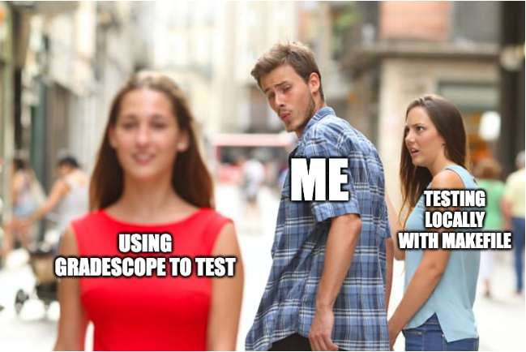

---  
layout: myDefault
title: PROJECT 5
---  

#  Backtracking to a Classic Problem

<p align="center">
  
</p>

Now we'll be delving into recursion, specifically recursive backtracking. Since we're playing chess, it's only natural that we tackle the N-Queens problem. 

In this project you will:
1) Modify the `ChessBoard` to include static functions that find *all* solutions the 8-Queens problem (as our board is an 8x8 board).
2) Implement functions within `Transform` namespace to help us transform board configurations
3) Group all solutions to the 8-Queens problem which are equivalent under rotation, horizontal, or vertical symmetry

**The link to accept the GitHub Classroom assignment can be found** [here](https://classroom.github.com/a/W5yezh9D)
---
#### Additional Resources (if you need)

---
### Before You Continue

You'll notice we have a lot of files in this project. So we've done some house-cleaning and organized them into folders.

The hierarchy you see stores the chess piece files neatly, with everything moved into a pieces folder for tidiness. Notice the `pieces_module.hpp`: a file that bundles all piece headers. By including this, we can include all these files, while only using *one* include statement. 

I'd encourage you to utilize when testing your code. We sure will when testing yours.\

**NOTE: Do *not* modify the include statements of any of the piece files. You should only place your code below the line denoting where your code should go. Especially *do not* include `ChessBoard` as you'll get circular importing errors.** 


---

### Task 1: Solving The 8-Queens Problem
When people say N-Queens, there's the tried-and-true way of marking occupied or threatened spaces to figure out where the place the next queen.

**But we're programmers. We like writing re-usable code. So we're not going to reinvent the wheel.**

1) Add this line of code to the public portion of your `ChessBoard.hpp` file:
```c++
// Alias for readability
typedef std::vector<std::vector<char>> CharacterBoard;
```
This is called **type-aliasing**.

Now whenever we write `CharacterBoard` in actuality, we'll mean `std::vector<std::vector<char>>`. 

It makes our code more readable, and less prone to errors when writing it. It's optional, but trust me, once you start working with lists of 2D vectors, it gets hard to read.

2) Now let's move on to solving 8-Queens. Define this wrapper function as a public member of `ChessBoard`.
```c++
/**
 * @brief Finds all possible solutions to the 8-queens problem.
 * 
 * @return A vector of CharacterBoard objects, 
 *         each representing a unique solution 
 *         to the 8-queens problem.
*/
static std::vector<CharacterBoard> findAllQueenPlacements();
```
<small>You could've written `std::vector<std::vector<std::vector<char>>>` as the return type; if you like that more then, hey, whatever helps you sleep at night. I'm not here to judge (but I am a little bit).</small> 

**Notice we declare this static.** This is because we don't need a specific instance of a `ChessBoard` to solve the problem. So when we want to invoke it, we use "`::`" the namespace resolution operator. No need to to tie it to a `ChessBoard` object.

```c++
std::vector<ChessBoard::CharacterBoard> result = ChessBoard::findAllQueenPlacements();
```

**Now, here's the catch.** To actually solve the 8-Queens problem, we'll be using `findAllQueenPlacements()` as a *wrapper* function. That means, it'll start the recursive process for a helper function that we'll define:

```c++
/**
 * @brief A STATIC helper function for recursively solving the 8-queens problem.
 * 
 * This function places queens column by column, checks for valid placements,
 * and stores all valid board configurations in the provided list.
 * 
 * @param col A const reference to aninteger representing the current column being processed.
 * @param board A (non-const) reference to a 2D vector of ChessPiece*, representing the current board configuration
 * @param placedQueens A (non-const) reference to a vector storing Queen*, which represents the queens we've placed so far
 * @param allBoards A (non-const) reference to a vector of CharacterBoard objects storing all the solutions we've found thus far
 */
queenHelper
```

We use **non-const** references, as this will allow us to modify our variables as they go (as well as save space, since we don't make a copy each time we call the function recursively).

#### Since this may be a little non-trivial, let's break down the steps:
1. **Base Case (All Queens Placed)**
   - We checks if 8 queens have been placed
   - If so, convert the current board state into a `CharacterBoard` and append the result to `allBoards`.
   - Return, since we've nothing else to do.

2. **Iterate Over Rows for Current Column & Check for Valid Spaces**
   - Loop through each row (`row`) in the current column (`col`) to try placing a queen.
   - Call `canMove` on each queen in `placedQueens` to determine if the square is safe (ie. if none of our Queens can move to the space, then we can place a Queen there).

3. **Place the Queen if Valid**
   - If the square is safe, dynamically allocate new `Queen` object and update the `board` with the queen at the current `(row, col)`.
   - Add the queen to the `placedQueens` vector.

4. **Recursive Call to Process the Next Column:**
   - Call `queenHelper` on the *next* column, but passing the same other parameters (ie. so each function call refers to the same objects), so we can attempt to place a queen in the next column.

5. **After Returning From `queenHelper` for the Next Column**
   - After the recursive call returns, we remove the most recently placed queen to explore alternate configurations. This means clearing the `Queen` from the board and de-allocating it.
   - At this point, our function should continue looping through the remaining rows (see step 2) to try the other (un-tried) squares in this column

Just set up the recursion in `findAllQueenPlacements` and you're done!

### Task 2: You Spin Me Right Round: Implementing `Transform` 
Now that we've found all the solutions to the 8-Queens problem, we're gonna step away from it for two seconds. You'll find out why soon. Just humor me for a bit, okay?

**We've already given you `Transform.hpp` and `Transform.cpp`. But thanks to the beauty of `Ctrl+C` & `Ctrl-V`, we'll have the declarations here for completeness:**

```c++
/**
 * @brief Rotates a square matrix 90 degrees clockwise.
 * @pre The input 2D vector must be square 
 *      (ie. the number of cells per row equals the number of columns)
 * 
 * @param matrix A const reference to a 2D vector of objects of type T
 * @return A new 2D vector representing the rotated matrix
 */
template <typename T>
std::vector<std::vector<T>> rotate(const std::vector<std::vector<T>>& matrix);

/**
 * @brief Swaps the elements of a square matrix across its vertical axis of symmetry
 * @pre The input 2D vector must be square 
 *      (ie. the number of cells per row equals the number of columns)
 * 
 * @param matrix A const reference to a 2D vector of objects of type T
 * @return A new 2D vector representing the transformed matrix
 */
template <typename T>
std::vector<std::vector<T>> flipAcrossVertical(const std::vector<std::vector<T>>& matrix);

/**
 * @brief Swaps the elements of a square matrix across its horizontal axis of symmetry
 * @pre The input 2D vector must be square 
 *      (ie. the number of cells per row equals the number of columns)
 * 
 * @param matrix A const reference to a 2D vector of objects of type T
 * @return A new 2D vector representing the transformed matrix
 */
template <typename T>
std::vector<std::vector<T>> flipAcrossHorizontal(const std::vector<std::vector<T>>& matrix);
```

We make these functiosn templated so we can support `int`, `string`, `ChessPiece*`, etc. That is, these routines should work for any 2D vector of objects <small>*with certain caveats, but you don't need to worry about that.</small>

**For Clarity**
* `Vertical Line of Symmetry` is the imaginary line dividing the matrix into two equal halves from left to right. Flipping swaps the left and right sides.
* `Horizontal Line of Symmetry` is the imaginary line dividing the matrix into two equal halves from top to bottom. Flipping swaps the top and bottom sides.

**Some examples, as well:**
Suppose we have some 2D vector of integers:
```c++
// Original Matrix (Example 3x3):
1 2 3
4 5 6
7 8 9
```
* Rotating by 90 clockwise we have:
```c++
7 4 1
8 5 2
9 6 3
```
* Flipping across the vertical line of symmetry:
```c++
3 2 1
6 5 4
9 8 7
```
* Flipping across the horizontal line of symmetry:
```c++
7 8 9
4 5 6
1 2 3
```

*Hint: you should use the examples to test your code.*

### Task 3: 
So here's the kicker. You know how there were *so* many solutions to the 8-Queens problem? Turns out they're not all special snowflakes. 

There's groups of them. If you rotate or flip a solution in some specific way, it'll end up being identical to another solution. So we'll make a function that groups those boards together:

```c++
/**
 * @brief Groups similar chessboard configurations by transformations.
 * 
 * This function organizes a list of chessboard configurations into groups of similar boards, 
 * where similarity is defined as being identical under a 
 *      1) Rotation (clockwise: 0°, 90°, 180°, 270°)
 *      2) Followed by a flip across the horizontal or vertical axis
 * 
 * @param boards A const ref. to a vector of `CharacterBoard` objects, each representing a chessboard configuration.
 * 
 * @return A 2D vector of `CharacterBoard` objects, 
 *         where each inner vector is a list of boards 
 *         that are transformations of each other.
 */
groupSimilarBoards
```
<small>I told you, the type alias at the beginning was useful. Unless you want `std::vector<std::vector<std::vector<std::vector<char>>>>`</small>

---

### Submission, Testing, & Debugging
<p align="center">
  
</p>

You will submit your solution to Gradescope. 

Seeing as we have a folder structure in our repo, we'll search your submission for the filenames listed below, so feel free to submit via GitHub repo OR just upload the files directly.

**Just make sure there's only copy of each filename in your ENTIRE repo / submission (ie. do NOT have more than one file named `ChessPiece.hpp`, no matter the location).**

The autograder will grade the following files:
```
1. ChessBoard.hpp
2. ChessBoard.cpp
3. Transform.hpp
4. Transform.cpp
```

**Once again, please do not modify the underlying file structure or import statements. You should only be modifying the provided files where specified.**

Although Gradescope allows multiple submissions, it is not a platform for testing and/or debugging, and it should not be used for that purpose. You MUST test and debug your program locally. 

**To help prevent over-reliance on Gradescope for testing, only 5 submissions per day will be allowed.**

Before submitting to Gradescope, you MUST ensure that your program compiles using the provided Makefile and runs correctly on the Linux machines in the labs at Hunter College. This is your baseline—if it runs correctly there, it will run correctly on Gradescope. If it does not, you will have the necessary feedback (compiler error messages, debugger, or program output) to guide you in debugging, which you don’t have through Gradescope. “But it ran on my machine!” is not a valid argument for a submission that does not compile. Once you have done all the above, submit it to Gradescope.

### Testing: Compiling with the Included `Makefile`

*For your convenience, we've included a `Makefile`, which allows you to quickly re-compile your code, instead of writing `g++` over and over again. **It also ensures that your code is being compiled using the correct version of C++. And by correct one, we mean the one the auto-grader uses.***

In the terminal, in the same directory as your `Makefile` and your source files, you can use the following commands:

```bash
make # Compiles all recently modified files specified by the OBJs list
make clean # Removes all files ending in .o from your directory, ie. clears your folder of old code
make rebulild # Performs clean and make in one step
```

This assumes you did not rename the Makefile and that it is the only one in the current directory.

### Debugging
*Here are some quick tips, in case you run into the infamous "It compiles on my machine, but not on Gradescope"*
1) Ensure your filenames are correct (case-sensitive), and don't contain leading / trailing spaces 
2) Ensure that your function signatures are correct (ie. function name spelling, order/type of the parameters, return type). 
**This also includes `const` declarations. Remember, if a function does *not* modify the underlying object, it must be declared `const`.** 

---

### Grading Rubric
- **Correctness:** 80% (distributed across unit testing of your submission)
- **Documentation:** 15%
- **Style and Design:** 5% (proper naming, modularity, and organization)

---

### Due Date
This project is **due on April 25 2025**.
*No late submission will be accepted.*

---

### Important Notes
You must start working on the projects as soon as they are assigned to detect any problems and to address them with us well before the deadline so that we have time to get back to you before the deadline.


**There will be no extensions and no negotiation about project grades after the submission deadline.**

---

### Additional Help

Help is available via drop-in tutoring in Lab 1001B (see Blackboard for schedule). You will be able to get help if you start early and go to the lab early. We only a finite number of UTAs in the lab; **the days leading up to the due date will be crowded and you may not be able to get much help then.**

Authors: Daniel Sooknanan, Georgina Woo, Prof. Maryash

Credit to Prof. Ligorio & Prof. Wole
