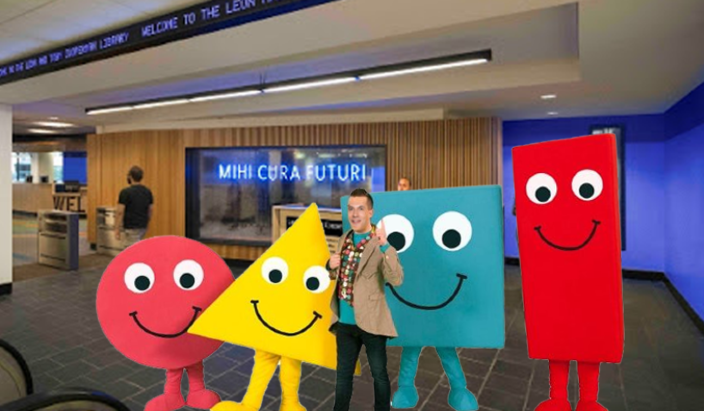
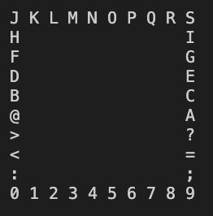

# Project 4:&nbsp; *Shapetography*, The Science of Shapes


Your objective for this project is to implement an abstract parent `Shape` class and its polymorphic children `Circle`, `Rectangle`, and `Triangle`. `Shape` is a 2D character array which requires the use of dynamic memory allocation, and its children are their eponymous shapes held character-by-character within that 2D array. Additionally, each shape is represented by its perimeter populated by ASCII characters within the range [48, 126] in order, and character choice from this range wraps around back to 48 when 127 is reached. In order to successfully complete this project, you **must** understand the prerequisite material from the previous projects, and you **must** understand the concepts of 2D arrays, abstract classes, polymorphism, and basic shape manipulations. 

---
### Some additional resources
- 2D Array:  
    [Geek for Geeks 2D array](https://www.geeksforgeeks.org/multidimensional-arrays-c-cpp/)  
    [Learn CPP Multidimensional Pointers](https://www.learncpp.com/cpp-tutorial/pointers-to-pointers/)  
    [Dynamically Allocate 2D arrays](https://www.geeksforgeeks.org/how-to-declare-a-2d-array-dynamically-in-c-using-new-operator/)
- Abstract Classes:  
    [Pure Virtual and Abstract Classes](https://www.geeksforgeeks.org/pure-virtual-functions-and-abstract-classes/)
- Polymorphism:  
    [Polymorphism Inheritance](https://www.geeksforgeeks.org/polymorphism-in-c/)
- ASCII Table:  
    [ASCII Table Reference](https://en.cppreference.com/w/cpp/language/ascii)
    

---

### Implementation
**Work incrementally!** Work through the tasks sequentially (implement and test). Only move on to a task when you are positive that the previous one has been completed correctly. Remember that the names of function prototypes and member variables must exactly match those declared in the respective header file when implementing a class.

---
## Task 1 
Define and implement the abstract class `Shape`, which contains the following methods:

```
        // Parameterized Constructor; there is no default constructor
        Shape(const int &width, const int &height);

        // Getters
        int getEdges();
        int getWidth();
        int getHeight();
        char **getDisplayChars();
        
        // Setters
        void setEdges(const int& edges); 
        void setWidth(const int& new_width);
        void setHeight(const int &new_height);
        void setDisplayChars(char **display);

        // Mutators
        void rotateRight();         //rotate by 90 degrees
        void rotateLeft();          //rotate by 90 degrees
        void reflect(char axis);    //reflect over x or y axis
        
        // Pure Virtual Methods (no implementation)
        virtual double getSurfaceArea() = 0;                   
        virtual double get3DVolume(const double& depth) = 0;    

        // Display - //iterate through 2D array and print chars
        void display();                                         
```

**Note:** 
- `reflect()` takes the parameter `'x'` or `'y'`.
- `getSurfaceArea()` uses the canonical formulae for surface area given each respective shape.
- `get3DVolume()` yields the volume of the caller shape if it was projected into 3 dimensions using the depth parameter as the z-axis value. For a circle, this function yields the volume of the related sphere. For a rectangle, this function yields the volume of the related rectangular cuboid. For a triangle, this function yields the volume of the related right triangular prism, since `Triangle` only considers right triangles. Use the canonical formulae for volume given each respective surface.

---

## Task 2 
Define and implement a class `Circle` that inherits from Shape and implements its pure virtual functions. The `Circle` class must contain the following methods: 
```
    //Parameterized contructor: takes diameter as width or height. 
    Circle(const int& diameter);

    double getSurfaceArea();                        
    double get3DVolume(const double& depth);        

```

As a freebie, here is the constructor:

```
Circle::Circle(const int &diameter) : Shape(diameter, diameter)
{
    setEdges(0);

    // Populate 2D array with empty chars
    char **arr = new char *[getHeight()];
    for (int row = 0; row < getHeight(); row++)
    {
        arr[row] = new char[getWidth()];
        for (int col = 0; col < getWidth(); col++)
        {
            arr[row][col] = ' ';
        }
    }

    // Populate the proper positions with *'s
    int x_radius = diameter / 2;
    int y_radius = (diameter / 2) - 1;
    float dist = 0;
    char ascii_counter = 48;

    for (int col = 0; col <= getWidth() + 1; col++)
    {
        for (int row = 0; row <= getHeight() + 5; row++)
        {
            dist = sqrt((row - y_radius) * (row - y_radius) +
                        (col - x_radius) * (col - x_radius));

            // dist in range: (radius - 0.5) to (radius + 0.5)
            if (dist > y_radius - 0.5 && dist < y_radius + 0.5)
            {
                arr[row][col] = ascii_counter;

                // fix ascii_counter to wrap around after
                ascii_counter++;
                if (ascii_counter > 126)
                {
                    ascii_counter = 48;
                }
            }
        }
    }
    setDisplayChars(arr);
}

```

- what `display()` yields for a `Circle` of diameter 10:  

    

- what `display()` yields after `rotateRight()` for this circle:  

    

- what `display()` yields after `rotateLeft()` for this circle:  

    

- what `display()` yields after `reflect('x')` for this circle:  

    

- what `display()` yields after `reflect('y')` for this circle:  

    

---
## Task 3 &nbsp; IMPLEMENT RECTANGLE
Define and implement a class 'Rectangle' that inherits from Shape and implements its pure virtual functions. The 'Rectangle' class must contain the following methods:
 ```
    /* Parameterized constructor; takes in width and height, 
       iterates through the 2D array to populate it with 
       the necessary characters given the parameter dimensions */
    Rectangle(const int& width, const int& height);  

    double getSurfaceArea();                        
    double get3DVolume(const double &depth);      
 
 ```

 * what `display()` yields for a `Rectangle` of dimensions 10x10:

- what `display()` yields after `rotateRight()` for this rectangle:

- what `display()` yields after `rotateLeft()` for this rectangle:

- what `display()` yields after `reflect('x')` for this rectangle:

- what `display()` yields after `reflect('y')` for this rectangle:

---

## Task 4 &nbsp; IMPLEMENT TRIANGLE
Define and implement a class `Triangle` that inherits from Shape and implements its pure virtual functions. The `Triangle` class must contain the following methods:

```
    /* Parameterized constructor; takes in side length as a parameter, iterates 
    through the 2D array to draw the right triangle using ASCII chars */
    Triangle(const int &side);                      

    double getSurfaceArea();                       
    double get3DVolume(const double &depth);       
 
 ```

* what `display()` yields for a `Triangle` of side length 10:

  &nbsp;

*  what `display()` yields after `rotateRight()` for this triangle:

  &nbsp;
  
*  what `display()` yields after `rotateLeft()` for this triangle:

  &nbsp;


* what `display()` yields after `reflect('x')` for this triangle:

  &nbsp;


*  what `display()` yields after `reflect('y')` for this triangle:


### Testing
You must always implement and test you programs **INCREMENTALLY!!!**
What does this mean? Implement and test one method at a time.
**For each class**
- Implement one function/method and test it thoroughly (multiple test cases + edge cases if applicable).
- Implement the next function/method and test in the same fashion.
**How do you do this?** Write your own `main()` function to test your classes. In this course you will never submit your test program, but you must always write one to test your classes. Choose the order in which you implement your methods so that you can test incrementally: i.e. implement mutator functions before accessor functions. Sometimes functions depend on one another. If you need to use a function you have not yet implemented, you can use stubs: a dummy implementation that always returns a single value for testing Don’t forget to go back and implement the stub!!! If you put the word STUB in a comment, some editors will make it more visible.

### Grading Rubric
**Correctness 80%** (distributed across unit testing of your submission)
**Documentation 10%**
**Style and Design 10%** (proper naming, modularity, and organization)

**Important:** You must start working on the projects as soon as they are assigned to detect any problems with submitting your code and to address them with us **well before** the deadline so that we have time to get back to you **before** the deadline. This means that you must submit and resubmit your project code **early** and **often** in order to resolve any issues that might come up **before** the project deadline.
##### There will be no negotiation about project grades after the submission deadline. #####
  
### Submission:
You will submit **the following files**:
`Shape.hpp`
`Shape.cpp`
`Circle.hpp`
`Circle.cpp`
`Rectangle.hpp`
`Rectangle.cpp`
`Triangle.hpp`
`Triangle.cpp`

Your project must be submitted on Gradescope. Although Gradescope allows multiple submissions, it is not a platform for testing and/or debugging and it should not be used for that. You MUST test and debug your program locally. Before submitting to Gradescope you MUST ensure that your program compiles (with g++) and runs correctly on the Linux machines in the labs at Hunter (see detailed instructions on how to upload, compile and run your files in the “Programming Rules” document). That is your baseline, if it runs correctly there it will run correctly on Gradescope, and if it does not, you will have the necessary feedback (compiler error messages, debugger or program output) to guide you in debugging, which you don’t have through Gradescope. “But it ran on my machine!” is not a valid argument for a submission that does not compile. Once you have done all the above you submit it to Gradescope.
