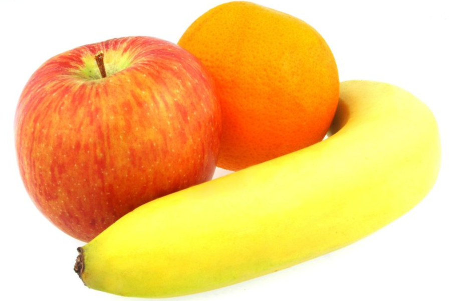

---  
layout: myDefault  
title: PROJECT 1  
---  

# Project 1: &nbsp; Inheritance
  
Your objective for this project is to implement an OOP architecture for cataloging produce using inheritance. You will use separate compilation with g++ to link multiple classes into one executable. In order to successfully complete this project, you must understand multi-file compilation, #includes, basic inheritance, namespaces, enums, and basic file I/O. If you are not absolutely comfortable with all of this, please seek help immediately: contact me or our UTA, Nigel.

## Here are some additional resources:

### Multi-File Compilation
https://www.cs.fsu.edu/ myers/c++/notes/compilation.html  
https://stackoverflow.com/questions/3202136/using-g-to-compile-multiple-cpp-and-h-files

### Includes
http://www.cplusplus.com/forum/articles/10627/

### Basic Inheritance
https://www.learncpp.com/cpp-tutorial/112-basic-inheritance-in-c/  

### Namespaces
http://www.cplusplus.com/doc/oldtutorial/namespaces/  
https://www.tutorialspoint.com/cplusplus/cpp namespaces.htm

### Enums
https://www.geeksforgeeks.org/enumerated-types-or-enums-in-c  
https://docs.microsoft.com/en-us/cpp/cpp/enumerations-cpp?view=vs-2019

### Basic File I/O
https://www.geeksforgeeks.org/basic-input-output-c/

### Implementation
You must separate the interface from the implementation, and thus the contents of each class’s respective `.hpp` and `.cpp` file are different. Implement this project’s classes based on the following specifications (FUNCTION PROTOTYPES AND MEMBER VARIABLE NAMES MUST MATCH EXACTLY). This project consists mostly of accessor functions. Recall that accessor functions are used to access private data members, and they simply return the member that they access.

## Task 1
Modify the file, `Produce.hpp`, to define the class Produce. Then, implement it. Produce must contain the following attributes:
```
class Produce public members:
      Produce(const std::string& in file)
      std::string getName() const
      double getWeight() const
      double getPricePerPound() const
      bool getOrganic() const
      bool getPrePackaged() const
      int getRipeness() const
      int getCondition() const
      std::string getRipenessStr() const
      std::string getConditionStr() const
      
class Produce private members:
      std::string name
      double weight
      double price_per_pound
      bool is_organic
      bool is_pre_packaged
      int ripeness
      int condition
```
### Notes & Suggestions
- The parameterized constructor must read in files of the format provided (see Test Data folder) and construct Produce objects given the data in that file.
- getRipenessStr() and getConditionStr() must return the lowercase string name of the private member to which they respectively correspond.

## Task 2
Define and implement two child classes of Produce, Fruit and Vegetables. The Fruit class must contain the following attributes:
```
class Fruit public members:
      Fruit(const std::string &in file)
      bool getPitted()
      bool getPeelableSkin()
      bool getRind()
      bool getEdibleSeeds()
      
class Fruit private members:
      bool is_pitted
      bool has_peelable_skin
      bool has_rind
      bool has_edible_seed
``` 
The Vegetable class must contain the following attributes:
```
class Vegetable public members:  
      Vegetable(const std::string &in file)
      string getVeggieType()
      
class Vegetable public members: 
      int veggie type
```
### Notes & Suggestions
- The respective parameterized constructors for both the Fruit and Vegatable classes must also read in files of the format provided. As Fruit and Vegetable inherit from Produce, the Produce constructor should be called before any additional initialization.  
- The Vegetable class requires you to define an enum that corresponds to vegetable type prior to the definition of the Vegetable class. It is good practice to do so in a namespace. Follow this example:
```
namespace categories
{
   enum VegieCategories
   {
      ALLIUM = 0;
      CRUCIFEROUS = 1;
      EDIBLE_STEM = 2;
      LEAFY_GREEN = 3;
      LEGUME = 4;
      MARROW = 5;
      ROOT = 6;
   };
}
```
- `getVeggieType()` must return the lowercase string name of the type of vegetable to which veggie type corresponds.

## Task 3
In a file entitled `Solution.cpp`, define namespace `solution: { ... }` that contains a method called `std::string shouldIBuyThis(Produce * product)`, which, given an arbitrary Produce, Fruit, or Vegetable object, returns a message that, depending upon the ripeness and condition of that item, tells you whether to purchase it.  
  
The following strings correspond to the expected return values of `shouldIBuyThis()`:  
  
”Yes, you should buy this <product name> because it is <product ripeness> and <product condition>”.
This should be returned under the condition that the item is either ripe and undamaged or underripe and undamaged.  
    
”It is not the best idea to buy this <product name> because it is <product ripeness> and <product condition>".  
This should be returned under the condition that the item is either ripe and damaged or underripe and damaged.  
  
”No, you should not buy this<product name> because it is <product ripeness> and <product condition>”.  
This should be returned under the condition that the item is either overripe and undamaged or overripe and damaged. 
      
### Testing
How to compile:  
`g++ Vegetable.cpp Produce.cpp Fruit.cpp <main file> -std=c++17`  
  
How to test `shouldIBuyThis()` in your main file:  
`Produce *product = new Fruit(<in file>);` 
`std::cout << solution::shouldIBuyThis(product) << std::endl;`  
  
You must always implement and test you programs INCREMENTALLY!!!  
What does this mean? Implement and test one method at a time.  
  
For each class:
- Implement one function/method and test it thoroughly (multiple test cases + edge cases if
applicable).  
- Implement the next function/method and test in the same fashion.  
  
How do you do this?  
  
Write your own `main()` function to test your classes. In this course you will never submit your test
program, but you must always write one to test your classes. Choose the order in which you implement
your methods so that you can test incrementally (i.e. implement mutator functions before accessor
functions). Sometimes functions depend on one another. If you need to use a function you have not yet
implemented, you can use stubs: a dummy implementation that always returns a single value for testing.  
However, don’t forget to go back and implement the stub!!! If you put the word STUB in a comment, some editors
will make it more visible.

### Grading Rubrics
- Correctness 80% (distributed across unit testing of your submission). A submission that implements all required classes and/or functions but does not compile will receive 40 points total (including documentation and design).
- Documentation 10%
- Style and Design 10% (proper naming, modularity, and organization)

### Submission
You will submit the following files:
- `Solution.cpp`
- `Produce.hpp`
- `Produce.cpp`
- `Fruit.cpp`
- `Fruit.hpp`
- `Vegetable.cpp`
- `Vegetable.hpp`  
  
Your project must be submitted on Gradescope. Although Gradescope allows multiple submissions, it is not a platform for testing and/or debugging and it should not be used for that. You MUST test and debug your program locally. Before submitting to Gradescope you MUST ensure that your program compiles (with g++) and runs correctly on the Linux machines in the labs at Hunter (see detailed instructions on how to upload, compile and run your files in the “Programming Rules” document). That is your baseline, if it runs correctly there it will run correctly on Gradescope, and if it does not, you will have the necessary feedback (compiler error messages, debugger or program output) to guide you in debugging, which you don’t have through Gradescope. “But it ran on my machine!” is not a valid argument for a submission that does not compile. Once you have done all the above you submit it to Gradescope.  
  
    
  
