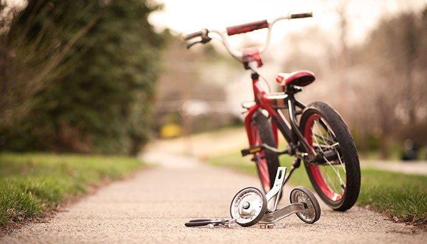
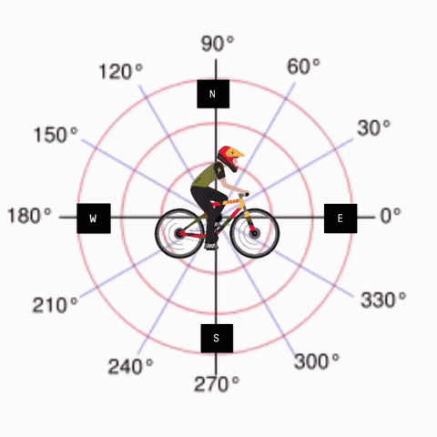

---  
layout: myDefault  
title: PROJECT 0  
---  

# Project 0 &nbsp; Taking off the Training Wheels  
  
  
The objective of this project is to refresh your knowledge of class objects and enums from CSCI 135. This will require you to implement a class, `Bicycle`, in addition to its private and public member functions, which will be specified in a further section of this document. In order to successfully complete this project, we strongly recommend that you look back to your CSCI 135 coursework as a reference.  

You are given [`Bicycle.hpp`](./Bicycle.hpp).  You must create and successfully write `Bicycle.cpp`.  

### Implementation
**Work incrementally!** Work through the tasks sequentially (implement and test). Only move on to a task when you are positive that the previous one has been completed correctly. Remember that the names of function prototypes and member variables must exactly match those declared in the respective header file when implementing a class. 

---
### **Task 1: Buying your very own Bicycle**
---
*Today is your first day of college, and the subways do not work! How will you reach class on time? Well, there is a bicycle shop two blocks from you. You enter the shop and ask the owner for a bicycle. He gives you two starter options:*

Implement the following default and parameterized constructors:

```
Bicycle();     // initialize all private members besides b_type,                      
               // curr_pedal_intensity_, and seat_height_ to 0;
               // b_type_ <- a random bike type
               // curr_pedal_intensity_ <- bike_details::NONE
               // seat_height_ <- 30


Bicycle(int kind_of_bike); // initialize all members besides b_type_ 
         //to the values that they take on in the default contructor
                           // b_type_ <- kind_of_bike
```

*Hint*: Use `rand()` from the `<stdlib.h>` library to produce random values.

---
### **Task 2: Bicycle Operations**
---
*Now that you have received your bicycle, you want to test its capabilities. Check out how it works! Remember, there is no warranty on your bicycle; so if a component doesn't work, it's up to you to fix it!*

Implement following getter functions:

```
/**
    return the string that corresponds to the curr_direction_ that 
        the caller faces relative to a cartesian plane; assume that 
        the caller is at position (0,0), the degree measure of (1, 0) 
        is 0 degrees, and the degree measure of (-1, 0) is 180 degrees 
    
    "North" == 90
    0 < "Northeast" < 90 
    "East" == 0
    "Southeast" > 270
    "South" == 270
    180 < "Southwest" < 270
    "West" == 180
    90 < "Northwest" < 180
*/ 

std::string getDirection();

string getBikeType();        // string version of b_type_

int getSeatHeight();         // seat_height_

float getSpeed();            // curr_speed_

float getDistanceTraveled(); // distance_traveled_

int getIntensity();          // curr_pedal_intensity_
```

Implement the following `public` methods:

```
void setSeatHeight(int inches);    // seat_height_

/** 
    updates direction_
    @param degrees: -360 <= degrees <= 360, and if the 
        user enters a number outside of these bounds 
        adjust @param degrees to be within this range
*/
void turn(float degrees);
```

*Hint*: Use the following visualization to influence your implementation of `turn()`.

 


Implement the following `private` method:

```
/**
    alters curr_speed_ depending on curr_speed_, 
        curr_pedal_intensity_, and b_type_
        
    USE THE FOLLOWING FORMULA: 
        [ (pedal intensity) / 8 ] * (bike type) + [ (pedal intensity) / 8 + (bike type) ]
*/
void updateSpeed();
```


---
### **Task 3: Time to hit the road**
---

*Your bicycle works as intended and your class is starting soon. It's time to hit the pavement!*

Implement the following public method:
```
/**
   if the current intensity is not HIGH,
       increase it by one level and call calculateSpeed()
*/
void pedal();

/**
   if the current intensity is not NONE,
       decrease it by one level and call calculateSpeed()
*/
void brake();

/**
    given curr_speed_, curr_pedal_intensity_, b_type_, 
        and @param float duration, calculate the 
        distance traveled during the specified time;
        increment distance_traveled_ by this amount
    @param float duration: time traveled
    @return: updated distance_traveled_
*/
float ride(float duration);
```


---

### Testing
How to compile:
```
g++ <test main file> -std=c++17
```
You must always implement and test you programs **INCREMENTALLY!!!**
What does this mean? Implement and test one method at a time.
* Implement one function/method and test it thoroughly (multiple test cases + edge cases if applicable).
* Implement the next function/method and test in the same fashion.
    **How do you do this?** Write your own `main()` function to test your class. In this course you will never submit your test program, but you must always write one to test your classes. Choose the order in which you implement your methods so that you can test incrementally: i.e. implement mutator functions before accessor functions. Sometimes functions depend on one another. If you need to use a function you have not yet implemented, you can use stubs: a dummy implementation that always returns a single value for testing Don’t forget to go back and implement the stub!!! If you put the word STUB in a comment, some editors will make it more visible.

### Grading Rubric
**Correctness 80%** (distributed across unit testing of your submission)
**Documentation 10%**
**Style and Design 10%** (proper naming, modularity, and organization)

### Important:
You must start working on the projects as soon as they are assigned to detect any problems with submitting your code and to address them with us **well before** the deadline so that we have time to get back to you **before** the deadline. This means that you must submit and resubmit your project code **early** and **often** in order to resolve any issues that might come up **before** the project deadline.
**There will be no negotiation about project grades after the submission deadline.**
  
### Submission:
You will submit **the following files**:
`Bicycle.cpp`

Your project must be submitted on Gradescope. Although Gradescope allows multiple submissions, it is not a platform for testing and/or debugging and it should not be used for that. You **MUST** test and debug your program locally. Before submitting to Gradescope you **MUST** ensure that your program compiles (with g++) and runs correctly on the Linux machines in the labs at Hunter (see detailed instructions on how to upload, compile and run your files in the “Programming Rules” document). That is your baseline, if it runs correctly there it will run correctly on Gradescope, and if it does not, you will have the necessary feedback (compiler error messages, debugger or program output) to guide you in debugging, which you don’t have through Gradescope. “But it ran on my machine!” is not a valid argument for a submission that does not compile. Once you have done all the above you submit it to Gradescope.


