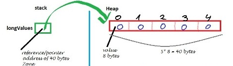

---  
layout: myDefault  
title: PROJECT 2  
---  

# Project 2: &nbsp; Dynamically Resizable Array
  
  
Your objective for this project is to implement a dynamically resizable array data structure in order to effectively store objects of the classes that you created in the previous project. As you did in Project&nbsp;1, you will use separate compilation with g++ to link multiple classes into one executable. In order to successfully complete this project, you **must** understand the prerequisite material from Project&nbsp;1 and you **must** understand the concept of an abstract data type, how template classes work, dynamic memory allocation, recursion, friend functions, and operator overloads. If you are not absolutely comfortable with all of this, please seek help immediately: contact me or our UTA, Nigel.

### Some additional resources:

- Abstract Data Types  
[Geeks for Geeks Reference](https://www.geeksforgeeks.org/abstract-data-types){:target="_blank"}  
[MIT Reference](http://web.mit.edu/6.005/www/fa14/classes/08-abstract-data-types/){:target="_blank"}

- Template Classes  
[C++ Documentation Reference](http://www.cplusplus.com/doc/oldtutorial/templates/){:target="_blank"}  
[Tutorialspoint Reference](https://www.tutorialspoint.com/cplusplus/cpp_templates.htm){:target="_blank"}  
Note: Recall that because the type of a class or function template is determined at compile time given the context of its use, you **cannot** compile the template class’s `.cpp` file. The `.cpp` file contains a **general** version of that class or function, which has no meaning in the absence of a context.

- Dynamic Memory Allocation  
[C++ Documentation Reference](http://www.cplusplus.com/doc/tutorial/dynamic/){:target="_blank"}  
[Tutorialspoint Reference](https://www.tutorialspoint.com/cplusplus/cpp_dynamic_memory.htm){:target="_blank"}

- Friend Functions  
[SoftwareTestingHelp Reference](https://www.softwaretestinghelp.com/friend-functions-in-cpp/){:target="_blank"}  
[Tutorialspoint Reference](https://www.tutorialspoint.com/cplusplus/cpp_friend_functions.htm){:target="_blank"}

- Operator Overloads  
[C++ Documentation Reference](https://en.cppreference.com/w/cpp/language/operators){:target="_blank"}  
[Caltech Reference](http://users.cms.caltech.edu/~donnie/cs11/cpp/cpp-ops.html){:target="_blank"}

### Implementation
**Work incrementally!** Work through the tasks sequentially (implement and test). Only move on to a task when you are positive that the previous one has been completed correctly. Remember that the names of function prototypes and member variables must exactly match those declared in the respective header file when implementing a class.

### Definition
Let a dynamically resizable array be an array whose maximum capacity increases by a factor of 2 in the event that an insertion is attempted when it is already at maximum capacity and whose maximum capacity decreases by a factor of 2, when the number of elements within it drops below half of its maximum capacity.  For axample: 
```
arr1 <- {1, 2, 3, 4}             //capacity == 4
arr1.add(5)
arr1 == {1, 2, 3, 4, 5, _, _, _} //capacity == 8

arr2 <- {1, 2, 3, 4}		         //capacity == 4
arr2.remove(4)
arr2 <- {1, 2, 3, _}		         //capacity == 4
arr2.remove(3)
arr2 == {1, 2}			             //capacity == 2
```  
  
  
### Required Files
[starter_code.zip](starter_code.zip){:target="_blank"}  
[test_data.zip](test_data.zip){:target="_blank"}

## Task
Modify the `DynamicArray.cpp` file to implement the following methods. I highly suggest that you complete them in the presented order. The prototypes below have already been written for you:

### i )
```
template <class T>
void DynamicArray<T>::resize()
```
which carries out the aforementioned dynamic sizing behavior.  
Hint: You must dynamically allocate a new array of the appropriate altered size and then you must copy all elements from the initial array into this new one. Finally, you must update and reassign the private members of the caller.

### ii )
```
template <class T>
bool DynamicArray<T>::add(const T &new_entry)
```
which inserts an item into the last position of the caller -- it **must** call resize and take into account the possibility that the pointer that represents the caller array could be equal to `nullptr`.

### iii )
```
template <class T>  
bool DynamicArray<T>::remove(const T &an_item)  
```
which removes the first instance of an item from the caller - it **must** check whether the element to be removed is within the array and it **must** call resize.  
Hint: Before you call resize you could copy all of the items except the one to be removed into a new dynamically allocated array.

### iv )
```
template <class T>  
void DynamicArray<T>::operator+(T rhs)  
```
which adds an item to the caller.  
**Example:**
```
arr1 <- {1, 2, 3, 4}		 //(capacity == 4)
var1 <- 5
arr1 + var1
arr1 == {1, 2, 3, 4, 5, _, _, _} //(capacity == 8)
```

### v )
```
template <class T>  
void DynamicArray<T>::operator-(const T &rhs)  
```
which removes an item from the caller if the caller contains it.  
**Example:**
```
arr1 <- {1, 2, 3, 4}		 //(capacity == 4)
arr1 - 4
arr1 <- {1, 2, 3, _}		 //(capacity == 4)
```
### vi )
```
template <class T>
T DynamicArray<T>::operator[](const size_t &index)
```
which returns the item at the given index.  

<!---  
  
## Task 2
Create a file, `Solution.cpp`. In that file create a namespace `solution { … }`. This file should include `DynamicArray.hpp`, `Produce.hpp`, `Vegetable.hpp`, and `Fruit.hpp` (thus, your main test file need only to include `Solution.cpp`). Within the solution namespace implement two methods:

### i )
```
template<class T>
void sortAlphabetically(DynamicArray<T> an_array)
```
which is a wrapper for the next function (and thus the code body of sortAlphabetically should only contain the call to the next function).  
  
### ii  )
```
template<class T>
void quicksort(DynamicArray<T> &an_array, int left_index, int right_index)
```
which is meant to operate over a dynamic array of Produce, Fruit, or Vegetable objects from Project&nbsp;1. Within this function implement quicksort to sort the dynamic array by the names of each item. Use the `getName()` function from the `Produce` class. You can use the last element of every subarray as the pivot.  
Hint: lexicographical ordering, which in this context is alphabetical ordering, follows a pattern where each successive letter is greater than the previous. For example:  
```
a < b < c < d < e < … < z
```  
Thus, for this portion of the project you are truly only sorting based on the <= comparison operator between the string names of each object within the dynamic array.  

--->

## Testing
**How to compile:**  
`g++ <main file> -std=c++17`  
You must always implement and test you programs **INCREMENTALLY**!!!  
What does this mean? Implement and test one method at a time.  
**For each class:**  
- Implement one function/method and test it thoroughly (multiple test cases + edge cases if applicable).   
- Implement the next function/method and test in the same fashion.  
**How do you do this?** 
Write your own `main()` function to test your classes. In this course you will never submit your test program, but you must always write one to test your classes. Choose the order in which you implement your methods so that you can test incrementally: i.e. implement mutator functions before accessor functions. Sometimes functions depend on one another. If you need to use a function you have not yet implemented, you can use stubs: a dummy implementation that always returns a single value for testing Don’t forget to go back and implement the stub!!! If you put the word STUB in a comment, some editors will make it more visible. 
  
### Grading Rubrics
**Correctness 80%** (distributed across unit testing of your submission)  
**Important:** You must start working on the projects as soon as they are assigned to detect any problems with submitting your code and address them with us **well before** the deadline, so that we have time to get back to you **before** the deadline.  This means that you must submit and resubmit your project code **early** and **often**, so that there is time to resolve any issues that might come up **before** the project deadline.  
There will be **no negotiation about project grades after the submission deadline**.  
**Documentation 10%**  
**Style and Design 10%** (proper naming, modularity, and organization)  
  
### Submission
You will submit **the following files**:  
`DynamicArray.cpp`
<!--- `Solution.cpp` --->
  
Your project must be submitted on Gradescope. Although Gradescope allows multiple submissions, it is not a platform for testing and/or debugging and it should not be used for that. You MUST test and debug your program locally. Before submitting to Gradescope you MUST ensure that your program compiles (with g++) and runs correctly on the Linux machines in the labs at Hunter (see detailed instructions on how to upload, compile and run your files in the “Programming Rules” document). That is your baseline, if it runs correctly there it will run correctly on Gradescope, and if it does not, you will have the necessary feedback (compiler error messages, debugger or program output) to guide you in debugging, which you don’t have through Gradescope. “But it ran on my machine!” is not a valid argument for a submission that does not compile. Once you have done all the above you submit it to Gradescope.  
  
  
  
