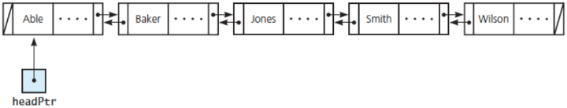

---  
layout: myDefault
title: PROJECT 3
---  

# Project 3 &nbsp; Doubly-Linked List


Your objective for this project is to implement a Doubly-Linked List. In order to successfully complete this project, you **must** understand the prerequisite material from the first and second projects, and you **must** understand the concept of a Linked List ADT. If you are not absolutely comfortable with all of this, please seek help immediately: contact me or our UTA, Nigel.

### Some additional resources
- Linked List:  
    [Geeks for Geeks](https://www.geeksforgeeks.org/linked-list-set-1-introduction/)  
    [CMU](https://www.cs.cmu.edu/~adamchik/15-121/lectures/Linked%20Lists/linked%20lists.html)  
    [edspresso](https://www.educative.io/edpresso/what-is-a-linked-list)

### Implementation
**Work incrementally!** Work through the tasks sequentially (implement and test). Only move on to a task when you are positive that the previous one has been completed correctly. Remember that the names of function prototypes and member variables must exactly match those declared in the respective header file when implementing a class.

## Task 1
Define and implement a class `DoubleNode` that is capable of holding an item of any arbitrary type `ItemType`. As a node of a Doubly-Linked list, it should contain two pointers that respectively point to other objects of type `DoubleNode`. The following methods will be required of your DoubleNode class, but feel free to add methods as you see fit:
- Default Constructor
- Parameterized Constructor(s)
- `ItemType getItem() const`
- `bool setNext(DoubleNode* ptr)`
- `bool setPrev(DoubleNode* ptr)`

Name your header file `DoubleNode.hpp`, and name your implementation file `DoubleNode.cpp`.

### Task 2
Define and implement a class `DoublyLinkedList` that is a demonstration of the Doubly-Linked List concept discussed in class. It should contain a head pointer to a `DoubleNode` of any arbitrary type `ItemType`, and it should contain a member that keeps track of its size. **Let `DoublyLinkedList` be 1 indexed unlike arrays, which are 0 indexed**.  
  
**Hint** If you get stuck on the way to design `DoublyLinkedList`, refer to the Linked List implementation in the textbook.  
  
The following methods are required of your `DoublyLinkedList` class:
```
//Default Constructor
//Copy Constructor
//Destructor
bool insert(const ItemType &item, const int &position)
    //inserts item at position in caller list
bool remove(const int &position)
    //removes the node at position
int getSize() const
    //returns the number of the nodes in the calling list
DoubleNode<ItemType> *getHeadPtr() const
    //returns a copy of the hearPtr
DoubleNode<ItemType> *getAtPos(const int &pos) const
    //returns a pointer to the node located at pos
bool isEmpty() const
    //returns whether the calling list is empty
void clear()
    //clears the list
void display() const
    //prints the contents of the calling list in order
void displayBackwards() const
    //prints the contents of the calling list in reverse order
DoublyLinkedList<ItemType> 
    interleave(const DoublyLinkedList<ItemType> &a_list)}
    //returns the interleaved list of the calling and parameter lists
```

**Interleave Example:** Define the calling list as a set of ordered nodes, `L1 = {4, 2, 8 ,5, 8}`, and define the list that is passed as a parameter as a set of ordered nodes, `L2 = {5, 1, 8, 4, 5, 9}`. `L1.interleave(L2)` yields the set `{4, 5, 2, 1, 8, 8, 5, 4, 8, 5, 9}`. In other words, to create the interleaved list, first add a node from `L1`, then one from `L2`, and then repeat as many times as necessary. If there are any nodes left over in `L1` or `L2` exclusively, append them to the end of the list.  
  
Name you header file`DoublyLinkedList.hpp`, and name your implementation file `DoublyLinkedList.cpp`.

### Testing
How to compile:
```
g++ <main file> -std=c++17
```
You must always implement and test you programs **INCREMENTALLY!!!**
What does this mean? Implement and test one method at a time.
**For each class**
- Implement one function/method and test it thoroughly (multiple test cases + edge cases if applicable).
- Implement the next function/method and test in the same fashion.
**How do you do this?** Write your own `main()` function to test your classes. In this course you will never submit your test program, but you must always write one to test your classes. Choose the order in which you implement your methods so that you can test incrementally: i.e. implement mutator functions before accessor functions. Sometimes functions depend on one another. If you need to use a function you have not yet implemented, you can use stubs: a dummy implementation that always returns a single value for testing Don’t forget to go back and implement the stub!!! If you put the word STUB in a comment, some editors will make it more visible.

### Grading Rubrics
- **Correctness 80%** (distributed across unit testing of your submission)  
- **Documentation 10%**  
- **Style and Design 10%** (proper naming, modularity, and organization)  
- **Important:** You must start working on the projects as soon as they are assigned to detect any problems with submitting your code and address them with us **well before** the deadline, so that we have time to get back to you **before** the deadline.  This means that you must submit and resubmit your project code **early** and **often**, so that there is time to resolve any issues that might come up **before** the project deadline.  
There will be **no negotiation about project grades after the submission deadline**.  
  
### Submission
You will submit **the following files**:
- `DoubleNode.hpp`  
- `DoubleNode.cpp`
- `DoublyLinkedList.cpp`
- `DoublyLinkedList.hpp`

Your project must be submitted on Gradescope. Although Gradescope allows multiple submissions, it is not a platform for testing and/or debugging and it should not be used for that. You MUST test and debug your program locally. Before submitting to Gradescope you MUST ensure that your program compiles (with g++) and runs correctly on the Linux machines in the labs at Hunter (see detailed instructions on how to upload, compile and run your files in the [**Programming Guidelines**](programming_guidelines.html){:target="_blank"} document). That is your baseline, if it runs correctly there it will run correctly on Gradescope, and if it does not, you will have the necessary feedback (compiler error messages, debugger or program output) to guide you in debugging, which you don’t have through Gradescope. “But it ran on my machine!” is not a valid argument for a submission that does not compile. Once you have done all the above you submit it to Gradescope.  
  
  
  
  
