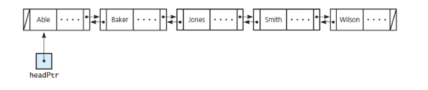

---  
layout: myDefault
title: PROJECT 3
---  

# Project 3 &nbsp; Making Your Fall Mixtape

Your objective for this project is to implement a Doubly-Linked List. In order to successfully complete this project, you **must** understand the prerequisite material from the first and second projects, and you **must** understand the concept of a Linked List ADT.


### Some additional resources
- Linked List:  
    [Geeks for Geeks](https://www.geeksforgeeks.org/linked-list-set-1-introduction/)   
    [CMU](https://www.cs.cmu.edu/~adamchik/15-121/lectures/Linked%20Lists/linked%20lists.html)  
    [edspresso](https://www.educative.io/edpresso/what-is-a-linked-list)  

---
### Implementation:
**Work incrementally!** Work through the tasks sequentially (implement and test). Only move on to a task when you are positive that the previous one has been completed correctly. Remember that the names of function prototypes and member variables must exactly match those declared in the respective header file when implementing a class.  

---
  
**Starter Code:** [Starter Code](starter_code.zip)

## Task 1: A Song of Your Choice... Or AudioBook... Or Podcast
Define and implement a class `DoubleNode` that is capable of holding an item of any arbitrary type `ItemType`. As a node of a Doubly-Linked list, it should contain two pointers that respectively point to other objects of type `DoubleNode`. The DoubleNode class should have the following private members:
```
ItemType item_;
DoubleNode<ItemType> *next_;
DoubleNode<ItemType> *prev_;
```
And the following public getters and setters as well as a **default and parameterized constructor**:
```
// Setter Functions
void setItem(const ItemType &anItem);
void setPrevious(DoubleNode<ItemType> *previousNodePtr);
void setNext(DoubleNode<ItemType> *nextNodePtr);

// Getter Functions
ItemType getItem() const;
DoubleNode<ItemType> *getNext() const;
DoubleNode<ItemType> *getPrevious() const;
```
Entitle your header (.hpp) file `DoubleNode.hpp`, and entitle your implementation file (.cpp) `DoubleNode.cpp`.  
Next, define and implement `PlaylistItem`, which will be an abstract class. `Song`, `AudioBook` and `Podcast` will inherit from this abstract class.  
`PlaylistItem` must contain the following private members:
```
std::string title_;
double length_;
std::string genre_;
```
And the following public functions:
```
/*
    Parameterized Construtor
    Parameters: title, length, genre
    Goal: Update member variables with given parameters
*/
PlaylistItem(std::string title, double length, std::string genre);

/************************ Getter Functions ************************/

/*
    Goal: Return the value of title_
*/
std::string getTitle() const;

/*
    Goal: Return the value of length_
*/
double getLength() const;

/*
    Goal: Return the value of genre_
*/
std::string getGenre() const;

/************************ Setter Functions ************************/

/*
    Goal: Update the value of title_ with the given parameter
*/
void setTitle(std::string title);

/*
    Goal: Update the value of length_ with the given parameter
*/
void setLength(double length);

/*
    Goal: Update the value of genre_ with the given parameter
*/
void setGenre(std::string genre);

/************************ Other Functions ************************/

/*
    A virtual function to be implemented by the children classes
*/
virtual void display() const = 0;
```
Entitle your header (.hpp) file `PlaylistItem.hpp`, and entitle your implementation file (.cpp) `PlaylistItem.cpp`.  
`Song` must have the artist_ private member on top of the title_, length_ and genre_ member variables that are inherited from `PlaylistItem`:
```
std::string artist_;
```
And the following public functions:
```
/*
    Parameterized Construtor
    Parameters: title, length, genre, artist
    Goal: Update member variables with given parameters
*/
Song(std::string title, double length, std::string genre, 
                                       std::string artist);

/************************ Getter Functions ************************/

/*
    Goal: Return the value of artist_
*/
std::string getArtist() const;

/************************ Setter Functions ************************/

/*
    Goal: Update the value of artist_ with the given parameter
*/
void setArtist(std::string artist);

/************************ Other Functions ************************/

/*
    Goal: Displays the member variables to the console. 
          Format is based on the given example in songExample.txt.
*/
void display() const;
```
Entitle your header (.hpp) file `Song.hpp`, and entitle your implementation file (.cpp) `Song.cpp`. Same for `AudioBook` and `Podcast`.  
Define and implement the children classes `AudioBook` and `Podcast` similarly.  
`AudioBook` will have the following additional private members:
```
std::string author_;
std::string speaker_;
```
And following public member functions:
```
AudioBook(std::string title, double length, std::string genre, 
                             std::string author, std::string speaker);

std::string getAuthor() const;
std::string getSpeaker() const;

void setAuthor(std::string author);
void setSpeaker(std::string speaker);

/*
    Goal: Displays the member variables to the console. 
          Format is based on the given example in audioBookExample.txt.
*/
void display() const;
```
`Podcast` will have the following additional private members:
```
std::string name_of_podcast_;
std::string host_;
std::string guest_;
``` 
And following public member functions:
```
Podcast(std::string title, double length, std::string genre, 
      std::string nameOfPodcast, std::string host, std::string guest);

std::string getNameOfPodcast() const;
std::string getHost() const;
std::string getGuest() const;

void setNameOfPodcast(std::string nameOfPodcast);
void setHost(std::string host);
void setGuest(std::string guest);

/*
    Goal: Displays the member variables to the console. 
            Format is based on the given example in podcastExample.txt.
*/
void display() const;
```
For both classes define and implement a parameterized constructor that will have a parameter for each member of the class. **Do not forget about the members they will inherit from PlaylistItem.** For both classes define and implement setter and getter functions for each of their members. And a display function that will output member variable to the console, an example output is provided in the given example text files.

**Hint**: Include `const` keyword for the getter and display functions.

**Hint**: Do not forget to include the `#ifndef #define #endif` tags in class definitions.  
  
---
  
## Task 2: A "High Fidelity" Special
Next, define and implement a class `DoublyLinkedList` that is a demonstration of the Doubly-Linked List concept discussed in class. It should contain the following protected members: a head pointer to a `DoubleNode` of any arbitrary type `ItemType` and a member that keeps track of the size of the list. **Let `DoublyLinkedList` be 1 indexed unlike arrays, which are 0 indexed**.

**Hint**: If you get stuck on the way to design `DoublyLinkedList`, refer to the Linked List implementation in the textbook. 

The following methods are required of your `DoublyLinkedList` class:
```
Default Constructor

Copy Constructor 

Destructor

bool insert(const ItemType &item, const int &position) 
   //inserts item at position in caller list
	
bool remove(const int &position)           
   //removes the node at position

int getSize() const                        
   // returns the number of the nodes in the calling list
				
DoubleNode<ItemType> *getHeadPtr() const   
   // returns a copy of the headPtr

DoubleNode<ItemType> *getAtPos(const int &pos) const 
   // returns a pointer to the node located at pos

bool isEmpty() const                       
   // returns whether the calling list is empty

void clear()                               
   // clears the list

int getIndexOf(const ItemType &item) const 
   // returns the position of the given item in the list, -1 otherwise

void display() const                       
   // prints the contents of the calling list in order

void displayBackwards() const              
   // prints the contents of the calling list in reverse order

DoublyLinkedList<ItemType> interleave(const DoublyLinkedList<ItemType> &a_list)} 
   // returns the interleaved list of the calling and parameter lists
```
**Interleave Example:** Define the calling list as a set of ordered nodes, $L1 = \{4, 2, 8 ,5, 8\}$, and define the list that is passed as a parameter as a set of ordered nodes, $L2 = \{5, 1, 8, 4, 5, 9\}$. `L1.interleave(L2)` yields the set $\{4, 5, 2, 1, 8, 8, 5, 4, 8, 5, 9\}$. In other words, to create the interleaved list, first add a node from L1, then one from L2, and then repeat as many times as necessary. If there are any nodes left over in L1 or L2 exclusively, append them to the end of the list.  
Entitle you header (.hpp) file `DoublyLinkedList.hpp`, and entitle your implementation file (.cpp) `DoublyLinkedList.cpp`.  
Finally, define and implement `Playlist`, which is a child of `DoublyLinkedList` and stores `PlaylistItem*`.
```
/*
    Default Constructor
    Goal: Calls its parent constructor
*/
Playlist();

/*
    Goal: Returns the sum of the lengths of the each item in the Playlist
*/
double getTotalTime() const;

/*
    Parameter: Another Playlist (rhs)
    Goal: Implement Union. 
            rhs to be combined with the contents of this (the calling) list. 
            Duplicates are allowed.
*/
void operator+=(Playlist rhs);

/*
    Parameter: Another Playlist (rhs)
    Goal: Implement Difference. 
            Removes all items from this (the calling) list that are also in rhs. 
*/
void operator-=(Playlist rhs);

/*
    Goal: Moves the current object at the head of the list to the end of the list. 
*/
void skip();

/*
    Goal: Moves the current object at the end of the list to the head of the list. 
*/
void rewind();

/* 
    Goal: Calls the display function of each item in the Playlist
*/
void display();
```
Entitle your header (.hpp) file `Playlist.hpp`, and entitle your implementation file (.cpp) `Playlist.cpp`.
  
---
### Testing
How to compile:
```
g++ ShoppingCart.cpp Grocery.cpp Vegetable.cpp JunkFood.cpp 
                               Drink.cpp <test main file> -std=c++17
```
You must always implement and test you programs **INCREMENTALLY!!!**
**What does this mean?** 
- Implement and test one method at a time.
**For each class**
- Implement one function/method and test it thoroughly (multiple test cases + edge cases if applicable).
- Implement the next function/method and test in the same fashion.
**How do you do this?** Write your own `main()` function to test your classes. In this course you will never submit your test program, but you must always write one to test your classes. Choose the order in which you implement your methods so that you can test incrementally: i.e. implement mutator functions before accessor functions. Sometimes functions depend on one another. If you need to use a function you have not yet implemented, you can use stubs: a dummy implementation that always returns a single value for testing Don’t forget to go back and implement the stub!!! If you put the word STUB in a comment, some editors will make it more visible.

### Submission:
**You will submit the following files:**
  
`DoubleNode.hpp`  
`DoubleNode.cpp`

`DoublyLinkedList.cpp`  
`DoublyLinkedList.hpp`

`Playlist.hpp`  
`Playlist.cpp`

`PlaylistItem.hpp`  
`PlaylistItem.cpp`

`Song.hpp`  
`Song.cpp`

`AudioBook.hpp`  
`AudioBook.cpp`

`Podcast.hpp`  
`Podcast.cpp`

Your project must be submitted on Gradescope. Although Gradescope allows multiple submissions, it is not a platform for testing and/or debugging and it should not be used for that. You MUST test and debug your program locally. Before submitting to Gradescope you MUST ensure that your program compiles (with g++) and runs correctly on the Linux machines in the labs at Hunter (see detailed instructions on how to upload, compile and run your files in the “Programming Rules” document). That is your baseline, if it runs correctly there it will run correctly on Gradescope, and if it does not, you will have the necessary feedback (compiler error messages, debugger or program output) to guide you in debugging, which you don’t have through Gradescope. “But it ran on my machine!” is not a valid argument for a submission that does not compile. Once you have done all the above you submit it to Gradescope.

### Grading Rubrics
**Correctness 80%** (distributed across unit testing of your submission)  
**Documentation 10%**  
**Style and Design 10%** (proper naming, modularity, and organization)  

### Important
You must start working on the projects as soon as they are assigned to detect any problems with submitting your code and to address them with us **well before** the deadline so that we have time to get back to you **before** the deadline. This means that you must submit and resubmit your project code **early** and **often** in order to resolve any issues that might come up **before** the project deadline.  
**There will be no negotiation about project grades after the submission deadline.**  
  
