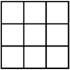

---  
layout: myDefault  
title: PROJECT 2  
---  

# Project 4: &nbsp; Dynamically Resizeable Square Grids
  
  
Your objective for this project is to implement a dynamically resizable square grid ADT that inherits from an abstract GridInterface class. In order to successfully complete this project, you **must** understand the prerequisite material from the previous projects, and you **must** understand the concept of polymorphism using abstract classes. If you are not absolutely comfortable with this topic, please seek help immediately: contact me or our UTA, Nigel.


### Some additional resources

[cplusplus.com](http://www.cplusplus.com/doc/tutorial/polymorphism/)  
[CodingUnit](https://www.codingunit.com/cplusplus-tutorial-polymorphism-and-abstract-base-class)
[Harlod Serrano](https://www.haroldserrano.com/blog/understanding-polymorphism-in-c)
[Geeks for Geeks](https://www.geeksforgeeks.org/pure-virtual-functions-and-abstract-classes/)

### Implementation
**Work incrementally!** Work through the tasks sequentially (implement and test). Only move on to a task when you are positive that the previous one has been completed correctly. Remember that the names of function prototypes and member variables must exactly match those declared in the respective header file when implementing a class.

### Definition
Let a dynamically resizable square grid be an $n$ by $n$ array whose maximum capacity is some number $m \geq n^2$ such that the square root of $m$ is an integer. In the event that an item is inserted into a grid that is already at capacity or in the event that an item is removed from a grid and the the number of occupied spaces is rendered a perfect square, the grid's maximum capacity is dynamically set to a new value for $m$ and all items of the grid are reoriented to fit into the first available positions. 

### Required Files
[starter_code.zip](starter_code.zip){:target="_blank"}

## Task
Define and implement a class `ArrayGrid` that is capable of holding items of any arbitrary type `ItemType`. This class should inherit from `GridInterface` and overload every method in `GridInterface.hpp`. Additionally, ArrayGrid will incorporate the `DynamicArray` class that you completed for project 2 as an internal storage mechanism for all the items that the grid must hold. You will have more freedom for this project than you have had for any that have come before in order for you to execute your best design ideas. Besides what you are required to write, you are free to write whatever methods or data members that you believe will help you to most efficiently solve the problem at hand. The following **public** methods are required of your `ArrayGrid` class:
```
/* One Parameter Constructor */
explicit ArrayGrid(const size_t &init_size = 1)


/* Destructor */
virtual ~ArrayGrid()


/** 
  adds a new entry to the caller
  @param new_entry the object to be added
  @post if successful, new_entry is stored in the caller and
          num_items_ is incremented; additionally calls 
          resize() if num_items_ > grid_capacity
  @return true if addition was successful; false otherwise 
*/
bool add(const ItemType &new_entry)


/** 
  tests whether the caller contains a given entry.
  @param an_entry the entry to locate
  @return true if the caller contains an_entry; false otherwise. 
*/
bool contains(const ItemType &an_entry) const


/* Accessor: num_items_ == 0 ? */
bool isEmpty() const


/** 
  removes the last entry from the caller
  @post if successful, the last entry has been removed from the caller
          and num_items_ has been decremented; additionally calls
          resize() if sqrt(num_items_) is an integer 
   @param an_entry the entry to be removed
   @return true if removal was successful; false otherwise 
*/
bool pop_back()


/* Accessor: items_ */
DynamicArray<DynamicArray<ItemType>> *getItems() const


/** 
  returns the number of times a given entry appears in the caller
  @param an_entry the entry to be counted
  @return the number of times an_entry appears in the caller
 */
int getFrequencyOf(const ItemType &an_entry) const
```

The following **private** methods are required of your `ArrayGrid` class:
```
/** 
  resizes grid_capicity_:
    CASE (num_items_ > grid_capacity_): 
            grid_capacity_ <- the smallest perfect square
                              >= num_items_
       CASE (grid_capacity_ > num_items_ && sqrt(num_items) is an integer): 
            grid_capacity <- num_items_
             
              !!!!! THIS FUNCTION MUST CALL REPOSITION !!!!!
  @post grid_capacity <- one of the aforementioned values
  @return true if resize was successful; false otherwise 
*/
bool resize();
    

/** 
  reorients the caller's items to fill as much ordered space as possible
            when resize() is called
  @post the caller's items have been properly repositioned; the only 
            empty space that may remain is at the end of the grid
  @return true if reposition was successful; false otherwise
*/    
bool reposition();

```

The following **private** members are required of your `ArrayGrid` class:
```
DynamicArray<DynamicArray<ItemType>> *items_
size_t grid_capacity_
size_t num_items_
```

Here is a method to help you visualize your work:

```
/** 
    displays grid in the required fashion
    requires the inclusion of <iomanip> and <iostream>
*/
template <class ItemType>
void ArrayGrid<ItemType>::display(size_t const &cell_width) const
{
    if (isEmpty())
    {
        cout << "This grid is empty!" << endl;
        return;
    }

    int grid_idx_1 = 0,
        grid_idx_2 = 0,
        num_ceil_floors = 2 * sqrt(grid_capacity_);

    if (grid_capacity_ == 1)
    {
        num_ceil_floors = 2;
    }

    for (size_t i = 0; i <= num_ceil_floors; i++)
    {
        if (i % 2 != 0)
        {
            cout << " ";
        }
        for (size_t j = 0; j <= num_ceil_floors; j++)
        {
            if (i % 2 == 0)
            {
                if (j == 0)
                    cout << " ";
                if (j % 2 == 0)
                    cout << " ";
                else
                    for (size_t k = 0; k < cell_width; k++)
                    {
                        cout << "-";
                    }
            }
            else
            {
                if (j % 2 == 0)
                    cout << "|";
                else
                {
                    if (grid_idx_1 < items_->getItems()->getOccupiedSpaces() && grid_idx_2 < items_->getItems()[grid_idx_1].getOccupiedSpaces())
                    {
                        cout << setw(cell_width) << right << items_->getItems()[grid_idx_1][grid_idx_2];

                        if (1 + grid_idx_2 == sqrt(grid_capacity_))
                        {
                            grid_idx_1++;
                            grid_idx_2 = 0;
                        }
                        else
                        {
                            grid_idx_2++;
                        }
                    }
                    else
                    {
                        cout << setw(cell_width) << right << "\\x";
                    }
                }
            }
        }
        cout << endl;
    }
    return;
}
```

Additionally, here are the prototypes of some methods that I suggest that you implement as intermediary processes of the main task:
```
/* Accessor: num_items_ == grid_capacity_ ? */
bool isFull() const

/* Accessor: grid_capacity_ */
size_t getCapacity() const

/* Accessor: num_items_ */
size_t getNumItems() const

/** 
  removes all entries from the caller
  @post num_items_ == 0, grid_capacity == 0
*/
void clear()
```

Entitle your header (.hpp) file `ArrayGrid.hpp`, and entitle your implementation file (.cpp) `ArrayGrid.cpp`.

### Examples

Suppose we instantiate an empty `ArrayGrid<int>` and then call `.add(0)`. The following output is that which occurs when we follow the pattern of iteratively calling display and then adding the next smallest natural number to this grid up to 5:
```
  One element:
  ---- 
 |   0|
  ---- 

  Two element:
  ---- ---- 
 |   0|   1|
  ---- ---- 
 |  \x|  \x|
  ---- ---- 

  Three elements:
  ---- ---- 
 |   0|   1|
  ---- ---- 
 |   2|  \x|
  ---- ---- 

  Four elements:
  ---- ---- 
 |   0|   1|
  ---- ---- 
 |   2|   3|
  ---- ---- 

  Five elements:
  ---- ---- ---- 
 |   0|   1|   2|
  ---- ---- ---- 
 |   3|   4|  \x|
  ---- ---- ---- 
 |  \x|  \x|  \x|
  ---- ---- ---- 
```
The following output is what occurs when we call `pop_back` and display over this grid iteratively until there is only one element within the grid:
```
  Five elements:
  ---- ---- ---- 
 |   0|   1|   2|
  ---- ---- ---- 
 |   3|   4|  \x|
  ---- ---- ---- 
 |  \x|  \x|  \x|
  ---- ---- ---- 

  Four elements:
  ---- ---- 
 |   0|   1|
  ---- ---- 
 |   2|   3|
  ---- ---- 

  Three elements:
  ---- ---- 
 |   0|   1|
  ---- ---- 
 |   2|  \x|
  ---- ---- 

  Two elements:
  ---- ---- 
 |   0|   1|
  ---- ---- 
 |  \x|  \x|
  ---- ---- 

  One element:
  ---- 
 |   0|
  ---- 
```

### Testing
How to compile:
```
g++ <main file> -std=c++17
```
You must always implement and test you programs **INCREMENTALLY!!!**
What does this mean? Implement and test one method at a time.
**For each class**
* Implement one function/method and test it thoroughly (multiple test cases + edge cases if applicable).
* Implement the next function/method and test in the same fashion.
    **How do you do this?** Write your own `main()` function to test your classes. In this course you will never submit your test program, but you must always write one to test your classes. Choose the order in which you implement your methods so that you can test incrementally: i.e. implement mutator functions before accessor functions. Sometimes functions depend on one another. If you need to use a function you have not yet implemented, you can use stubs: a dummy implementation that always returns a single value for testing Don’t forget to go back and implement the stub!!! If you put the word STUB in a comment, some editors will make it more visible.

### Grading Rubric
**Correctness 80%** (distributed across unit testing of your submission)
**Documentation 10%**
**Style and Design 10%** (proper naming, modularity, and organization)

**Important:** You must start working on the projects as soon as they are assigned to detect any problems with submitting your code and to address them with us **well before** the deadline so that we have time to get back to you **before** the deadline. This means that you must submit and resubmit your project code **early** and **often** in order to resolve any issues that might come up **before** the project deadline.
##### There will be no negotiation about project grades after the submission deadline. #####
  
### Submission:
You will submit **the following files**:
`ArrayGrid.hpp`
`ArrayGrid.cpp`

Your project must be submitted on Gradescope. Although Gradescope allows multiple submissions, it is not a platform for testing and/or debugging and it should not be used for that. You MUST test and debug your program locally. Before submitting to Gradescope you MUST ensure that your program compiles (with g++) and runs correctly on the Linux machines in the labs at Hunter (see detailed instructions on how to upload, compile and run your files in the “Programming Rules” document). That is your baseline, if it runs correctly there it will run correctly on Gradescope, and if it does not, you will have the necessary feedback (compiler error messages, debugger or program output) to guide you in debugging, which you don’t have through Gradescope. “But it ran on my machine!” is not a valid argument for a submission that does not compile. Once you have done all the above you submit it to Gradescope.
