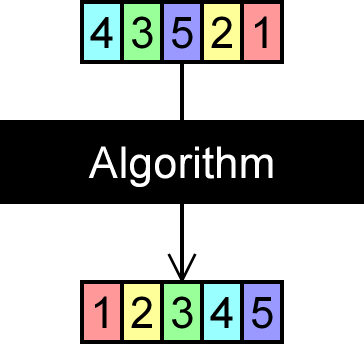

---  
layout: myDefault  
title: PROJECT 5  
---  

# Project 5: &nbsp; Sorting Algorithms &<br/><span style="LINE-HEIGHT:30px">&nbsp; &nbsp; &nbsp; &nbsp; &nbsp; &nbsp; &nbsp; &nbsp; &nbsp; &nbsp; &nbsp;Doubly - Linked &nbsp;Lists</span>



Your objective for this project is to implement five sorting algorithms over the `DoublyLinkedList` class that you created for Project 3. In order to successfully complete this project, you **must** understand the prerequisite material from the previous projects, you **must** know what a comparator is, and you **must** understand how the bubble sort, insertion sort, quick sort, merge sort, and shell sort algorithms work. If you are not absolutely comfortable with these topics, please seek help immediately: contact me or our UTA, Nigel.

### Some additional resources
- Comparators  
[Custom Comparison Functions](https://stackoverflow.com/questions/52984999/different-types-for-stdsort-comparator-in-c/)  
[Less Function Object](http://www.cplusplus.com/reference/functional/less/)  
[Greater Function Object](http://www.cplusplus.com/reference/functional/greater/)
   
- Bubble Sort  
[Brilliant](https://brilliant.org/wiki/bubble-sort/)  
[University Academy](https://youtu.be/We8h4_rcRRw)

- Insertion Sort  
[Khan Academy](https://www.khanacademy.org/computing/computer-science/algorithms/insertion-sort/a/insertion-sort)  
[Jenny's Lectures](https://youtu.be/yCxV0kBpA6M)

- Quick Sort  
[Khan Academy](https://www.khanacademy.org/computing/computer-science/algorithms/quick-sort/a/overview-of-quicksort)  
[HackerRank](https://youtu.be/SLauY6PpjW4)

- Merge Sort  
[Khan Academy](https://www.khanacademy.org/computing/computer-science/algorithms/merge-sort/a/overview-of-merge-sort)  
[Adbul Bari](https://youtu.be/mB5HXBb_HY8)

- Shell Sort  
[Runestone Academy](https://runestone.academy/runestone/books/published/pythonds/SortSearch/TheShellSort.html)  
[Rob Edwards](https://youtu.be/ddeLSDsYVp8)

### Implementation
**Work incrementally!** Work through the tasks sequentially (implement and test). Only move on to a task when you are positive that the previous one has been completed correctly. Remember that the names of function prototypes and member variables must exactly match those declared in the respective header file when implementing a class.

### Required Files
[starter_code.zip](starter_code.zip){:target="_blank"}

## Task 
Modify each method of the `solutions` namespace in `Solutions.cpp` to complete implementation of the requried sorting algorithms. 

### Testing
How to compile:
```
g++ <main file> -std=c++17
```
You must always implement and test you programs **INCREMENTALLY!!!**
What does this mean? Implement and test one method at a time.
**For each class**
- Implement one function/method and test it thoroughly (multiple test cases + edge cases if applicable).
- Implement the next function/method and test in the same fashion.
**How do you do this?** Write your own `main()` function to test your classes. In this course you will never submit your test program, but you must always write one to test your classes. Choose the order in which you implement your methods so that you can test incrementally: i.e. implement mutator functions before accessor functions. Sometimes functions depend on one another. If you need to use a function you have not yet implemented, you can use stubs: a dummy implementation that always returns a single value for testing Don’t forget to go back and implement the stub!!! If you put the word STUB in a comment, some editors will make it more visible.

### Grading Rubrics
**Correctness 80%** (distributed across unit testing of your submission)  
**Documentation 10%**  
**Style and Design 10%** (proper naming, modularity, and organization)  

### Important
You must start working on the projects as soon as they are assigned to detect any problems with submitting your code and to address them with us **well before** the deadline so that we have time to get back to you **before** the deadline. This means that you must submit and resubmit your project code **early** and **often** in order to resolve any issues that might come up **before** the project deadline.  
**There will be no negotiation about project grades after the submission deadline.**
  
### Submission:
**You will submit the following files**:  
`Solutions.cpp`

Your project must be submitted on Gradescope. Although Gradescope allows multiple submissions, it is not a platform for testing and/or debugging and it should not be used for that. You MUST test and debug your program locally. Before submitting to Gradescope you MUST ensure that your program compiles (with g++) and runs correctly on the Linux machines in the labs at Hunter (see detailed instructions on how to upload, compile and run your files in the “Programming Rules” document). That is your baseline, if it runs correctly there it will run correctly on Gradescope, and if it does not, you will have the necessary feedback (compiler error messages, debugger or program output) to guide you in debugging, which you don’t have through Gradescope. “But it ran on my machine!” is not a valid argument for a submission that does not compile. Once you have done all the above you submit it to Gradescope.
