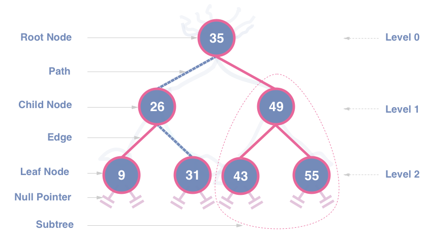

# Project 6 &nbsp; BST-Dictionary

Your objective for this project is to implement a `BST-Dictionary` class given a `BinaryNode` class. In order to successfully complete this project, you **must** understand the prerequisite material from all previous projects, and you **must** understand the concept of the BST ADT.

### Some additional resources
- BST:  
    [Geeks for Geeks](https://www.geeksforgeeks.org/binary-search-tree-data-structure/)  
    [freeCodeCamp](https://www.freecodecamp.org/news/data-structures-101-binary-search-tree-398267b6bff0/)

### Implementation

**Work incrementally!** Work through the tasks sequentially (implement and test). Only move on to a task when you are positive that the previous one has been completed correctly. Remember that the names of function prototypes and member variables must exactly match those declared in the respective header file when implementing a class.

---


## The Task 

In a file entitiled `BSTdict.hpp` define your dictionary class. It will use string binary nodes and it must contain the following methods:
```
* Default Constructor
* Copy Constructor
* Destructor
* bool isEmpty()
* bool insert(const string& word) // adds a word to the dictionary and maintains the BST property. DOES NOT ALLOW DUPLICATES
* bool remove(const string& word)
* int getHeight() // retuns the number of nodes on the longest path from root to leaf
* bool insertVector(const vector<string>& vec) // adds a vector of words to the dictionary
* void display() // prints words one per line using in-order traversal. 
```
Implement this class in a file entitled `BSTdict.cpp`.

---


### Grading Rubric
**Correctness 80%** (distributed across unit testing of your submission)
**Documentation 10%**
**Style and Design 10%** (proper naming, modularity, and organization)

**Important:** You must start working on the projects as soon as they are assigned to detect any problems with submitting your code and to address them with us **well before** the deadline so that we have time to get back to you **before** the deadline. This means that you must submit and resubmit your project code **early** and **often** in order to resolve any issues that might come up **before** the project deadline.
### There will be no negotiation about project grades after the submission deadline. 
  
### Submission:
You will submit **the following files**:
`BSTdict.hpp`
`BSTdict.cpp`

Your project must be submitted on Gradescope. Although Gradescope allows multiple submissions, it is not a platform for testing and/or debugging and it should not be used for that. You MUST test and debug your program locally. Before submitting to Gradescope you MUST ensure that your program compiles (with g++) and runs correctly on the Linux machines in the labs at Hunter (see detailed instructions on how to upload, compile and run your files in the “Programming Rules” document). That is your baseline, if it runs correctly there it will run correctly on Gradescope, and if it does not, you will have the necessary feedback (compiler error messages, debugger or program output) to guide you in debugging, which you don’t have through Gradescope. “But it ran on my machine!” is not a valid argument for a submission that does not compile. Once you have done all the above, please submit it to Gradescope.
