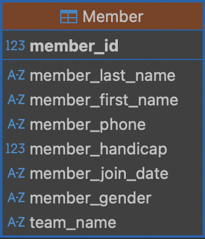
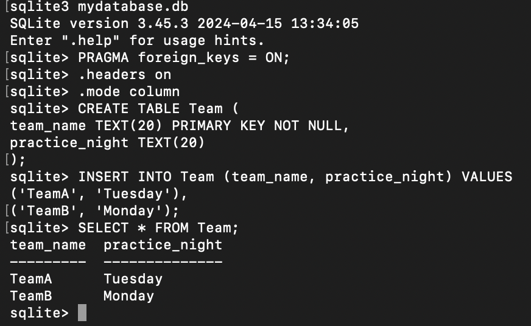
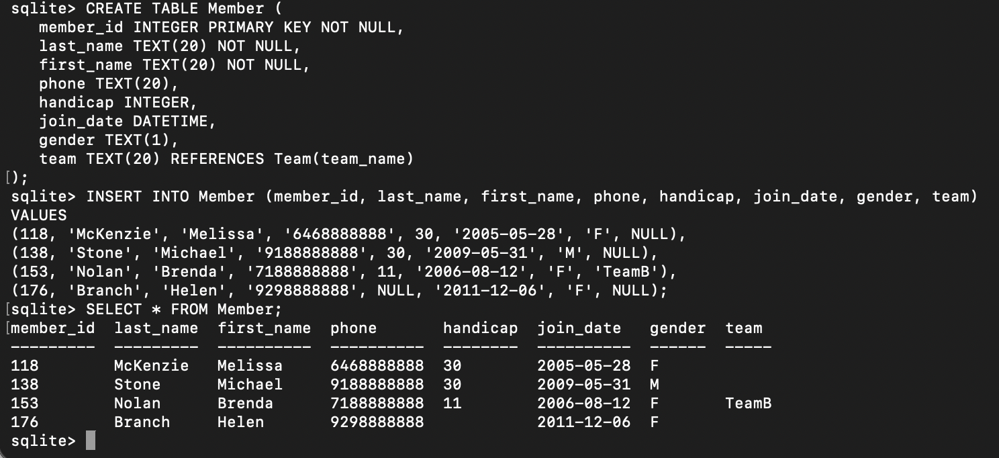
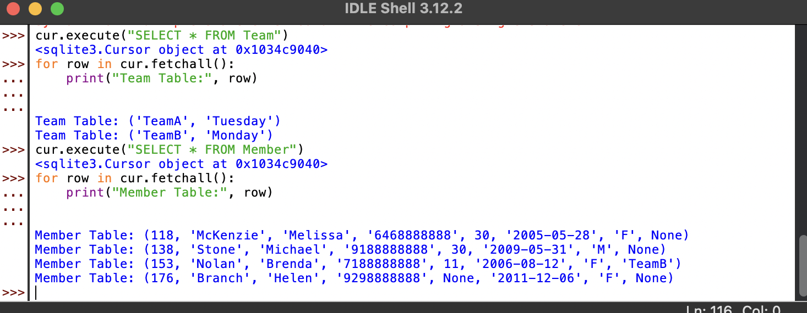

---
layout: myDefault 
title: LAB 1  
---  
# LAB 1

<p align="center">

</p>

Today's lab will focus on two ways of creating a new database; through the terminal and Python IDLE.

Software tools needed: the terminal and Python IDLE programming environment.


These are the UML representation of Team class and Member class.
<p align="center">
     
     
</p>


## Terminal
- Open your terminal, navigate to your Desktop and create(or open if exists) a database from it
```
cd ~/Desktop
sqlite3 mydatabase.db
```

- Enable key enforcement, otherwise there could be any value in Member.Team and we don't want that
```
PRAGMA foreign_keys = ON;
```

Lets make the output readable, making the column names aligned and formats query results for readability only.
```
.headers on
```
```
.mode column
```
    
- Create the Team table
```
CREATE TABLE Team (
team_name TEXT(20) PRIMARY KEY NOT NULL,
practice_night TEXT(20)
);
```

- Insert sample tuples into Team table
```
INSERT INTO Team (team_name, practice_night) VALUES
('TeamA', 'Tuesday'),
('TeamB', 'Monday');
```

We can verify that the data is inserted by typing
```
SELECT * FROM Team;
```
<p align="center">
 
</p>

- Create Member table
```
CREATE TABLE Member (
   member_id INTEGER PRIMARY KEY NOT NULL,
   last_name TEXT(20) NOT NULL,
   first_name TEXT(20) NOT NULL,
   phone TEXT(20),
   handicap INTEGER,
   join_date DATETIME,
   gender TEXT(1),
   team TEXT(20) REFERENCES Team(team_name)
);
```


- Insert sample tuples into Member table
``` 
INSERT INTO Member (member_id, last_name, first_name, phone, handicap, join_date, gender, team)
VALUES
(118, 'McKenzie', 'Melissa', '6468888888', 30, '2005-05-28', 'F', NULL),
(138, 'Stone', 'Michael', '9188888888', 30, '2009-05-31', 'M', NULL),
(153, 'Nolan', 'Brenda', '7188888888', 11, '2006-08-12', 'F', 'TeamB'),
(176, 'Branch', 'Helen', '9298888888', NULL, '2011-12-06', 'F', NULL);
```

- Lets verify 
```
SELECT * FROM Member;
```

<p align="center">
 
</p>

You can double check the tables in the database
``` 
.tables
```
Verify the schemas of both tables
```
.schema Team
```
```
.schema Member
```


## Python IDLE
We will be using the IDLE programming environment for Python, since it is very simple and comes with all distributions of Python.

- To launch IDLE, open the terminal, and in the terminal window, type the following and a new window will launch for IDLE.
```
idle3
```

- Import the modules
~~~ python
    import os
    import sqlite3
    
    #Create a folder in your home directory
    os.makedirs(os.path.expanduser("~/SQLiteDB"), exist_ok=True)
    
    #Connect to the database inside that folder
    conn = sqlite3.connect(os.path.expanduser("~/SQLiteDB/mydatabasePython.db"))
    cur = conn.cursor()
~~~

- Enable foreign key
```
cur.execute("PRAGMA foreign_keys = ON;")
```

- Create Team table
```
cur.execute("""
CREATE TABLE Team (
    team_Name TEXT(20) PRIMARY KEY NOT NULL,
    practice_night TEXT(20)
)
""")
```

- Insert tuples into Team table
```
cur.execute("INSERT INTO Team (team_Name, practice_night) VALUES (?, ?)", ('TeamA', 'Tuesday'))
cur.execute("INSERT INTO Team (team_Name, practice_night) VALUES (?, ?)", ('TeamB', 'Monday'))
```

- Create Member Table
```
cur.execute("""
CREATE TABLE Member (
   member_id INTEGER PRIMARY KEY NOT NULL,
   last_name TEXT(20) NOT NULL,
   first_name TEXT(20) NOT NULL,
   phone TEXT(20),
   handicap INTEGER,
   join_date DATETIME,
   gender TEXT(1),
   team TEXT(20) REFERENCES Team(team_name)
)
""")
```

- Insert tuples into Member table
```
    members = [
        (118, 'McKenzie', 'Melissa', '6468888888', 30, '2005-05-28', 'F', None),
        (138, 'Stone', 'Michael', '9188888888', 30, '2009-05-31', 'M', None),
        (153, 'Nolan', 'Brenda', '7188888888', 11, '2006-08-12', 'F', 'TeamB'),
        (176, 'Branch', 'Helen', '9298888888', None, '2011-12-06', 'F', None)
    ]
    
    cur.executemany("""
    INSERT INTO Member (member_id, last_name, first_name, phone, handicap, join_date, gender, team)
    VALUES (?, ?, ?, ?, ?, ?, ?, ?)
    """, members)
```

- Verify tables
```
    cur.execute("SELECT * FROM Team")
    for row in cur.fetchall():
        print("Team Table:", row)
    
    cur.execute("SELECT * FROM Member")
    for row in cur.fetchall():
        print("Member Table:", row)
```
  
- Save and close
```
conn.commit()
conn.close() 
```

You will see the following output:

<p align="center">
    
