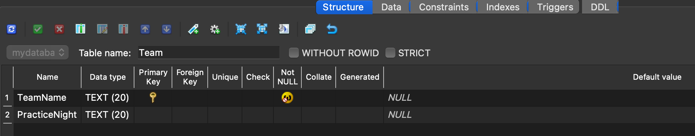
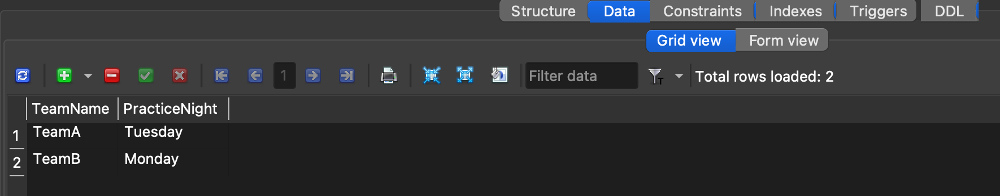
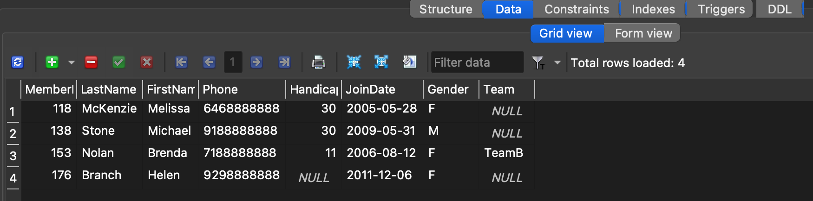

---
layout: myDefault 
title: LAB 1  
---  

# LAB 1

Today’s lab will focus on downloading and setting up SQLiteStudio.  
Software tools needed: web browser.

### Downloading SQLiteStudio

We will be using SQLiteStudio, a GUI database browser that lets you work with SQLite databases without using the terminal.

To install and launch it:

1. Navigate to the [SQLiteStudio website](https://sqlitestudio.pl/) and download the installer for your operating system.

2. Once the file has downloaded, open it. You should see the SQLiteStudio icon. Double-click the icon to launch the application.

   *You may encounter a security warning while opening. If so, go to Settings → Privacy & Security and click “Open Anyway.”*

3. Follow the prompts to complete the setup, including accepting the license agreement. After installation, launch SQLiteStudio. You should see the main interface, ready for use.

### Using SQLiteStudio

* Create a new database by clicking the database icon with a plus sign in the top bar (**Control + O**). Fill it out with the following information:

   - **Database Type:** SQLite 3  
   - **File:** Select “Create a new database file,” then click the folder icon and choose where you want your database to be stored.  
   - **Name:** `mydatabase`

* On the left-side panel, right-click on `mydatabase` and select Connect to the database.

* Open the SQL Editor (**Alt + E**). Copy and paste the following code, then execute the query (**F9**):

~~~ mysql
CREATE TABLE Member (
   MemberID INTEGER PRIMARY KEY NOT NULL,
   LastName TEXT(20) NOT NULL,
   FirstName TEXT(20) NOT NULL,
   Phone TEXT(20),
   Handicap INTEGER,
   JoinDate DATETIME,
   Gender TEXT(1),
   Team TEXT(20) REFERENCES Team(TeamName)
);
~~~

* In the left panel, double-click Tables, then select Member. You should see the table structure as follows:

Now is your turn to create a table called "Team". Have two columns: 
- TeamName: TEXT type of size 20, set as Primary Key, and Not NULL.
- PracticeNight: TEXT type of size 20.

Also, insert the following tuples into the Team table and run the query
- ('TeamA', 'Tuesday')
- ('TeamB', 'Monday')

When you click on the Data tab in the Team table, you should see the tuples inserted:

* Once the tables are created, we can add tuples to the `Member` table. Insert sample tuples by copying and pasting the following SQL code:

~~~ mysql
INSERT INTO Member (MemberID, LastName, FirstName, Phone, Handicap, JoinDate, Gender, Team)
VALUES
(118, 'McKenzie', 'Melissa', '6468888888', 30, '2005-05-28', 'F', NULL),
(138, 'Stone', 'Michael', '9188888888', 30, '2009-05-31', 'M', NULL),
(153, 'Nolan', 'Brenda', '7188888888', 11, '2006-08-12', 'F', 'TeamB'),
(176, 'Branch', 'Helen', '9298888888', NULL, '2011-12-06', 'F', NULL);
~~~

After executing the query, click on the Data tab in the Member table. You should see the tuples displayed as follows:

  
