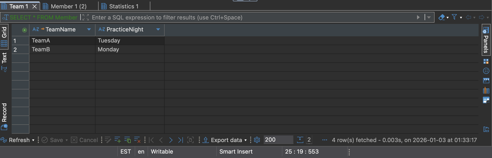
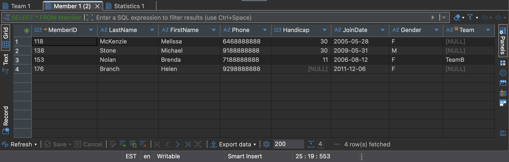
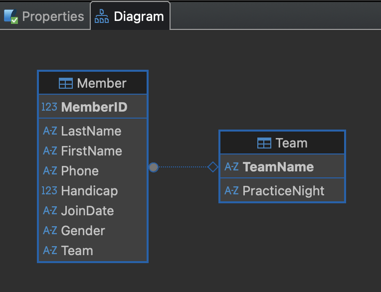
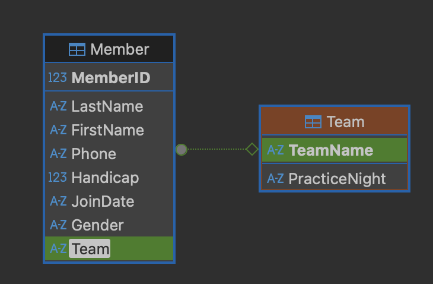

---
layout: myDefault 
title: LAB 2  
---  

# LAB 2

<p align="center">

</p>

Today’s lab will focus on downloading and setting up DBeaver.  
Software tools needed: web browser.

### Downloading DBeaver

We will be using DBeaver, a GUI that lets you connect, view and query databases without using the terminal.

To install and launch DBeaver:

1. Navigate to the [DBeaver website](https://dbeaver.io/download/$0) and download the installer for your operating system.

2. Once the file has downloaded, open it. You should see the DBeaver icon. Drag the icon to the application folder to install it. Open DBeaver from the Application folder or from Launchpad.

3. Follow the prompts to complete the setup.


### Using DBeaver

#### Creating Database In DBeaver

1. Create a new database and connect it by clicking the plug icon in the upper-left corner. Select SQLite and click on next. It will pop up a "Generic JDBC Connection Settings" window. Click on `Create...` and save it as "dbeaverdatabase.db" on your desktop, then click on `Save` and `Finish`. Right-click on the database that you just created, and select `Connect` (green plug icon).

2. Create a new SQL script by right-clicking on the database, selecting `SQL Editor`, and the selecting `New SQL script`. (control^ + ]). The SQL Editor will open, where you can write and execute SQL commands by clicking on the third icon of the left side toolbar.

``` sql
-- foreign key enforcement
PRAGMA foreign_keys = ON;

-- clean tables
DROP TABLE IF EXISTS Member;
DROP TABLE IF EXISTS Team;

CREATE TABLE Team (
    TeamName TEXT(20) NOT NULL PRIMARY KEY,
    PracticeNight TEXT(20)
);

INSERT INTO Team (TeamName, PracticeNight) VALUES
    ('TeamA', 'Tuesday'),
    ('TeamB', 'Monday');

CREATE TABLE Member (
    MemberID INTEGER NOT NULL PRIMARY KEY,
    LastName TEXT(20) NOT NULL,
    FirstName TEXT(20) NOT NULL,
    Phone TEXT(20),
    Handicap INTEGER,
    JoinDate DATE,
    Gender TEXT(1),
    Team TEXT(20),
    FOREIGN KEY (Team) REFERENCES Team(TeamName)
);

INSERT INTO Member (MemberID, LastName, FirstName, Phone, Handicap, JoinDate, Gender, Team)
VALUES
    (118, 'McKenzie', 'Melissa', '6468888888', 30, '2005-05-28', 'F', NULL),
    (138, 'Stone', 'Michael', '9188888888', 30, '2009-05-31', 'M', NULL),
    (153, 'Nolan', 'Brenda', '7188888888', 11, '2006-08-12', 'F', 'TeamB'),
    (176, 'Branch', 'Helen', '9298888888', NULL, '2011-12-06', 'F', NULL);

SELECT * FROM Team;
SELECT * FROM Member;
```

After executing the code, you should see the following tables.

*** If tables do not show up after executing the SQL script, right-click on the database and select `Refresh`.


<p align="center">

</p>
<p align="center">

</p>


#### Opening Database In DBeaver 

In the previous lab, we learned how to create a database ising the terminal and and Python IDLE. Now, we will access that same database through DBeaver and view its diagram.

1. Click the plug icon in the upper-left corner to create a new database connection. Select SQLite and click on next. In the Generic JDBC Connection Settings window, click `Open...` and search for the database "mydatabase.db" on your desktop. Click on `Open` and `Finish`. Right-click on the database that you just opened, and select `Connect` (green plug icon).

2. Right-click on the database that we just connected, and click on `View Diagram`. You will see that the two tables are connected.

<p align="center">
  
</p>

If you click on the `Team` attribute in the Member table, it will be highlighted in green in the Member table and `TeamName` in the Team table because it indicates that `Team` is a foreign key referencing `TeamName`.

<p align="center">
  
</p>
