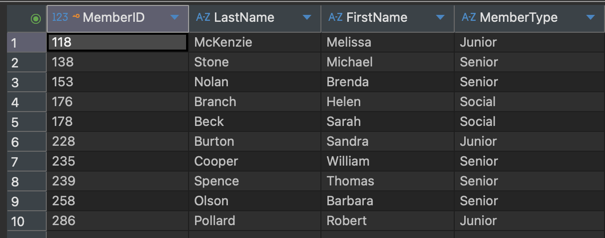
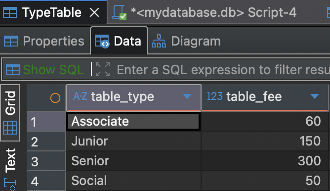
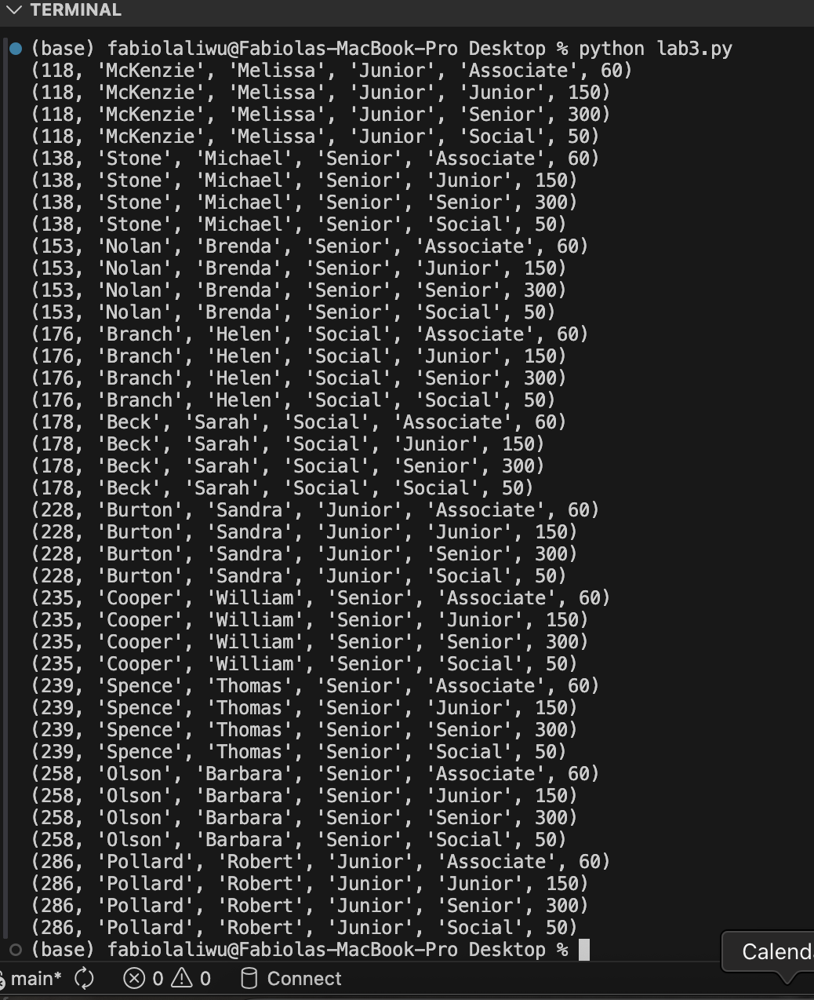
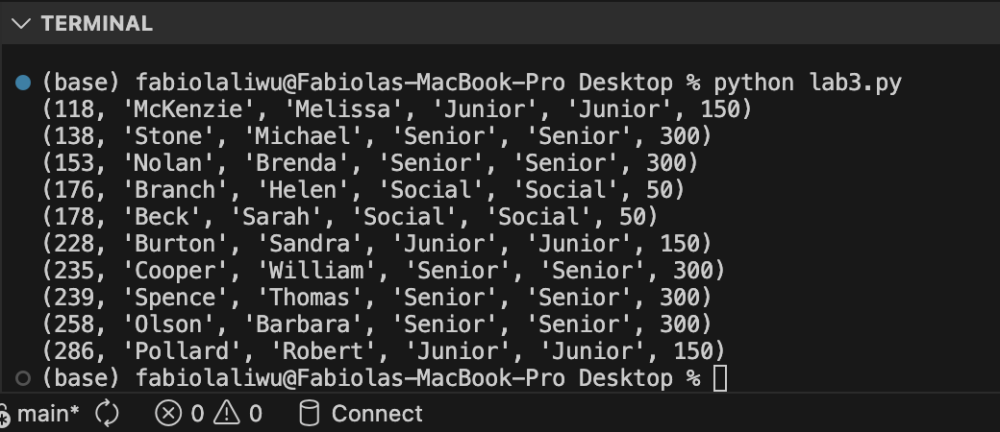
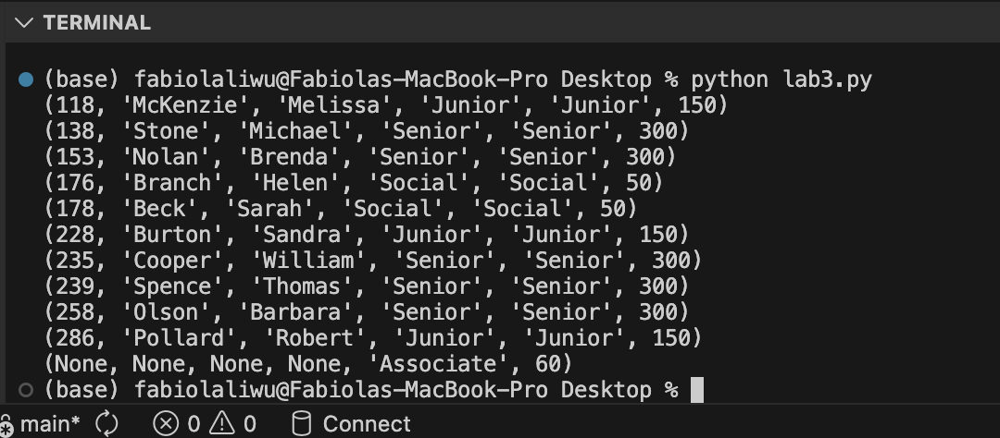
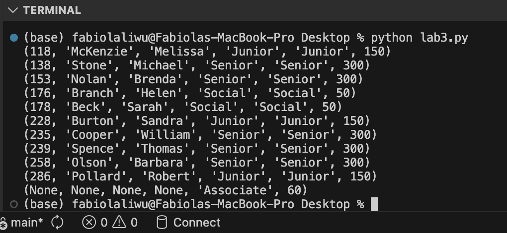
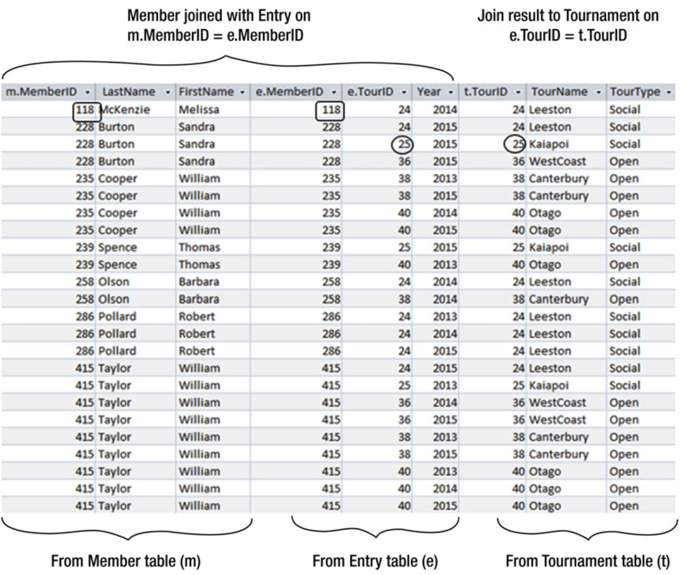
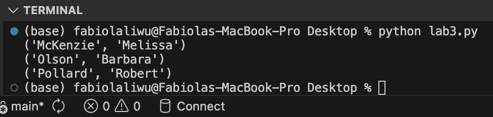

---
layout: myDefault 
title: LAB 3  
---  

# LAB 3

<p align="center">
  
</p>

Today’s lab will focus on using Python as the host-laguage interface.  
Software tools needed: DBeaver and Visual Studio Code.

## Create the tables in DBeaver

As we learned in [Lab 2](https://maryash.github.io/354/labs/lab_02$0), lets create the following tables in DBeaver:

<p align="center">

</p>

<p align="center">

</p>

## Join queries using Python

1. Lets open VSCode, and create a python file called `lab3.py` and save this file on your desktop. 

    If you don't have VS Code installed, follow this short [youtube video](https://www.youtube.com/watch?v=qj5JLEQLelk$0) for installation instructions.

2. We have to connect to the database that we created in DBeaver using Python:  

    ``` sql
        import sqlite3
        
        conn = sqlite3.connect("dbeaverdatabase.db")
        cur = conn.cursor()
    ```

3. Lets execute a CROSS JOIN and display the results using the following code:

    ```sql
        cur.execute("""
        SELECT *
        FROM Member m CROSS JOIN TypeTable t;
        """)
        
        rows = cur.fetchall()
        for row in rows:
            print(row)
    ```

4. Close the connection
    ```sql
        conn.close()
    ```

5. Run the program with 
    ```sql
        python lab3.py
    ```

Your complete `lab3.py` file should look like this:

  ```sql
      import sqlite3
      
      conn = sqlite3.connect("dbeaverdatabase.db")
      cur = conn.cursor()
      
      cur.execute("""
      SELECT *
      FROM Member m CROSS JOIN TypeTable t;
      """)
      
      rows = cur.fetchall()
      for row in rows:
          print(row)
      
      conn.close()
  ```

It will display
<p align="center">

</p>

### INNER JOIN

Now it is your turn to try an INNER JOIN. Your result should look like the following:

<p align="center">

</p>

### OUTER JOINS
For outer joins, the idea is similar to the inner join.

##### LEFT OUTER JOIN
<p align="center">

</p>

##### RIGHT OUTER JOIN
<p align="center">

</p>

##### FULL OUTER JOIN
<p align="center">

</p>


### Extending Join Queries
To reproduce the examples in the book, let's create the three tables shown on page 39.

```sql
    DROP TABLE IF EXISTS Entry;
    DROP TABLE IF EXISTS Tournament;
    DROP TABLE IF EXISTS Member;

    CREATE TABLE Member (
    member_id INTEGER PRIMARY KEY,
    member_last_name  TEXT,
    member_first_name TEXT
    );

    INSERT INTO Member (member_id, member_last_name, member_first_name) VALUES
    (118, 'McKenzie', 'Melissa'),
    (138, 'Stone', 'Michael'),
    (153, 'Nolan', 'Brenda'),
    (176, 'Branch', 'Helen'),
    (178, 'Beck', 'Sarah'),
    (228, 'Burton', 'Sandra'),
    (235, 'Cooper', 'William'),
    (239, 'Spence', 'Thomas'),
    (258, 'Olson', 'Barbara'),
    (286, 'Pollard', 'Robert'),
    (290, 'Sexton', 'Thomas'),
    (323, 'Wilcox', 'Daniel'),
    (331, 'Schmidt', 'Thomas'),
    (332, 'Bridges', 'Deborah'),
    (339, 'Young', 'Betty'),
    (414, 'Gilmore', 'Jane'),
    (415, 'Taylor', 'William'),
    (461, 'Reed', 'Robert'),
    (469, 'Willis', 'Carolyn'),
    (487, 'Kent', 'Susan');

    CREATE TABLE Tournament (
    tournament_id   INTEGER PRIMARY KEY,
    tournament_name TEXT
    );

    INSERT INTO Tournament (tournament_id, tournament_name) VALUES
    (24, 'Leeston'),
    (25, 'Kaiapoi'),
    (36, 'WestCoast'),
    (38, 'Canterbury'),
    (40, 'Otago');

    CREATE TABLE Entry (
    entry_member_id INTEGER,
    entry_tournament_id   INTEGER,
    entry_year     INTEGER
    );

    INSERT INTO Entry (entry_member_id, entry_tournament_id, entry_year) VALUES
    (118, 24, 2014),
    (228, 24, 2015),
    (228, 25, 2015),
    (228, 36, 2015),
    (235, 38, 2013),
    (235, 38, 2015),
    (235, 40, 2014),
    (235, 40, 2015),
    (239, 25, 2015),
    (239, 40, 2013),
    (258, 24, 2014),
    (258, 38, 2014),
    (286, 24, 2013),
    (286, 24, 2014),
    (286, 24, 2015),
    (415, 24, 2015),
    (415, 25, 2013),
    (415, 36, 2014),
    (415, 36, 2015),
    (415, 38, 2013),
    (415, 38, 2015),
    (415, 40, 2013),
    (415, 40, 2014),
    (415, 40, 2015);
```


 We also want to return the names of everyone who entered the Leeston tournament in 2014. To do this, we will follow the process approach, which leads us to the outcome approach.

```sql
    import sqlite3

    conn = sqlite3.connect("dbeaverdatabase.db")
    cur = conn.cursor()
    
    # Using the column names defined in the CREATE TABLE statements above
    cur.execute("""
    SELECT member_last_name, member_first_name
    FROM Member m 
    INNER JOIN Entry e ON m.member_id = e.entry_member_id
    INNER JOIN Tournament t ON e.entry_tournament_id = t.tournament_id
    WHERE t.tournament_name = 'Leeston'
      AND e.entry_year = 2014;
    """)
    
    rows = cur.fetchall()
    for row in rows:
        print(row)
    
    conn.close()
```

#### Process Approach
We first join the Member table to the Entry table and the result to the Tournament table.

<p align="center">

</p>

#### Outcome Approach
This is the final outcome.
Our goal was simply to retrieve the names that satisfy the criteria specified in the SQL query.
<p align="center">

</p>
