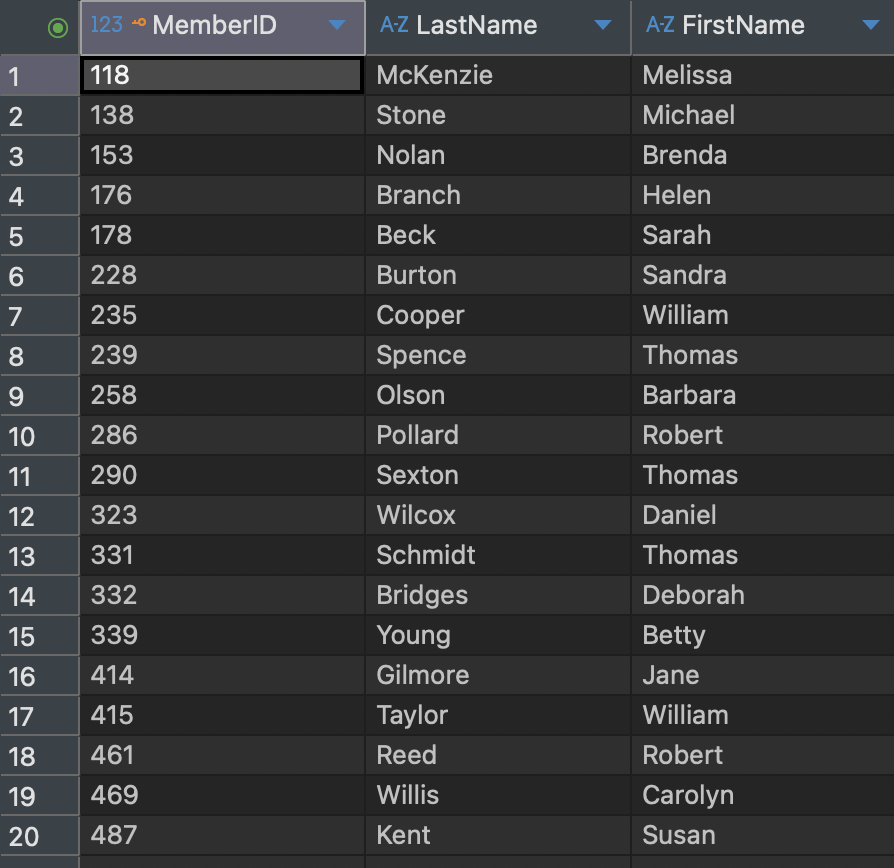
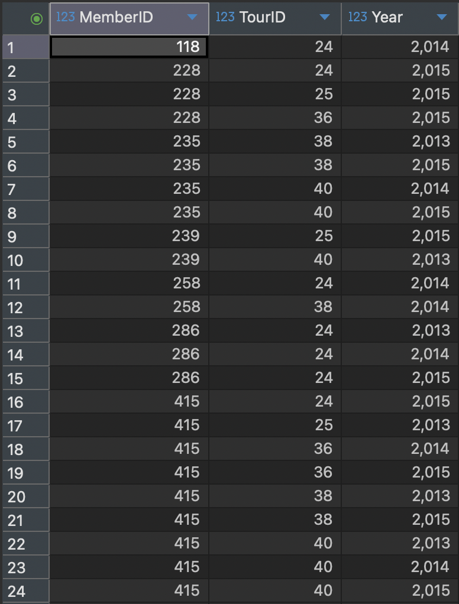
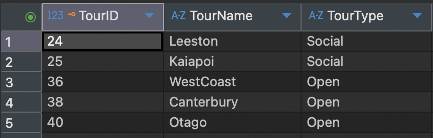
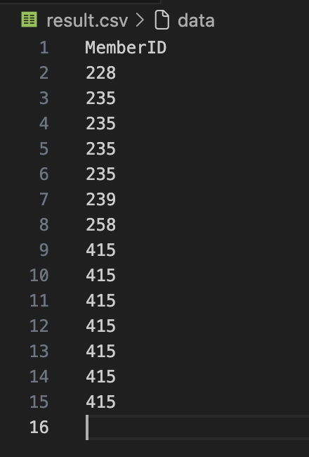
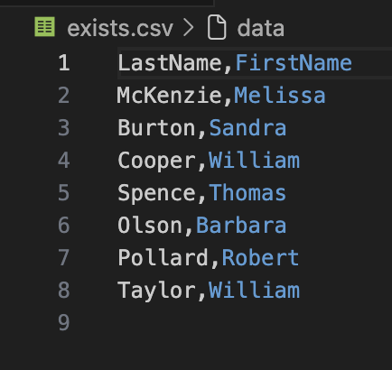
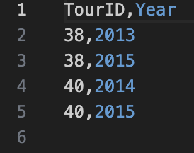
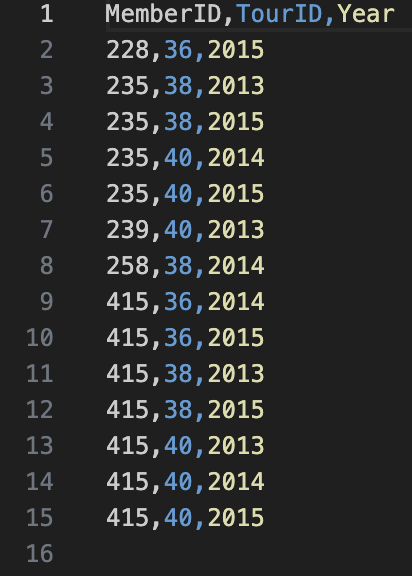
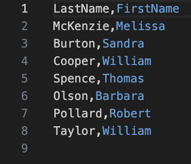

---
layout: myDefault 
title: LAB 4  
---  

# LAB 4

<p align="center">
  
</p>

Today's lab we will focus on how to open csv files to populate tables with the data and write subqueries.

1. Let's start by creating a folder on your desktop called `subqueries`. Inside the folder, we will place the database `dbeaverdatabase.db`that we used in Lab 3, a new python file called `lab4.py` and the following csv files:

    - [Member.csv](Member.csv)
    - [Tournament.csv](Tournament.csv)
    - [Entry.csv](Entry.csv)

2. Copy the following code into `lab4.py`. This program opens the database, creates the tables, and populates them with data from the CSV files.

``` python
        import csv
        import sqlite3

        conn = sqlite3.connect("dbeaverdatabase.db")
        cur = conn.cursor()

        cur.executescript("""
        DROP TABLE IF EXISTS Entry;
        DROP TABLE IF EXISTS Tournament;
        DROP TABLE IF EXISTS Member;

        CREATE TABLE Member (
            member_id INTEGER PRIMARY KEY,
            member_last_name TEXT,
            member_first_name TEXT
        );

        CREATE TABLE Tournament (
            tournament_id INTEGER PRIMARY KEY,
            tournament_name TEXT,
            tournament_type TEXT
        );

        CREATE TABLE Entry (
            entry_member_id INTEGER,
            entry_tournament_id INTEGER,
            entry_year INTEGER
        );
        """)

        # read the csv files
        with open("Member.csv", newline="") as f:
            reader = csv.reader(f)
            next(reader) 
            for row in reader:
                if len(row) != 3:
                    continue
                cur.execute(
                    "INSERT INTO Member VALUES (?, ?, ?)",
                    (int(row[0]), row[1], row[2])
                )

        with open("Tournament.csv", newline="") as f:
            reader = csv.reader(f)
            next(reader)  
            for row in reader:
                if len(row) != 3:
                    continue
                cur.execute(
                    "INSERT INTO Tournament VALUES (?, ?, ?)",
                    (int(row[0]), row[1], row[2])
                )

        with open("Entry.csv", newline="") as f:
            reader = csv.reader(f)
            next(reader) 
            for row in reader:
                if len(row) != 3:
                    continue 
                cur.execute(
                    "INSERT INTO Entry VALUES (?, ?, ?)",
                    (int(row[0]), int(row[1]), int(row[2]))
                )

        conn.commit()
        conn.close()
```

3. Run the program with 
    ```
    python lab4.py
    ```

** double check the tables in DBeaver to make sure the data was imported correctly.

<p align="center">

</p>

<p align="center">

</p>

<p align="center">

</p>

## IN Keyword

Now let’s write some subqueries using the IN keyword. Before doing so, let’s review how IN works.

Instead of repeating e.entry_tournament_id three times:
```
SELECT e.entry_member_id
FROM Entry e
WHERE e.entry_tournament_id = 36 OR e.entry_tournament_id = 38 OR e.entry_tournament_id = 40;
```

we can use the IN keyword and list the values inside parentheses:
```
SELECT e.entry_member_id
FROM Entry e
WHERE e.entry_tournament_id IN (36, 38, 40);
```

the reason that someone may have been interested in tournaments 36, 38, and 40 might have been because they are the current Open tournaments, so rather than list the Open tournaments individually, we can use another SQL query to generate the set of values we require.

``` python
        import csv
        import sqlite3

        conn = sqlite3.connect("dbeaverdatabase.db")
        cur = conn.cursor()

        cur.execute("""
        SELECT e.entry_member_id
        FROM Entry e
        WHERE e.entry_tournament_id IN (
        SELECT t.tournament_id
        FROM Tournament t
        WHERE t.tournament_type = 'Open');
        """)

        rows = cur.fetchall()

        with open("result.csv", "w", newline="") as f:
            writer = csv.writer(f)
            writer.writerow(["entry_member_id"])
            writer.writerows(rows)

        conn.close()
```

Run the program with 

```
    python lab4.py
```
Open the `result.csv` file, you should see the following output:

<p align="center">

</p>


## EXISTS Keyword

Thinking about the EXISTS Keyword, we can translate it as 

"I’ll write out the names from row m, where m comes from the Member table, if there exists a
row e in the Entry table where e.entry_member_id = m.member_id."

which in SQL will be

```
        SELECT m.member_last_name, m.member_first_name
        FROM Member m
        WHERE EXISTS (
        SELECT *
        FROM Entry e
        WHERE e.entry_member_id = m.member_id);
```

Now it is your turn to write this query in Python and save the output to a CSV file called exists.csv.
The file should look like the following:

<p align="center">

</p>


## Different Types of Subqueries
There are different types of nested queries and alternate ways of expressing them.

#### A subquery returning a single value
To find the tournaments that member Cooper has entered, this is the same as

```
SELECT e.entry_tournament_id, e.entry_year FROM Entry e WHERE e.entry_member_id = (
SELECT m.member_id FROM Member m
WHERE m.member_last_name = 'Cooper');
```

this 

```
SELECT e.entry_tournament_id, e.entry_year FROM Entry e
INNER JOIN Member m ON e.entry_member_id = m.member_id
WHERE m.member_last_name = 'Cooper';
```

Both of them will return the same output

<p align="center">

</p>

#### A subquery returning a set of single values
It is your turn to find all the entries for an Open tournament, your output should be the following

<p align="center">

</p>

#### A subquery checking for existence
To find the names of members that have entered any tournament, this is the same

```
SELECT m.member_last_name, m.member_first_name
FROM Member m
WHERE EXISTS 
(SELECT * FROM Entry e
WHERE e.entry_member_id = m.member_id);
```

as

```
SELECT DISTINCT m.member_last_name, m.member_first_name FROM Member m
INNER JOIN Entry e ON e.entry_member_id = m.member_id;
```

You should see the following output

<p align="center">

</p>
