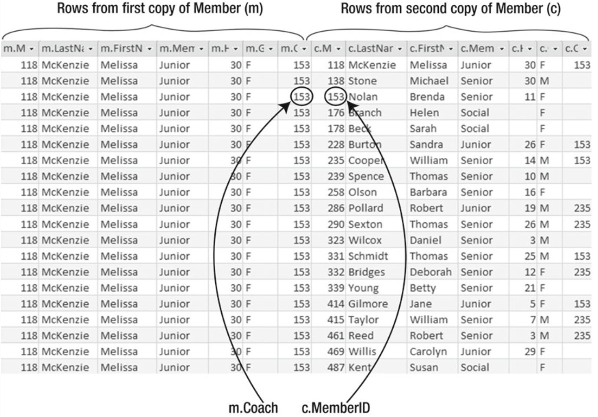
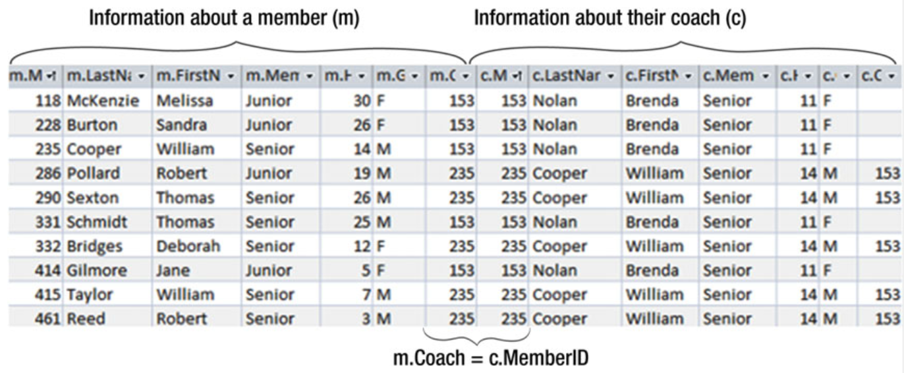
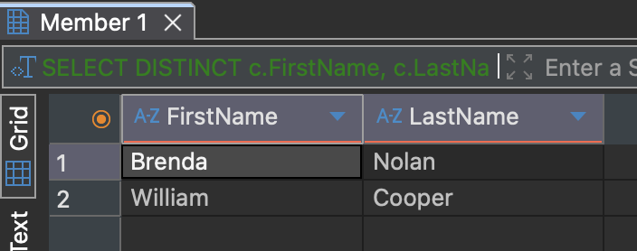
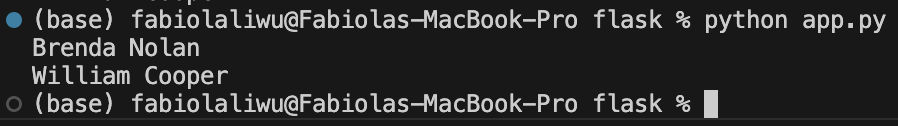
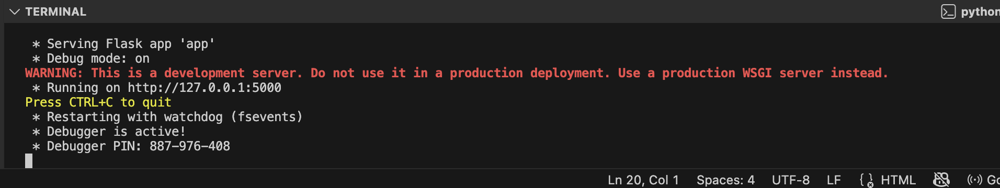
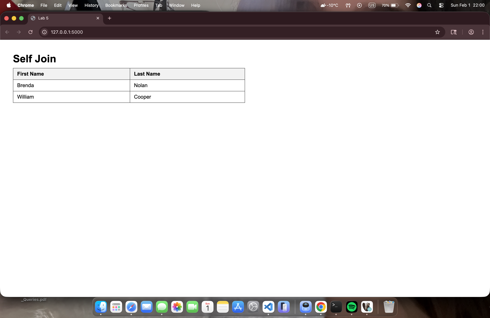
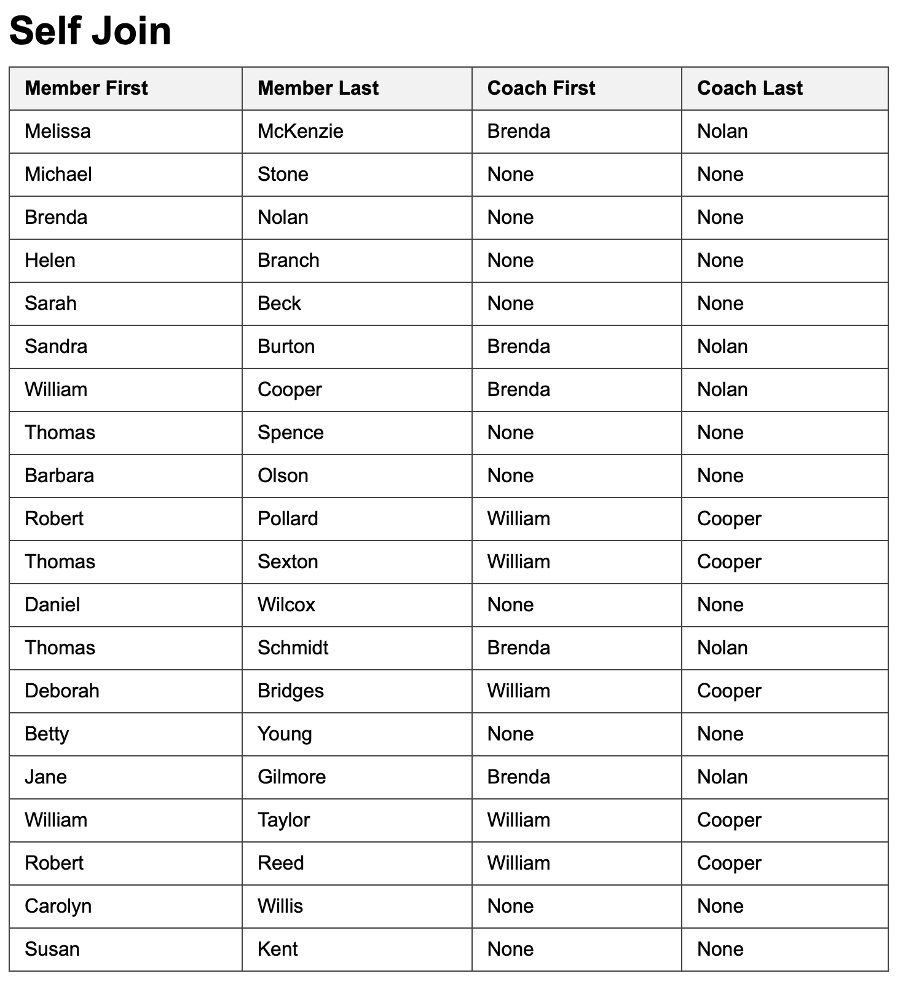

---
layout: myDefault 
title: LAB 5  
---  

# LAB 5

Today's lab will be about self joins and provide a brief introduction to Flask

Let's not beat around the bush, and go straight to the point. We can use the same folder `subqueries` that we used in the previous lab. We only need to delete the csv files, and it will be ready to go. Alternatively, we can create a new folder named `flask` and move the existing database `dbeaverdatabase.db` into that folder, and create a new p=Python file called `app.py`

<p align="center">

</p>

To recreate the table on page 59 of the book, use the following SQL script. If you forgot how to create a new table in DBeaver, check out [Lab2](https://maryash.github.io/354/labs/lab_02).

```
PRAGMA foreign_keys = ON;

DROP TABLE IF EXISTS Member;

CREATE TABLE Member (
member_id   INTEGER PRIMARY KEY,
member_last_name   TEXT NOT NULL,
member_first_name  TEXT NOT NULL,
member_handicap   INTEGER,
member_type TEXT,
member_gender     TEXT,
member_coach      INTEGER,
FOREIGN KEY (member_coach) REFERENCES Member(member_id)
);

INSERT INTO Member (member_id, member_last_name, member_first_name, member_handicap, member_type, member_gender, member_coach) VALUES
(118, 'McKenzie', 'Melissa', 30, 'Junior', 'F', 153),
(138, 'Stone', 'Michael', 30, 'Senior', 'M', NULL),
(153, 'Nolan', 'Brenda', 11, 'Senior', 'F', NULL),
(176, 'Branch', 'Helen', NULL, 'Social', 'F', NULL),
(178, 'Beck', 'Sarah', NULL, 'Social', 'F', NULL),
(228, 'Burton', 'Sandra', 26, 'Junior', 'F', 153),
(235, 'Cooper', 'William', 14, 'Senior', 'M', 153),
(239, 'Spence', 'Thomas', 10, 'Senior', 'M', NULL),
(258, 'Olson', 'Barbara', 16, 'Senior', 'F', NULL),
(286, 'Pollard', 'Robert', 19, 'Junior', 'M', 235),
(290, 'Sexton', 'Thomas', 26, 'Senior', 'M', 235),
(323, 'Wilcox', 'Daniel', 3, 'Senior', 'M', NULL),
(331, 'Schmidt', 'Thomas', 25, 'Senior', 'M', 153),
(332, 'Bridges', 'Deborah', 12, 'Senior', 'F', 235),
(339, 'Young', 'Betty', 21, 'Senior', 'F', NULL),
(414, 'Gilmore', 'Jane', 5, 'Junior', 'F', 153),
(415, 'Taylor', 'William', 7, 'Senior', 'M', 235),
(461, 'Reed', 'Robert', 3, 'Senior', 'M', 235),
(469, 'Willis', 'Carolyn', 29, 'Junior', 'F', NULL),
(487, 'Kent', 'Susan', NULL, 'Social', 'F', NULL);
```

## Self join
Self joins are Cartesian product (every combination of rows from each table) followed by selecting a subset of those rows that satisfy some join condition.

So when we run
```
SELECT *
FROM Member m INNER JOIN Member c ON m.member_coach = c.member_id;
```
this is part of the Cartesian product that we are doing
<p align="center">

</p>

The join condition `m.member_coach = c.member_id` then filters this result, keeping only the rows where a member’s coach matches another member’s `MemberID`:
<p align="center">

</p>

Since we are only interested in the first and last names of the coaches, we select only those columns. We also apply `DISTINCT` to avoid duplicate results:
```
SELECT DISTINCT c.member_first_name, c.member_last_name
FROM Member m INNER JOIN Member c ON m.member_coach = c.member_id;
```

This is the result we see in DBeaver
<p align="center">

</p>

And this is the result we see when running the same query in Python from the terminal 

```python
import sqlite3

conn = sqlite3.connect("dbeaverdatabase.db")
cur = conn.cursor()

cur.execute("""
SELECT DISTINCT c.member_first_name, c.member_last_name
FROM Member m INNER JOIN Member c ON m.member_coach = c.member_id;
""")

rows = cur.fetchall()
for first, last in rows:
print(f"{first} {last}")

conn.close()
```

<p align="center">

</p>

## Flask
In real applications, we don't just do queries in database tools like DBeaver or in the terminal. While running SQL directly is useful for learning and testing, most real-world applications access databases through code and display results in a user-friendly interface. Therefore, in this lab we will have a brief introduction to Flask. Flask acts as a simple bridge between the database and the user interface. It lets us take the results of a self join query and present them in a formatted web page.

### Installing flask

In the terminal, type the foolowing command
``` 
python -m pip install flask
```

#### Creating a Flask application
Let's create a Python file `app.py` in the same folder as the database. This Flask application connects to the database, runs the same self join query we tested earlier, and sends the results to an HTML template.

``` python
import os
import sqlite3 
from flask import Flask, render_template

app = Flask(__name__) # start the app

BASE_DIR = os.path.dirname(os.path.abspath(__file__))
DB_PATH = os.path.join(BASE_DIR, "dbeaverdatabase.db")

@app.route("/") #run the following when the useer is in the home page
def selfjoin():
# coonect it to the database
with sqlite3.connect(DB_PATH) as conn:
        conn.row_factory = sqlite3.Row
        cur = conn.cursor()
        #execute query
        cur.execute("""
        SELECT DISTINCT c.member_first_name, c.member_last_name
        FROM Member m INNER JOIN Member c ON m.member_coach = c.member_id;
        """)
        rows = cur.fetchall() #fetch the data
# returns the data to the template
return render_template("selfjoin.html", rows=rows)

#starts the Flask web server in debug mode
if __name__ == "__main__":
app.run(debug=True)
```

#### Create the templates folder
In the same folder, create a new folder called templates. Inside templates, create a file called `selfjoin.html`. 

The folder structure should look like this:

<p align="center">

</p>

The template receives the result of the self join and displays each coach’s name in a list. In `selfjoin.html`, add the following

```
<!DOCTYPE html>
<html lang="en">
<head>
<meta charset="UTF-8">
<title>Lab 5</title>
<style>
        body {
        font-family: Arial, sans-serif;
        margin: 40px;
        }

        h1 {
        margin-bottom: 10px;
        }

        table {
        border-collapse: collapse;
        width: 50%;
        }

        th, td {
        border: 1px solid #444;
        padding: 8px 12px;
        text-align: left;
        }

        th {
        background-color: #f2f2f2;
        }
</style>
</head>
<body>
<h1>Self Join</h1>
<table>
        <tr>
        <th>First Name</th>
        <th>Last Name</th>
        </tr>

        
        <tr>
        <td>{{ row["FirstName"] }}</td>
        <td>{{ row["LastName"] }}</td>
        </tr>
        
</table>
</body>
</html>
```


In the terminal, run the following

```
python app.py
```

You will see the following output in the terminal

<p align="center">

</p>

Open the link and you should see the list of coaches displayed on a web page.
<p align="center">

</p>

#### Practice: List the Names of All Members and the Names of Their Coaches
Change the `app.py` file to retrieve all the members and their coaches first name and last name. Remember to also change the HTML since we are now passing four columns instead of only two. The following should be your output: 

<p align="center">

</p>
