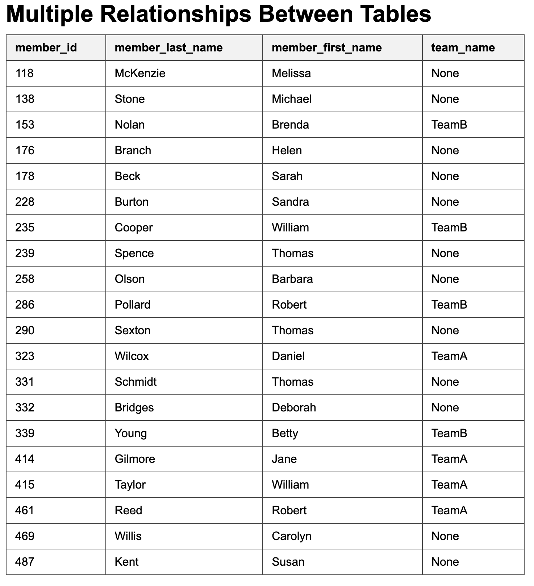
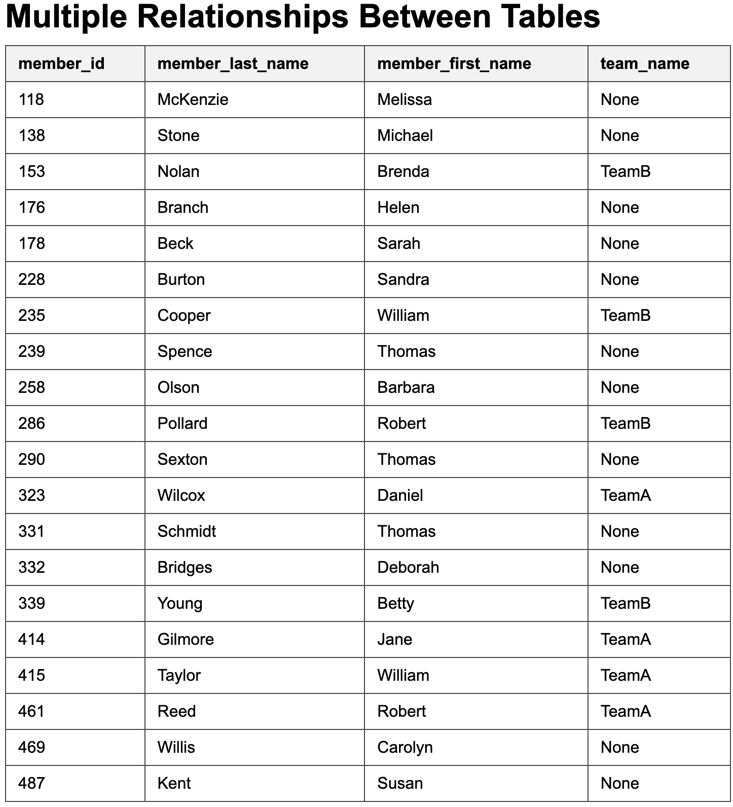
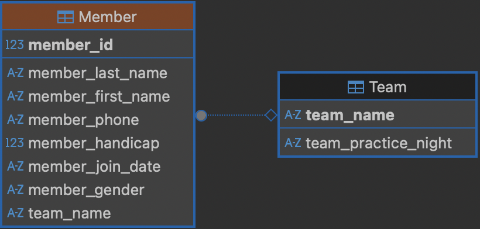
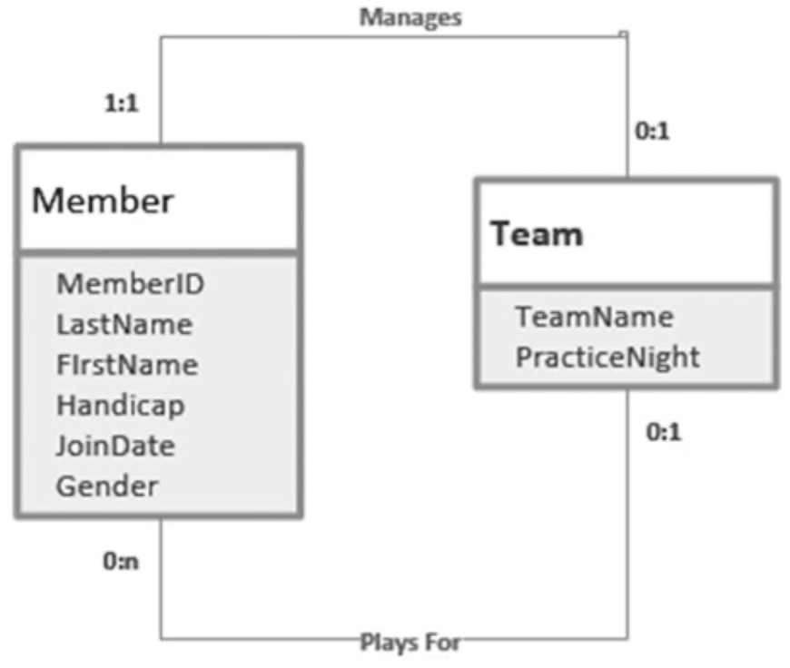
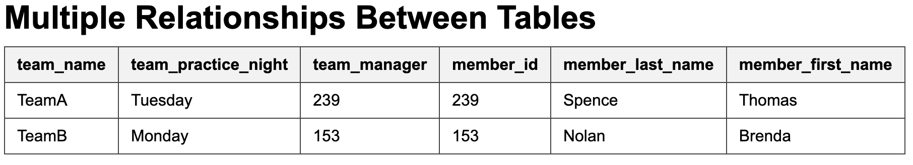
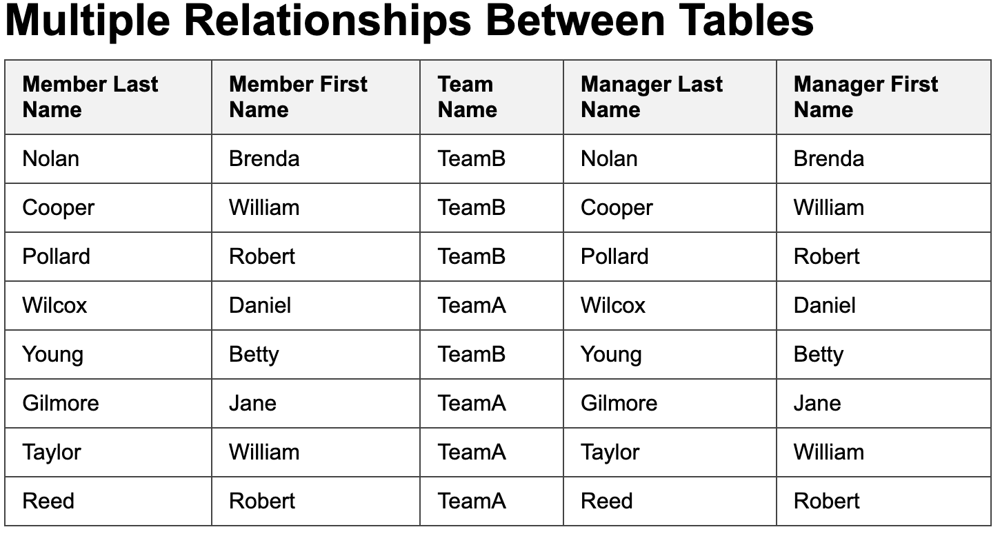

---
layout: myDefault 
title: LAB 6  
---  

# LAB 6

Today's lab will be a refresh of Flask and about multiple relationships between tables. 

Let's run this SQL script in DBeaver.

```
-- foreign key enforcement
PRAGMA foreign_keys = ON;

-- clean tables
DROP TABLE IF EXISTS Member;
DROP TABLE IF EXISTS Team;

CREATE TABLE Team (
team_name TEXT(20) NOT NULL PRIMARY KEY,
team_practice_night TEXT(20)
);

INSERT INTO Team (team_name, team_practice_night) VALUES
('TeamA', 'Tuesday'),
('TeamB', 'Monday');

CREATE TABLE Member (
member_id INTEGER NOT NULL PRIMARY KEY,
member_last_name TEXT(20) NOT NULL,
member_first_name TEXT(20) NOT NULL,
team_name TEXT(20),
FOREIGN KEY (team_name) REFERENCES Team(team_name)
);

INSERT INTO Member (member_id, member_last_name, member_first_name, team_name)
VALUES
(118, 'McKenzie', 'Melissa', NULL),
(138, 'Stone', 'Michael', NULL),
(153, 'Nolan', 'Brenda', 'TeamB'),
(176, 'Branch', 'Helen', NULL),
(178, 'Beck', 'Sarah', NULL),
(228, 'Burton', 'Sandra', NULL),
(235, 'Cooper', 'William', 'TeamB'),
(239, 'Spence', 'Thomas', NULL),
(258, 'Olson', 'Barbara', NULL),
(286, 'Pollard', 'Robert', 'TeamB'),
(290, 'Sexton', 'Thomas', NULL),
(323, 'Wilcox', 'Daniel', 'TeamA'),
(331, 'Schmidt', 'Thomas', NULL),
(332, 'Bridges', 'Deborah', NULL),
(339, 'Young', 'Betty', 'TeamB'),
(414, 'Gilmore', 'Jane', 'TeamA'),
(415, 'Taylor', 'William', 'TeamA'),
(461, 'Reed', 'Robert', 'TeamA'),
(469, 'Willis', 'Carolyn', NULL),
(487, 'Kent', 'Susan', NULL);
```
Let’s try to generate the following output using Flask

<p align="center">

</p>

To do this, we need to add the following query to our Python file in order to retrieve all columns from the `Member` table:
```
SELECT * FROM Member;
```

Let's modify the `selfjoin.html` file, since we are getting member_id, member_last_name, member_first_name, and team_name columns.

- The title will be **"Multiple Relationships Between Tables"**.
- The table will begin with a header row specifying the table attributes.
- Then, we will include a loop that iterates through every row passed from Flask.
- Finally, we will close the loop.

The body of the HTML should look like this:

```
<body>
<h1>Multiple Relationships Between Tables</h1>
<table>
        <tr>
        <th>member_id</th>
        <th>member_last_name</th>
        <th>member_first_name</th>
        <th>team_name</th>
        </tr>

        
        <tr>
        <td>{{ row["member_id"] }}</td>
        <td>{{ row["member_last_name"] }}</td>
        <td>{{ row["member_first_name"] }}</td>
        <td>{{ row["team_name"] }}</td>
        </tr>
        
</table>
</body>
```

Run the python file with the following command in the terminal: 

```
python app.py
```

<p align="center">

</p>


The `Team` and `Member` tables are related through the `team_name` column in the `Member` table. You can verify this relationship by clicking on the `Member` table and selecting Diagram. You should see the following:

<p align="center">

</p>

There can be multiple relationships between these two tables. One relationship is that members play for teams, which is a 1-Many relationship (one team has many members). Another relationship is that a member may manage a team.

<p align="center">

</p>

### Extracting Information from Multiple Relationships

Let's modify the `Team` table to do some examples extracting information from multiple relationships.

```
-- foreign key enforcement
PRAGMA foreign_keys = ON;

-- clean tables
DROP TABLE IF EXISTS Member;
DROP TABLE IF EXISTS Team;

CREATE TABLE Team (
team_name TEXT(20) NOT NULL PRIMARY KEY,
team_practice_night TEXT(20),
team_manager INTEGER
);

INSERT INTO Team (team_name, team_practice_night, team_manager) VALUES
('TeamA', 'Tuesday', 239),
('TeamB', 'Monday', 153);

CREATE TABLE Member (
member_id INTEGER NOT NULL PRIMARY KEY,
member_last_name TEXT(20) NOT NULL,
member_first_name TEXT(20) NOT NULL,
team_name TEXT(20),
FOREIGN KEY (team_name) REFERENCES Team(team_name)
);

INSERT INTO Member (member_id, member_last_name, member_first_name, team_name)
VALUES
(118, 'McKenzie', 'Melissa', NULL),
(138, 'Stone', 'Michael', NULL),
(153, 'Nolan', 'Brenda', 'TeamB'),
(176, 'Branch', 'Helen', NULL),
(178, 'Beck', 'Sarah', NULL),
(228, 'Burton', 'Sandra', NULL),
(235, 'Cooper', 'William', 'TeamB'),
(239, 'Spence', 'Thomas', NULL),
(258, 'Olson', 'Barbara', NULL),
(286, 'Pollard', 'Robert', 'TeamB'),
(290, 'Sexton', 'Thomas', NULL),
(323, 'Wilcox', 'Daniel', 'TeamA'),
(331, 'Schmidt', 'Thomas', NULL),
(332, 'Bridges', 'Deborah', NULL),
(339, 'Young', 'Betty', 'TeamB'),
(414, 'Gilmore', 'Jane', 'TeamA'),
(415, 'Taylor', 'William', 'TeamA'),
(461, 'Reed', 'Robert', 'TeamA'),
(469, 'Willis', 'Carolyn', NULL),
(487, 'Kent', 'Susan', NULL);

SELECT * FROM Member;
```

If we want information about the teams and the names of their managers, we can use the following query

```
SELECT t.team_name, t.team_practice_night, t.team_manager,
m.member_id, m.member_last_name, m.member_first_name
FROM Team t INNER JOIN Member m ON t.team_manager = m.member_id;
```

The HTML should look like
```
<table>
        <tr>
                <th>team_name</th>
                <th>team_practice_night</th>
                <th>team_manager</th>
                <th>member_id</th>
                <th>member_last_name</th>
                <th>member_first_name</th>
        </tr>

        
        <tr>
                <td>{{ row["team_name"] }}</td>
                <td>{{ row["team_practice_night"] }}</td>
                <td>{{ row["team_manager"] }}</td>
                <td>{{ row["member_id"] }}</td>
                <td>{{ row["member_last_name"] }}</td>
                <td>{{ row["member_first_name"] }}</td>
        </tr>
        
</table>
```

This should produce the following output

<p align="center">

</p>

Now, let’s print every member, the team they belong to, and the name of that team’s manager.
This is the query:

```
SELECT m.member_last_name, m.member_first_name, m.team_name, m2.member_last_name, m2.member_first_name
FROM Member m, Team t, Member m2
WHERE m.team_name = t.team_name AND t.team_manager = m2.member_id
```

It’s now your turn to modify the HTML. You should get the following output:
<p align="center">

</p>
